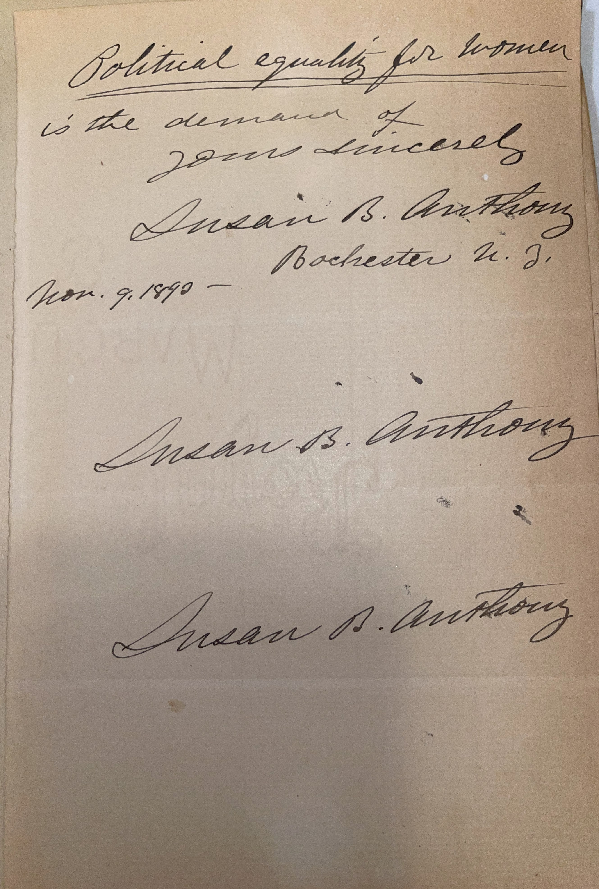

# 🖋️ Susan B. Anthony - Letter (1899)

---

## 📜 Transcription

**Letter (December 5, 1893):**  

Rochester Dec. 5, 1893  

My Dear Sir  

I have no idea that I am the author of the sentence you ask about—It isn’t a bit like me—  

Let me ask you to please send me the names and P.O. addresses of any friends woman suffrage in your town 

Susan B. Anthony  

**Note (November 2, 1893):**  

My strongest hope is that the majority of the men of New York will vote to enfranchise the women of the state at the election of Nov. 6, 1893—  

Susan B. Anthony  
Rochester N.Y.  
Nov. 2, 1893  

---

## 📚 Susan B. Anthony

**Susan B. Anthony (1820–1906)** was a pioneering American suffragist, abolitionist, and social reformer, widely regarded as one of the most influential leaders of the women’s suffrage movement in the United States. Born on February 15, 1820, in Adams, Massachusetts, Anthony dedicated her life to advocating for women’s rights, particularly the right to vote. She began her activism in the temperance and abolitionist movements before focusing on suffrage, co-founding the National Woman Suffrage Association (NWSA) in 1869 with Elizabeth Cady Stanton. Anthony’s efforts included organizing conventions, delivering speeches, and lobbying for legal reforms. She famously voted illegally in the 1872 presidential election to challenge voting restrictions, resulting in her arrest and a widely publicized trial that galvanized the suffrage movement. By 1890, she had merged the NWSA with the American Woman Suffrage Association to form the National American Woman Suffrage Association (NAWSA), serving as its president from 1892 to 1900.

By December 5, 1893, when this letter was written, Anthony was 73 and living in Rochester, New York, where she had settled with her family in 1845. In the letter, addressed to a “Dear Sir,” likely C. W. Mills, Anthony denies authorship of a sentence Mills inquired about, stating, “It isn’t a bit like me,” and requests the names and addresses of women suffragists in Boston or Cambridge, reflecting her ongoing efforts to expand her network. An additional note, dated November 2, 1893, expresses her hope for women’s enfranchisement in New York at the election of November 6, 1893, though New York women did not gain the vote until 1917. This note underscores her active engagement in the suffrage campaign during that election year. Written in 1893, during a period when the suffrage movement was steadily building momentum, this letter captures Anthony’s enduring dedication and her active role in organizing support for the cause. Anthony continued her activism until her death on March 13, 1906, in Rochester, just 14 years before the 19th Amendment granted women the right to vote in 1920.

---

## 🔗 Return to [Index](index.md)