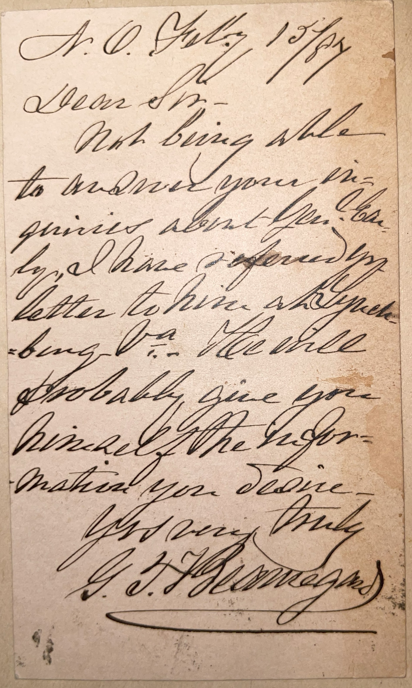

---

## 📜 Transcription

N.O. July 1st 1884  

Dear Sir,  

Not being able to answer your inquiries about Gen. Early, I forward my letter to him, asking him to reply to you. He will probably give you himself the information you desire.  

Yours truly  
G. T. Beauregard  

---

## 📚 P.G.T. Beauregard

**Pierre Gustave Toutant Beauregard (1818–1893)**, commonly known as P.G.T. Beauregard, was a prominent Confederate general during the American Civil War, born on May 28, 1818, in St. Bernard Parish, Louisiana, to a French Creole family on the "Contreras" sugarcane plantation. Raised in a French-speaking, Catholic household, Beauregard didn’t learn English until age 11, when he attended the Frères Peugnet School in New York City. He graduated from the United States Military Academy at West Point in 1838, ranking second in his class, and distinguished himself as an engineer during the Mexican-American War (1846–1848), earning brevets for bravery at the battles of Contreras and Churubusco.  

Beauregard’s Civil War career began with a dramatic flourish—he ordered the bombardment of Fort Sumter in April 1861, marking the war’s first engagement, after South Carolina seceded and he resigned his U.S. Army commission to join the Confederacy. He led Confederate forces to victory at the First Battle of Bull Run (Manassas) in July 1861, earning early fame as a Southern hero. However, his relationship with Confederate President Jefferson Davis soured due to strategic disagreements, and Beauregard was transferred to the Western Theater. There, he played a key role in the Battle of Shiloh (1862) and later commanded the defense of Charleston, South Carolina, from 1862 to 1864, successfully repelling Union attacks. In 1864, he was instrumental in halting Union General William Tecumseh Sherman’s advance at the Battle of Bentonville, one of the last major Confederate efforts.  

After the war, Beauregard returned to Louisiana and became a successful civilian, working in railroad management and public administration. From 1877 to 1893, he supervised the Louisiana Lottery alongside another former Confederate general, Jubal Early, a role that was both lucrative and controversial due to its ties to corruption. This position ensured Beauregard’s financial stability, and he died a wealthy man, unlike many of his peers. He was also involved in the state’s Reconstruction politics, advocating for civil rights for freedmen while promoting Southern economic recovery, and served as Louisiana’s adjutant general from 1879 to 1888, overseeing the state militia.  

By July 1, 1884, when this letter was written from New Orleans (abbreviated as "N.O."), Beauregard was 66 years old and a well-established figure in the city. The letter, addressed to an unnamed recipient, mentions forwarding inquiries about General Jubal Early to Early himself, indicating that the recipient was seeking information—possibly historical, personal, or professional—about Early, with whom Beauregard had a close working relationship through the Louisiana Lottery. Jubal Early, a fellow Confederate general, had led the 1864 Shenandoah Valley Campaign and, like Beauregard, was active in post-war Southern society, often writing to defend the Confederate cause. In 1884, both men were engaged in literary efforts to shape their legacies; Beauregard published his memoir, *The Military Operations of General Beauregard*, that year, while Early contributed articles to the *Southern Historical Society Papers*. The letter reflects Beauregard’s role as a connector in post-war Confederate networks, facilitating communication between former colleagues, possibly to assist with historical documentation or personal inquiries about Early’s activities. Beauregard remained active in New Orleans until his death on February 20, 1893, leaving a legacy as one of the Confederacy’s most capable generals, with notable post-war contributions to infrastructure and civil rights advocacy.  

---

## 🔗 Return to [Index](index.md)