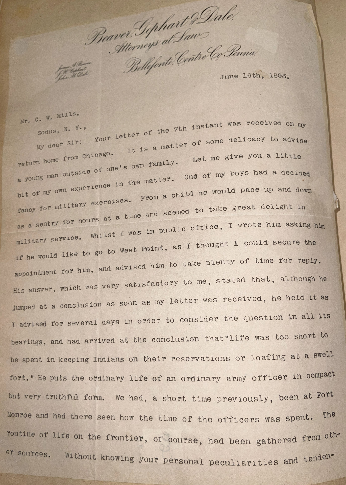
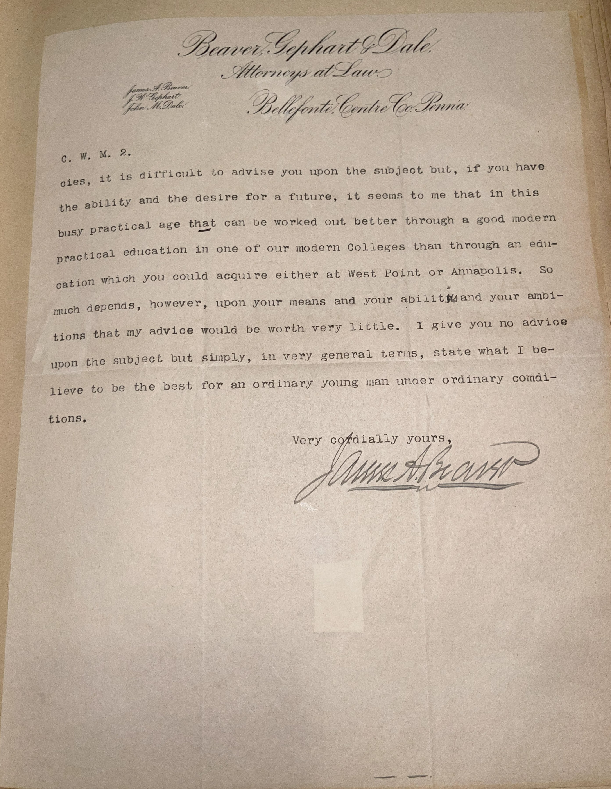

# 🖋️ James Beaver - Letter (1893)

---

## 📜 Transcription

Beaver, Iglehart & Dale,
Attorneys at Law,
Bellefonte, Centre Co., Penna.
June 16th, 1893.
Mr. C. W. Mills,
Sodus, N. Y.
My dear Sir:
Your letter of the 9th instant was received on my return home from Chicago. It is a matter of some delicacy to advise a young man outside of one’s own family. Let me give you a little bit of my own experience in the matter. One of my boys had a decided fancy for military exercises. From a child he would pace up and down as a sentry for hours at a time and seemed to take great delight in military service. Whilst I was in public office, I wrote him asking him if he would like to go to West Point, as I thought I could secure the appointment for him, and advised him to take plenty of time for reply. His answer, which was very satisfactory to me, stated that, although he jumped at the conclusion as soon as my letter was received, he held it as I advised for several days in order to consider the question in all its bearings, and had arrived at the conclusion that “life was too short to be spent in keeping Indians on their reservations or loafing at a swell fort.” He puts the ordinary life of an ordinary army officer in compact but very truthful form. We had, a short time previously, been at Fort Monroe and had there seen how the time of the officers was spent. The routine of life on the frontier, of course, had been gathered from other sources. Without knowing your personal peculiarities and tendencies, it is difficult to advise you upon the subject but, if you have the ability and the desire for a future, it seems to me that in this busy practical age that can be worked out better through a good modern education in one of our modern colleges than through an education which you could acquire either at West Point or Annapolis. So much depends, however, upon your means and your ability and your ambitions that my advice would be worth very little. I give you no advice upon the subject but simply, in very general terms, state what I believe to be the best for an ordinary young man under ordinary conditions.
Very cordially yours,
James A. Beaver

---

## 📚 James Beaver

**James Addams Beaver (1837–1914)** was a prominent American attorney, soldier, and politician from Pennsylvania, best known for his service as the 20th Governor of Pennsylvania from 1887 to 1891. Born in Millerstown, Pennsylvania, Beaver graduated from Jefferson College (now Washington & Jefferson College) in 1856 and was admitted to the bar in 1858, establishing a successful law practice in Bellefonte, Centre County. His legal career was interrupted by the Civil War, during which he served with distinction in the Union Army, rising to the rank of brigadier general. Beaver was wounded multiple times, including at the Battle of Chancellorsville, where he lost a leg, earning him a reputation for bravery and resilience. After the war, he returned to Bellefonte, co-founding the law firm Beaver, Iglehart & Dale, as evidenced by the letterhead from 1893.

Beaver’s political career was equally notable. A staunch Republican, he was deeply involved in Pennsylvania politics, serving as a delegate to the Republican National Convention and playing a key role in party leadership. As governor, he focused on industrial development, education reform, and veterans’ affairs, reflecting his commitment to progress and public service. Beyond politics, Beaver was a devout Presbyterian, serving as a trustee of the Pennsylvania State College (now Penn State University), where the Beaver Stadium is named in his honor. His 1893 letter to C. W. Mills reflects his thoughtful approach to mentorship, drawing on personal experience to guide a young man’s career choice, and underscores his belief in the value of a modern education over a military path during a transformative era in American history.

---

## 🔗 Return to [Index](index.md)
