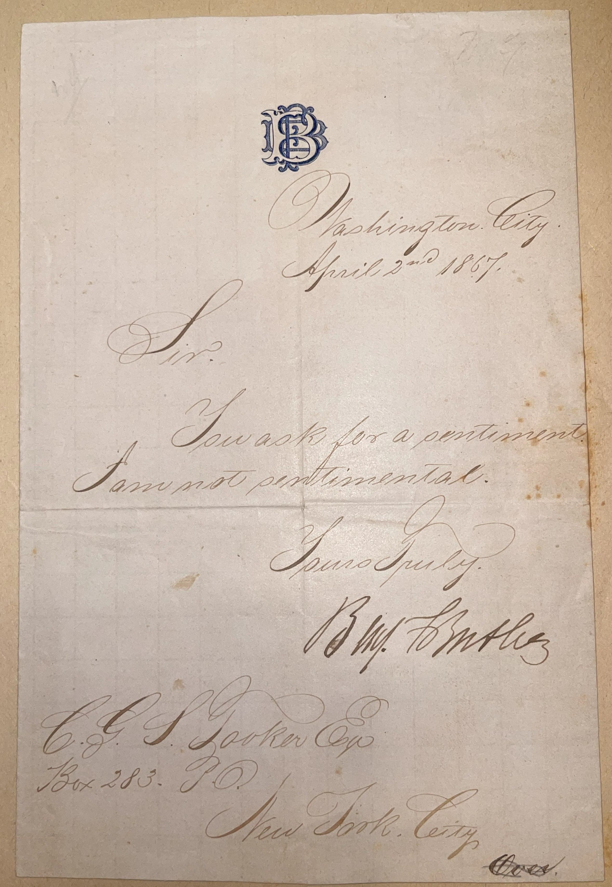

# 🖋️ Benjamin F. Butler - Letter (1893)

---

## 📜 Transcription

Washington City,

April 22nd 1867.

Sir.

You ask for a sentiment. I am not sentimental.

Yours Truly,

B.F. Butler

C.H. Gordon Esq

Box 233, P.O.

New York City
---

## 📚 Benjamin F. Butler

**Benjamin Franklin Butler (1818–1893)**, the author of this letter, was a polarizing figure in American history, known for his roles as a Union major general during the Civil War, a politician, and a lawyer, born on November 5, 1818, in Deerfield, New Hampshire. Raised in Lowell, Massachusetts, Butler graduated from Waterville College (now Colby College) in 1838 and built a successful legal career defending working-class clients, which shaped his early political alignment with the Democratic Party. His military career began with the Massachusetts militia, where he rose to brigadier general by 1855, and during the Civil War, he gained prominence as one of the first volunteer major generals appointed by President Lincoln in 1861. Butler’s “Contraband Decision” at Fort Monroe in 1861 allowed fugitive slaves to seek refuge with Union forces, a pivotal step toward emancipation, though his controversial tenure as military governor of New Orleans in 1862—where he issued the infamous “Woman Order” and earned the nickname “Beast Butler” from Southerners—cemented his reputation as a ruthless administrator. His military record was mixed, with failures at Big Bethel and Fort Fisher leading to his removal from command in 1865.

After the war, Butler transitioned to politics as a Radical Republican, serving in the U.S. House of Representatives from 1867 to 1875 and again from 1877 to 1879, where he played a leading role in the impeachment of President Andrew Johnson in 1868, though his performance as a prosecutor was criticized as subpar. The letter, written on April 22, 1867, from Washington, D.C., captures Butler at the start of his congressional career, reflecting his characteristically blunt demeanor in response to a request for a sentiment. Butler later authored the initial version of the Civil Rights Act of 1871 (Ku Klux Klan Act) and served as governor of Massachusetts in 1882, after switching back to the Democratic Party and running unsuccessfully for president in 1884 as the Greenback-Labor candidate. He died on January 11, 1893, in Washington, D.C., leaving a complex legacy as a champion of labor and civil rights, yet a figure often criticized for questionable financial dealings during the war and his heavy-handed governance.

---

## 🔗 Return to [Index](index.md)
