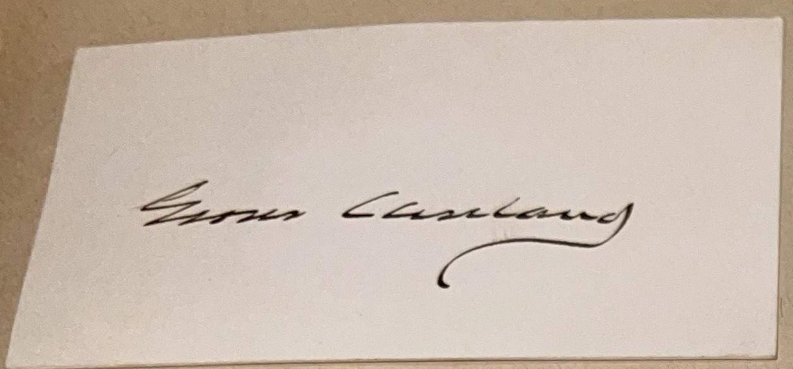
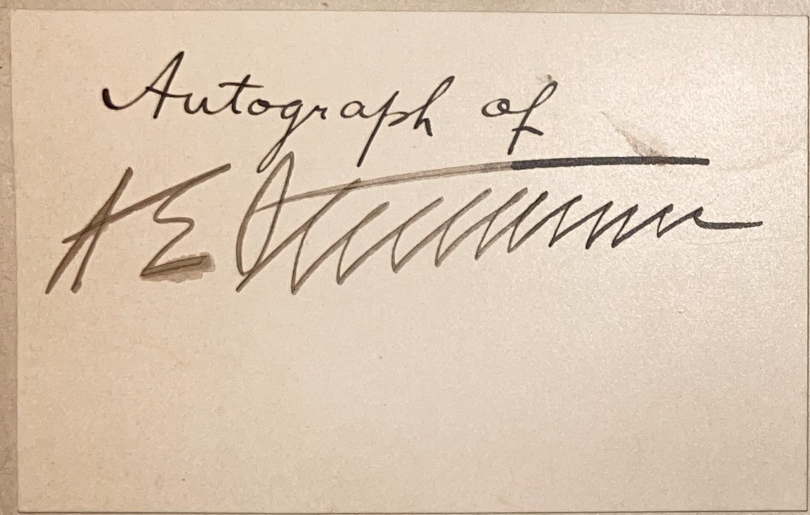
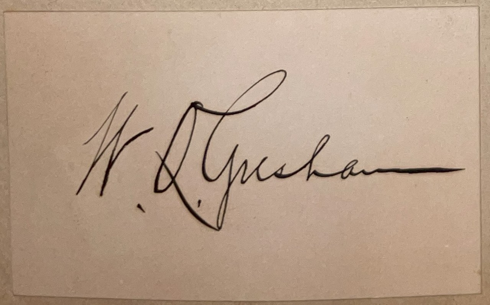
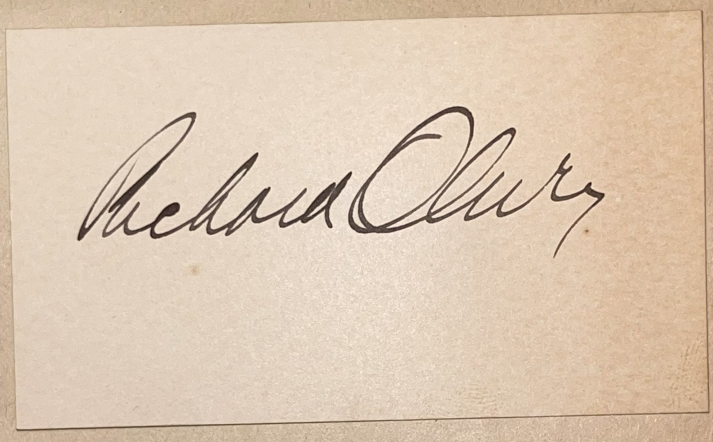
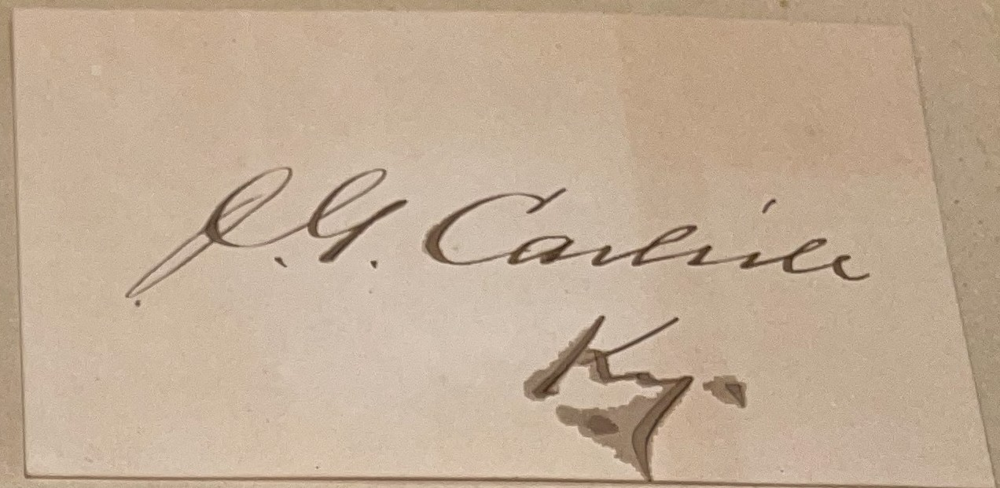
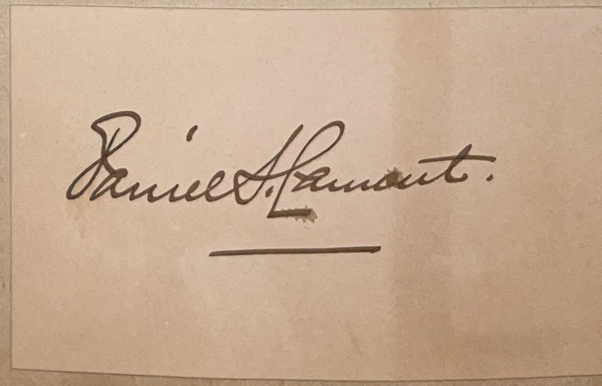
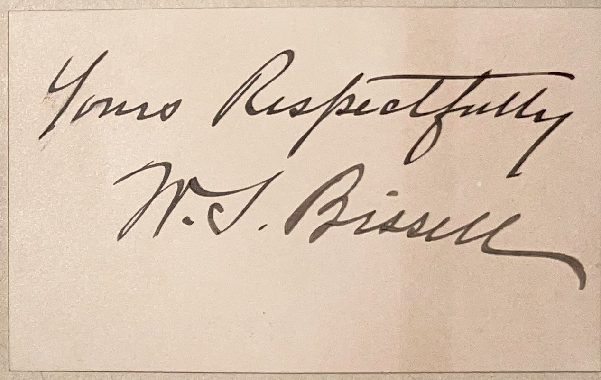
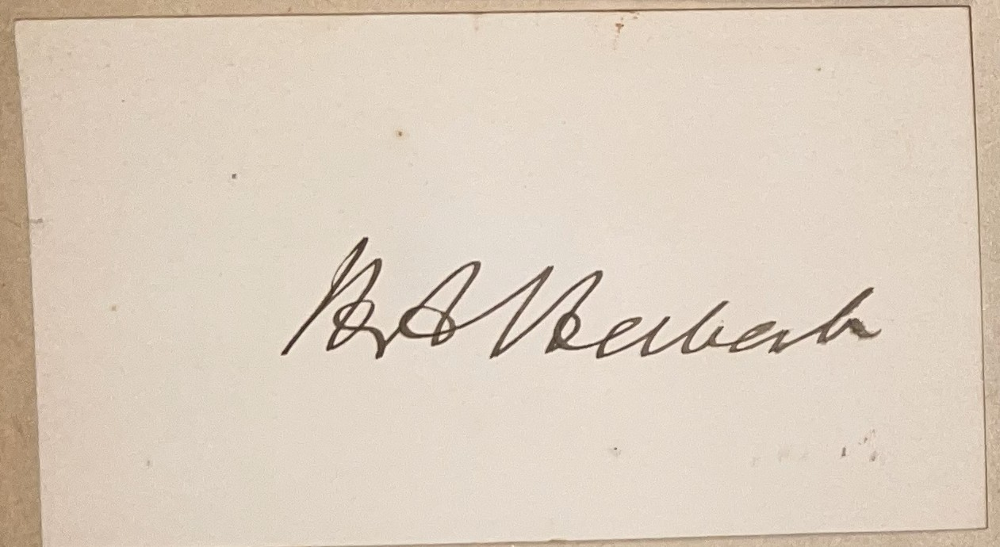
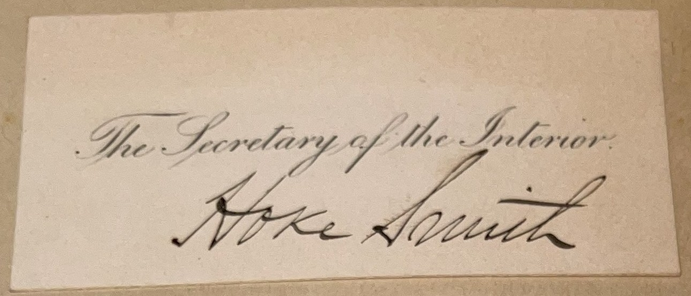
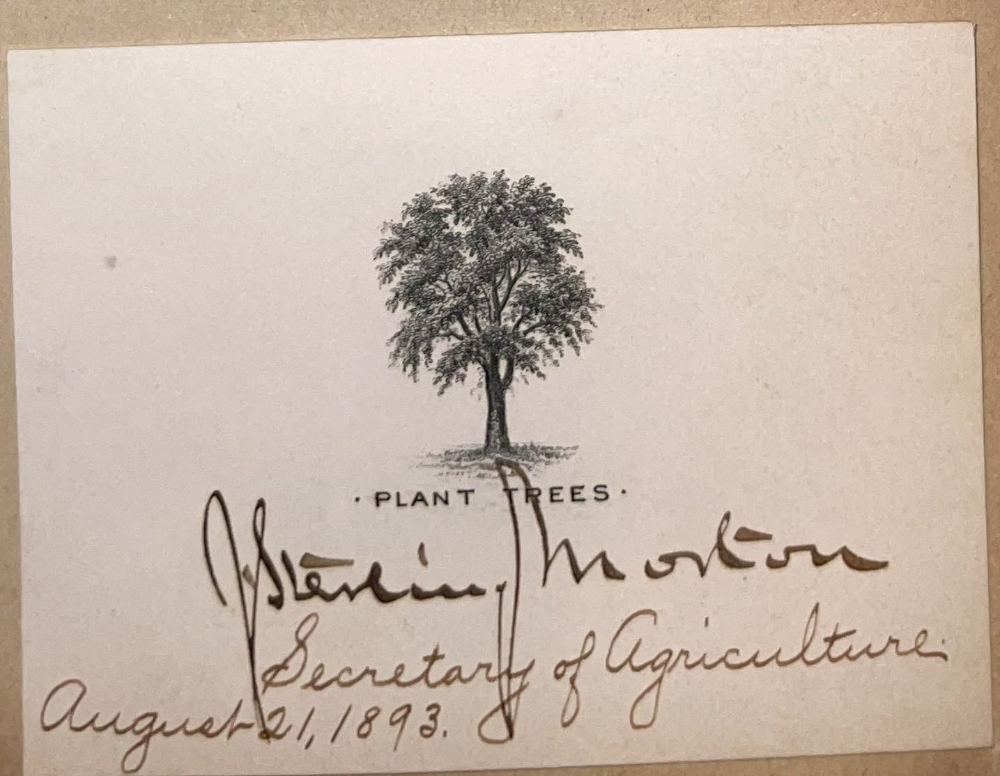

# 🖋️ Grover Cleveland and His 1893 Cabinet - Signatures

## 📜 Signatures and Descriptions

This page features the signatures of Grover Cleveland and his complete cabinet from his second term in 1893, likely collected by C. W. Mills as part of his efforts to gather autographs from prominent figures of the era. Below, each signature is displayed alongside a brief description of the individual’s role and contributions during Cleveland’s administration.

---

## 📚 Grover Cleveland and His 1893 Cabinet

  
  

    <strong>Grover Cleveland (1837–1908)</strong> was the 22nd and 24th president of the United States, serving two non-consecutive terms from 1885 to 1889 and 1893 to 1897, making him the only U.S. president to achieve this feat until Donald Trump in 2024. In 1893, at the start of his second term, Cleveland was 56 years old, returning to the White House after defeating Benjamin Harrison in the 1892 election. A Democrat known for his honesty and fiscal conservatism, Cleveland faced immense challenges during his second term, including the Panic of 1893, which triggered a severe economic depression with widespread unemployment and business failures. His decision to repeal the Sherman Silver Purchase Act of 1890, which he blamed for the economic crisis, split the Democratic Party, alienating western and southern Democrats who favored free silver. Cleveland also intervened in the 1894 Pullman Strike, sending federal troops to Chicago to break the strike, a move that angered labor unions but earned him support from the business community. Despite his unpopularity by the end of his term, Cleveland’s commitment to limited government and anti-corruption principles left a lasting legacy as a principled leader during the Gilded Age.
  

### Cabinet Members

  
  

    <strong>Vice President: Adlai E. Stevenson I (1893–1897)</strong> 
    Adlai E. Stevenson I, a former U.S. Congressman from Illinois, served as Cleveland’s vice president during his second term, having previously been First Assistant Postmaster General in Cleveland’s first administration. A moderate Democrat, Stevenson supported free silver, which put him at odds with Cleveland’s gold standard policies, but he played a largely ceremonial role, presiding over the Senate during a tumultuous economic period.
  

  
  

    <strong>Secretary of State: Walter Q. Gresham (1893–1895)</strong> 
    Walter Q. Gresham, a former federal judge and Republican who switched to the Democratic Party, served as Secretary of State until his death in 1895. He supported Cleveland’s anti-imperialist stance, notably opposing the annexation of Hawaii after the 1893 coup against Queen Liliuokalani, and focused on maintaining peaceful foreign relations during a time of domestic economic crisis.
  

  
  

    <strong>Secretary of State: Richard Olney (1895–1897)</strong> 
    Richard Olney, a Boston lawyer and former Attorney General, became Secretary of State after Gresham’s death, serving from 1895 to 1897. Known for his assertive foreign policy, Olney played a key role in the 1895 Venezuela Crisis, invoking the Monroe Doctrine to mediate a boundary dispute with Britain, and supported Cleveland’s intervention in the Pullman Strike, reflecting his pro-business stance.
  

  
  

    <strong>Secretary of the Treasury: John G. Carlisle (1893–1897)</strong> 
    John G. Carlisle, a former Speaker of the U.S. House from Kentucky, was Secretary of the Treasury during Cleveland’s second term, managing the economic fallout of the Panic of 1893. A staunch advocate of the gold standard, Carlisle worked with Cleveland to repeal the Sherman Silver Purchase Act and secure a controversial loan from J.P. Morgan to replenish the Treasury’s gold reserves, actions that alienated many Democrats.
  

  
  

    <strong>Secretary of War: Daniel S. Lamont (1893–1897)</strong> 
    Daniel S. Lamont, a close ally of Cleveland who had served as his private secretary during his first term, was Secretary of War throughout the second term. Lamont oversaw military affairs during a relatively peaceful period, focusing on administrative efficiency, and supported Cleveland’s decision to deploy federal troops to suppress the 1894 Pullman Strike, ensuring the continuity of mail delivery.
  

  
  

    <strong>Attorney General: Richard Olney (1893–1895)</strong> 
    Richard Olney served as Attorney General before becoming Secretary of State, bringing his legal expertise to Cleveland’s administration during the early years of the economic crisis. He was instrumental in obtaining an injunction against the Pullman Strike, arguing it disrupted interstate commerce, a move that facilitated federal intervention but drew criticism from labor groups.
  

  
  

    <strong>Postmaster General: Wilson S. Bissell (1893–1895)</strong> 
    Wilson S. Bissell, a Buffalo lawyer and longtime friend of Cleveland, served as Postmaster General until 1895, when he resigned due to health issues. He worked to improve postal efficiency during the economic downturn, but his tenure was marked by controversy over patronage disputes within the Democratic Party.
  

  
  

    <strong>Secretary of the Navy: Hilary A. Herbert (1893–1897)</strong> 
    Hilary A. Herbert, a former Confederate officer and U.S. Congressman from Alabama, served as Secretary of the Navy, advocating for naval expansion during a period of growing U.S. global ambitions. He oversaw the modernization of the fleet, including the construction of new battleships, aligning with the era’s emphasis on naval power as a tool of national prestige.
  

  
  

    <strong>Secretary of the Interior: Hoke Smith (1893–1896)</strong> 
    Hoke Smith, a Georgia lawyer and newspaper publisher, served as Secretary of the Interior until 1896, focusing on land management and Native American affairs. He supported Cleveland’s conservation efforts but faced criticism for his handling of railroad land grants and resigned to run for governor of Georgia, where he later became a prominent segregationist.
  

  
  

    <strong>Secretary of Agriculture: Julius Sterling Morton (1893–1897)</strong> 
    Julius Sterling Morton, a Nebraska politician and founder of Arbor Day, served as Secretary of Agriculture, promoting scientific farming and conservation during the economic crisis. He opposed direct federal aid to farmers, aligning with Cleveland’s fiscal conservatism, and focused on improving agricultural education and efficiency.
  

---

## 🔗 Return to [Index](index.md)