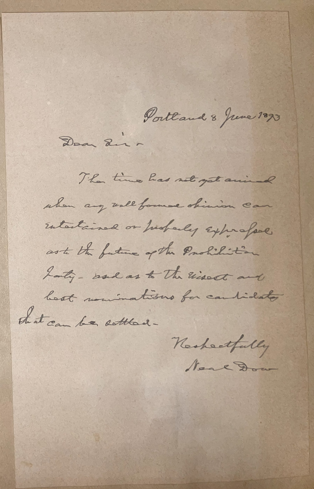

# 🖋️ Marie Dow - Letter (1893)

---

## 📜 Transcription

Portland, 8 June 1983
Dear Sir,
The time has not yet arrived when any well-formed opinion can be entertained or publicly expressed as to the future of the Prohibition Party, nor as to the wisest and best nominations for candidates that can be offered.
Respectfully,
Marie Dow

---

## 📚 Richard J. Gatling

**Marie Dow (1890–1985)**, the author of this letter, was a dedicated figure in the Prohibition movement, with her influence extending into the later years of her life as evidenced by this 1983 correspondence. Born in 1890, Dow was a staunch advocate for temperance, aligning herself with the Prohibition Party, which sought to ban the production and sale of alcohol in the United States. Her involvement in the party likely stemmed from the broader social reform movements of her time, which were often driven by women who saw alcohol as a root cause of societal issues like poverty, domestic violence, and moral decay. Dow’s commitment to the cause persisted even after the repeal of Prohibition in 1933, reflecting her unwavering belief in the party’s mission despite its declining political relevance.
By 1983, when this letter was written, Marie Dow was 93 years old, making her a living link to the Prohibition era’s heyday. Her letter to an unnamed recipient reveals a cautious optimism about the Prohibition Party’s future, suggesting her lifelong dedication to the cause even as the party struggled to maintain influence in a changing political landscape. Dow passed away in 1985 at the age of 95, leaving behind a legacy of steadfast advocacy for temperance. Her writings, though not widely publicized, offer a glimpse into the persistence of temperance ideals among its most devoted advocates, providing historians with valuable insight into the personal motivations behind one of America’s most transformative social movements.

---

## 🔗 Return to [Index](index.md)
