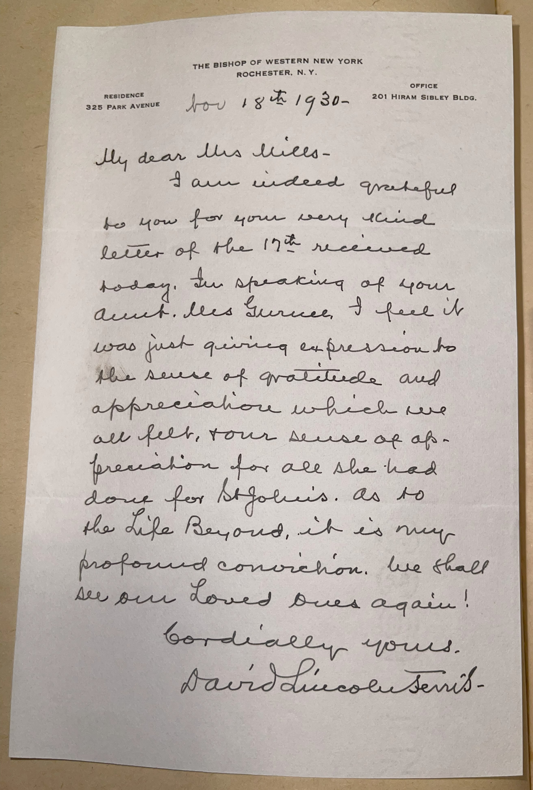

# 🖋️ David Lincoln Ferris - Letter (1930)

---

## 📜 Transcription

**Letter (November 18, 1930):**  

Nov 18ᵗʰ 1930  
THE BISHOP OF WESTERN NEW YORK  
ROCHESTER, N. Y.  

My dear Mrs. Mills—  

I am indeed grateful to you for your very kind letter of the 17ᵗʰ received today. In speaking of your Aunt, Mrs. Gurnee, I feel I was just giving expression to the sense of gratitude and appreciation which we all felt, your sense of appreciation for all she had done for St. John’s.  

As to the Life Beyond, it is my profound conviction. We shall see our Loved Ones again!  

Cordially yours,  
David Lincoln Ferris  

---

## 📚 David Lincoln Ferris

**David Lincoln Ferris (1864–1947)** was an American Episcopal bishop, serving as the Bishop of Western New York from 1929 to 1931 and previously as the Bishop of Rochester from 1924 to 1929. In 1930, when this letter was written, Ferris was 66 years old, stationed in Rochester, New York, as indicated by his letterhead, and nearing the end of his tenure as Bishop of Western New York. The letter, addressed to a Mrs. Mills, expresses gratitude for her kind words and reflects Ferris’ pastoral role, offering spiritual comfort regarding the afterlife.

Born on December 22, 1864, in Peekskill, New York, Ferris graduated from Trinity College in Hartford, Connecticut, in 1887 and later attended Berkeley Divinity School, where he was ordained as a priest in 1892. He served in various parishes in New York and Pennsylvania before becoming rector of Christ Church in Rochester in 1902, a position he held until his election as Bishop Coadjutor of Western New York in 1920. Ferris became the Bishop of Rochester in 1924, overseeing the diocese during a period of growth, and in 1929, he was elected Bishop of Western New York, a role that expanded his oversight to include the broader region. Known for his dedication to social service, Ferris was instrumental in establishing community programs and supporting church initiatives, such as those at St. John’s, mentioned in the letter. In this letter, written on November 18, 1930, Ferris responds to Mrs. Mills, thanking her for her letter and acknowledging her aunt, Mrs. Gurnee, for her contributions to St. John’s, likely a church or charitable institution in the diocese. Ferris also offers spiritual reassurance, affirming his belief in the afterlife with the statement, “We shall see our Loved Ones again!” Written in 1930, during the early years of the Great Depression, this letter captures Ferris’ role as a compassionate spiritual leader, providing comfort and gratitude amidst challenging times. Ferris retired in 1931 due to health issues but continued to serve in an emeritus capacity until his death on June 9, 1947, in Rochester, leaving a legacy of service and faith in the Episcopal Church.

---

## 🔗 Return to [Index](index.md)