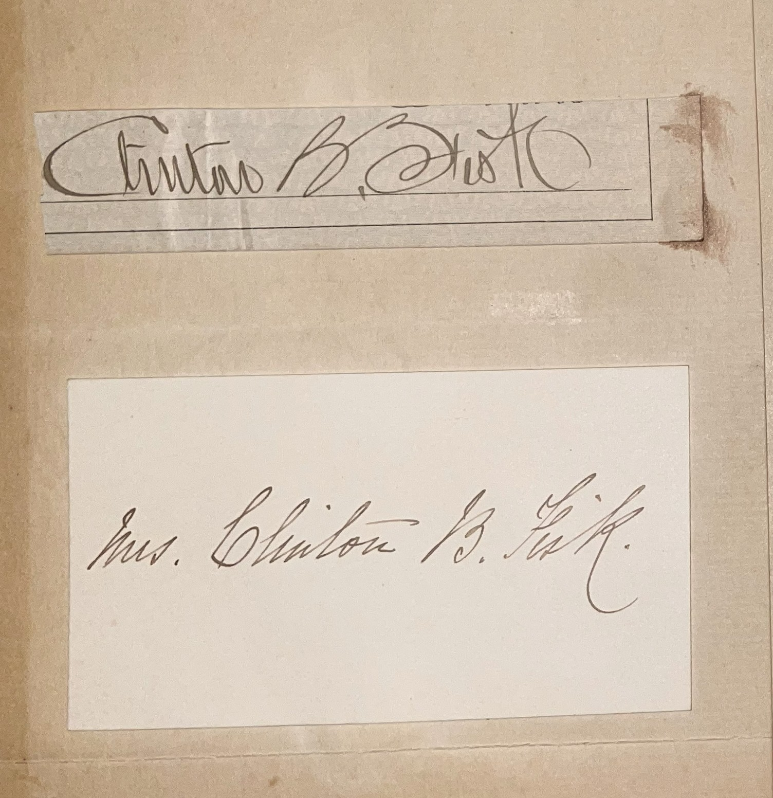

# 🖋️ Clinton B. Fisk - Signature

---

## 📚 Clinton B. Fisk

**Clinton Bowen Fisk (1828–1890)** was a notable American figure during the late 19th century. He was a Union general during the American Civil War, serving with distinction in the Western Theater. After the war, Fisk became deeply involved in Reconstruction efforts, working with the Freedmen’s Bureau to support newly freed African Americans. He was a staunch advocate for education and played a key role in founding Fisk University in Nashville, Tennessee, in 1866, an institution dedicated to the education of African Americans. Fisk was also a prominent prohibitionist, running as the Prohibition Party’s presidential candidate in 1888. A devout Methodist, his commitment to social reform and education left a lasting legacy, particularly through Fisk University, which remains a leading historically Black university today.

The signature of "Mrs. Clinton B. Fisk" likely refers to his wife, Lucy Fisk, who supported her husband’s endeavors, though less is documented about her individual contributions.

---

## 🔗 Return to [Index](index.md)
