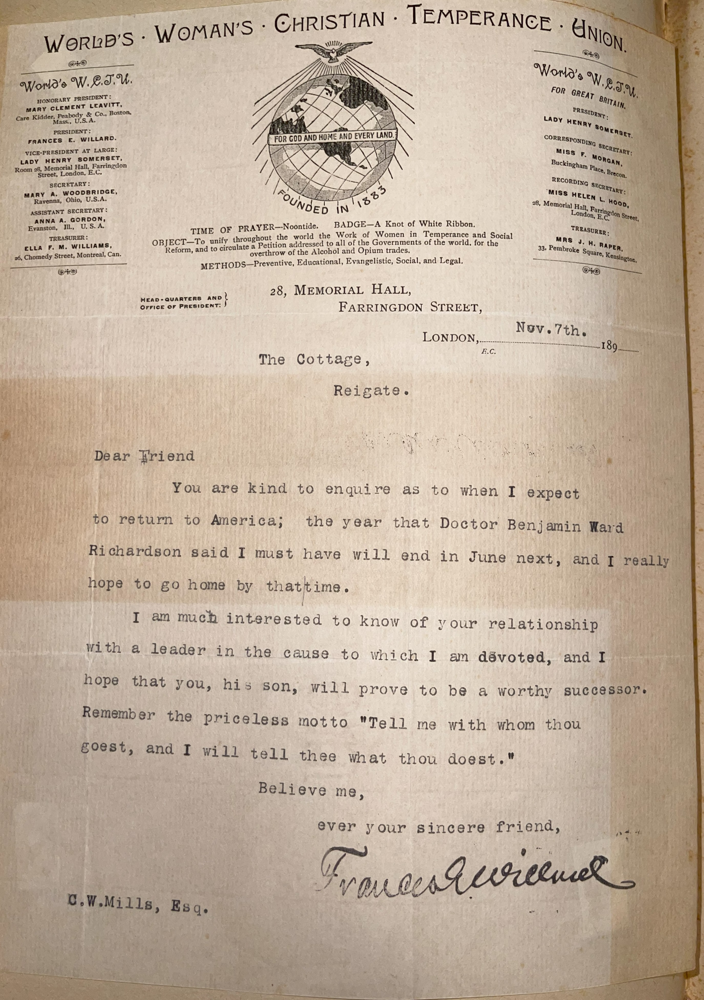

# 🖋️ Frances Willard - Letter (1893)

---

## 📜 Transcription

**Letter (November 7, 1893):**  

WORLD'S WOMAN'S CHRISTIAN TEMPERANCE UNION  
28, Memorial Hall, Farringdon Street, London, E.C.  
Nov. 7th  
The Cottage, Reigate  

Dear Friend,  

You are kind to enquire as to when I expect to return to America; the year that Doctor Benjamin Ward Richardson said I must have will end in June next, and I really hope to go home by that time.  

I am much interested to know of your relationship with a leader in the cause to which I am devoted, and I hope that you, his son, will prove to be a worthy successor. Remember the priceless motto "Tell me with whom thou goest, and I will tell thee what thou doest."  

Believe me,  
ever your sincere friend,  
Frances Willard  

C.W. Mills, Esq.  

---

## 📚 Frances Willard

**Frances Willard (1839–1898)** was a leading American educator, temperance reformer, and women’s rights activist, best known as the president of the Woman’s Christian Temperance Union (WCTU), which she transformed into a global force for social reform. Born on September 28, 1839, in Churchville, New York, Willard grew up in a Methodist family and was educated at the North Western Female College in Evanston, Illinois, where she later became a professor and dean. In 1874, she joined the temperance movement, co-founding the WCTU, and was elected its president in 1879, a position she held until her death. Under her leadership, the WCTU expanded its mission beyond prohibition to include women’s suffrage, labor rights, education reform, and social purity, adopting the motto “Do Everything” to reflect its broad agenda. Willard’s advocacy for women’s suffrage was particularly significant; she argued that women needed the vote to protect their homes and families from the harms of alcohol, a strategy known as “Home Protection” that helped bridge temperance and suffrage movements.

Willard was also a prolific writer and speaker, authoring books like *Woman and Temperance* (1883) and delivering thousands of lectures across the U.S. and abroad. In 1883, she helped establish the World’s WCTU, extending the organization’s reach internationally, and by the 1890s, she was a global figure in the temperance movement. In 1892, Willard traveled to England for a health-related sabbatical, as advised by her physician, Dr. Benjamin Ward Richardson, a prominent British doctor and temperance advocate. She spent much of 1892–1893 in England, working with the World’s WCTU and staying in Reigate, a town south of London, where she wrote this letter.

The letter, dated November 7th and likely written in 1893 based on its alignment with Willard’s time in England and the context of C.W. Mills’ 1893–1894 correspondence campaign, was written from The Cottage in Reigate on World’s WCTU letterhead. Addressed to C.W. Mills, Esq., it responds to Mills’ inquiry about Willard’s return to America, noting that her year-long sabbatical, prescribed by Dr. Richardson, would end in June 1894, when she hoped to return home. Willard also expresses interest in Mills’ relationship to a temperance leader—possibly Mills’ father, given the reference to Mills as “his son”—and encourages him to follow in his father’s footsteps, citing a motto emphasizing the importance of good company: “Tell me with whom thou goest, and I will tell thee what thou doest.” This advice reflects Willard’s belief in moral influence and her role as a mentor to younger generations in the temperance cause. Written during a period of rest and international work, the letter captures Willard’s dedication to her global mission, even while abroad, and her personal warmth toward those connected to the temperance movement. Willard returned to the U.S. in 1894 and continued her activism until her death on February 17, 1898, in New York City, leaving a legacy as one of the most influential women of the 19th century, whose work advanced both temperance and women’s rights.

---

## 🔗 Return to [Index](index.md)