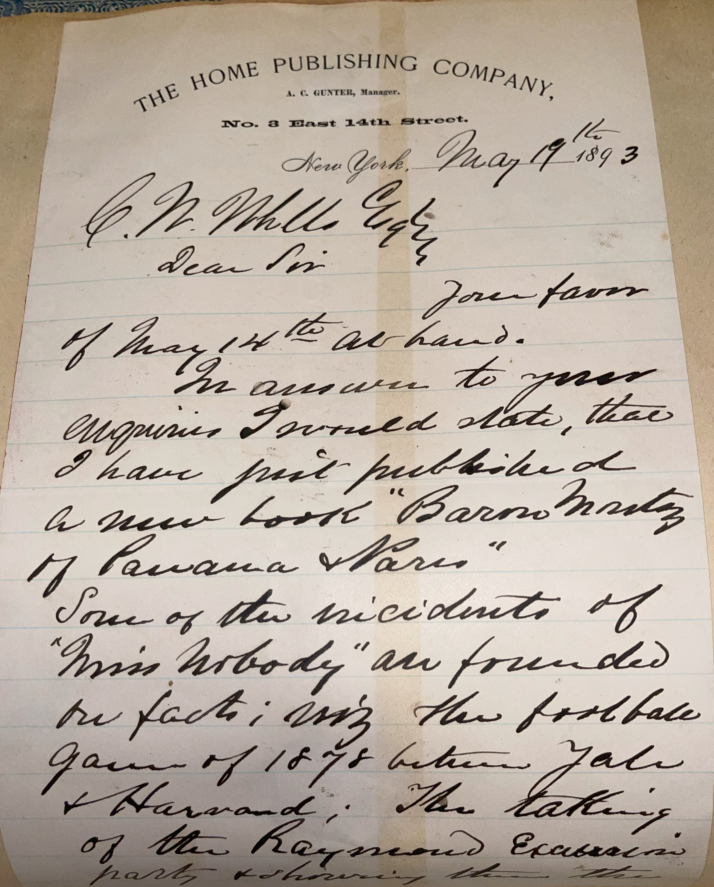
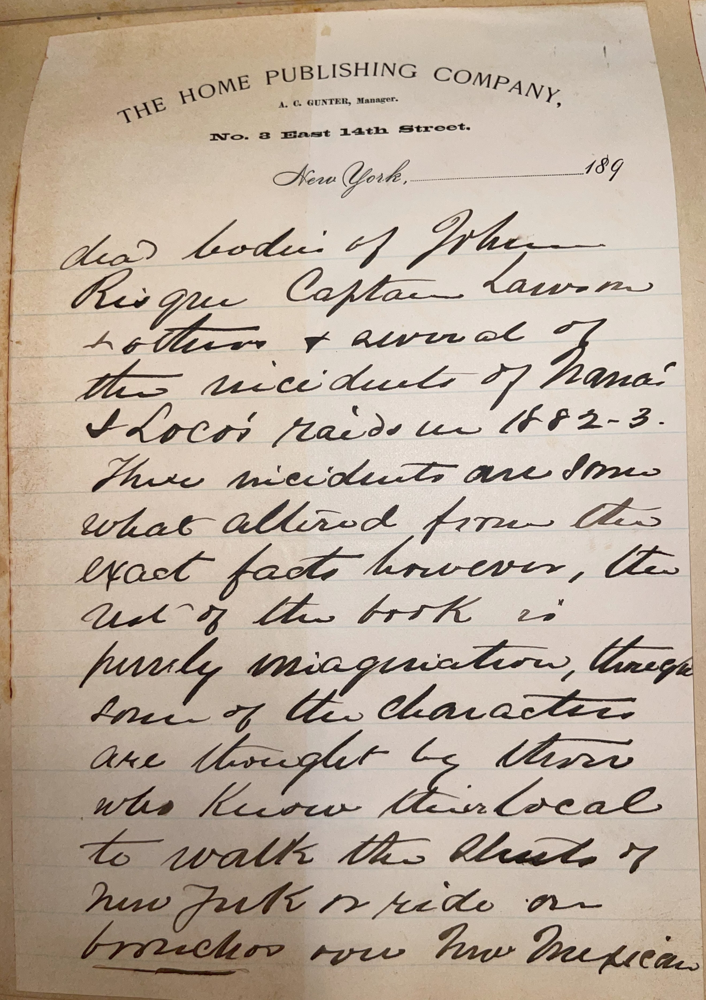
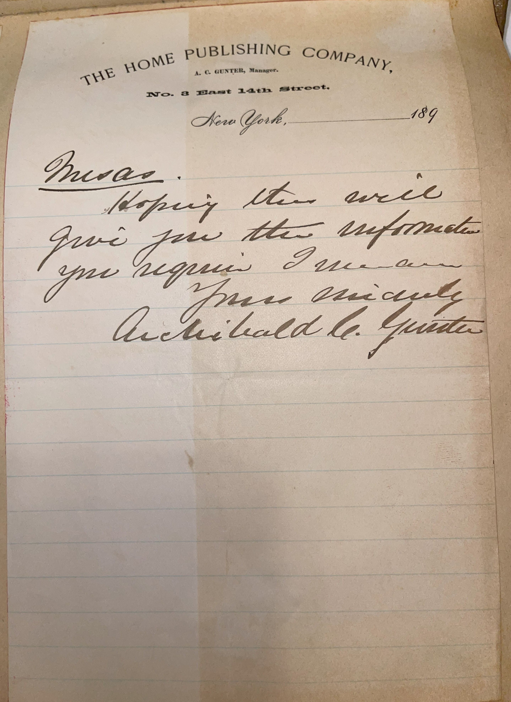

# 🖋️ Archibald Clavering Gunter - Letter (1893)

---

## 📜 Transcription

THE HOME PUBLISHING COMPANY,  
A. C. GUNTER, Manager.  
No. 8 East 14th Street,  
New York, May 9, 1893  

C. W. Mills Esq.  
Dear Sir:  

Dear Sir,

Your favor of May 14th is at hand.

In answer to your inquiries, I would state that I have just published a new book, "Baron Montez of Panama and Paris."

Some of the incidents of "Miss Nobody" are founded on fact; also the football game of 1878 between Yale & Harvard. The taking of the Raymond Excursion party and showing them dead bodies of John Risque, Captain Lawton Lothrop, & several of the incidents of Nana’s Loco’s raids in 1882-3.

These incidents are somewhat altered from the exact facts, however, the rest of the book is purely imagination, though some of the characters are thought by those who know their local to walk the streets of New York or ride on bronchos over New Mexican mesas. 

Hoping this will give you the information you require, I (?)

Yours sincerely,
Archibald C. Gunter

---

## 📚 Archibald Clavering Gunter

**Archibald Clavering Gunter (1847–1907)** was a popular American novelist, playwright, and publisher, best known for his 1887 bestseller *Mr. Barnes of New York*, which sold over a million copies and was adapted into a play and later a silent film. Born on October 25, 1847, in Liverpool, England, Gunter moved to the United States as a child, growing up in San Francisco. He began his career as a mining engineer in California but turned to writing in the 1870s, publishing his first novel, *Found the One and Lost the Other*, in 1876. His breakthrough came with *Mr. Barnes of New York*, a sensational tale of international intrigue that captured the public’s imagination, leading to a series of sequels and other adventure novels. Gunter’s works often featured exotic settings, dramatic plots, and a mix of romance and action, appealing to a wide audience in the late 19th century.

By May 9, 1893, when this letter was written, Gunter was 45 and at the height of his career, operating The Home Publishing Company at No. 8 East 14th Street, New York, which he founded to manage the distribution of his own books. In this letter, Gunter mentions his recent publication, *Baron Montez of Panama and Paris* (1893), and confirms that some incidents in *Miss Nobody* (1890) are based on real events, including the Yale vs. Harvard football game of 1879, an early milestone in American college football history (Yale won 1-0 on November 22, 1879, at Hamilton Park in New Haven). The “Raymond Excelsior Hotel,” which Gunter read about in 1882-3, likely inspired a setting in one of his novels, though he notes the incidents are altered and much of the book is “purely imagination.” He also references a character who traveled from New York to New Mexico for health reasons, a common practice in the 19th century for those seeking the dry climate to treat illnesses like tuberculosis. Written in 1893, during the Gilded Age and the year of the World’s Columbian Exposition in Chicago, this letter captures Gunter at the peak of his literary success, offering a glimpse into his creative process and his practice of blending real events into his fiction. Gunter continued writing and publishing until his death on February 24, 1907, in New York, leaving a legacy as a pioneer of popular fiction in America.

---

## 🔗 Return to [Index](index.md)