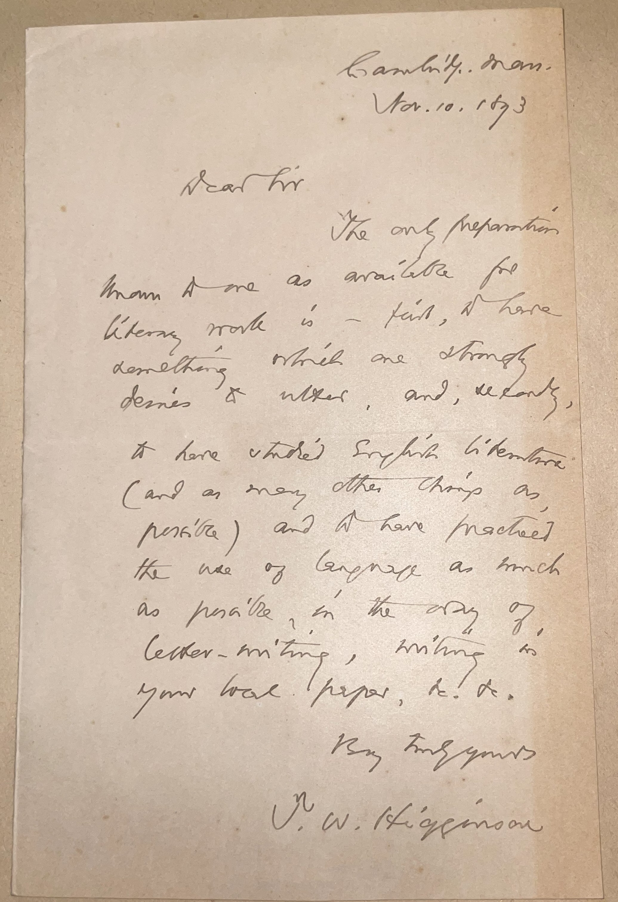

# 🖋️ Thomas Wentworth Higginson - Letter (1893)

---

## 📜 Transcriptions

Dublin, N.H.

Aug 12, 1893

Dear Sir

I learn to swim is a so much easier matter & try, is the best way to write for the press is to write for it. Of not at first accepted by the magazines, one can at least write for one’s local papers, and learn & make how to interest people and how to make one’s meaning clear. But all that one can do, on the way, in respect to gaining knowledge and elegant training, is a much clearer gain. There is a little book of mine, “Hints on Writing & Speechmaking,” which would help you. See O. Kappel, Boston, or Henry Holt & Co.

T.W. Higginson

## 📜

Cambridge, Mass.

Oct. 10, 1893

Dear Sir

The only preparation known to me as available for literary work is – first, a firm knowledge of what one strongly desires to write, and, secondly, to have studied English literature (and as many other things as possible) and to have mastered the use of English as much as possible in the way of letter-writing, writing to your local papers, &c. &c.

Very truly yours

T. W. Higginson

---

## 📚 Thomas Wentworth Higginson

**Thomas Wentworth Higginson (1823–1911)**, the author of these letters, was a prominent American Unitarian minister, abolitionist, writer, and soldier, born on December 22, 1823, in Cambridge, Massachusetts, into a family with deep New England roots. A graduate of Harvard College (1841) and Harvard Divinity School (1847), Higginson became a radical abolitionist, joining the Boston Vigilance Committee to protect fugitive slaves and serving as one of the "Secret Six" who funded John Brown’s 1859 raid on Harpers Ferry—an act that made him a target of federal authorities. His commitment to social justice extended to women’s rights; he was an early advocate for women’s suffrage and edited Woman’s Journal with Lucy Stone. Higginson also served as a colonel in the Civil War, leading the 1st South Carolina Volunteers, the first federally authorized Black regiment, an experience he chronicled in his memoir Army Life in a Black Regiment (1870). A prolific writer, he published essays, poetry, and books on history and literature, and is perhaps best known for mentoring Emily Dickinson, encouraging her poetry and preserving her work after her death, though his editorial changes to her poems remain a point of scholarly debate.

By August 12, 1893, when this letter was written from Dublin, New Hampshire, Higginson was 69 years old and a well-established literary figure, often spending summers in Dublin, a popular retreat for intellectuals. The letter, addressed to an unnamed recipient, offers practical advice on learning to write for the press, reflecting Higginson’s role as a mentor to aspiring writers—a role he played throughout his life, most notably with Dickinson. He suggests starting with local papers and recommends his own book, Hints on Writing & Speechmaking, showing his dedication to fostering clear communication and intellectual growth. Higginson continued writing and advocating for social causes until his death on May 9, 1911, in Cambridge, leaving a legacy as a bridge between 19th-century reform movements and literary culture, his work embodying the era’s progressive ideals while grappling with its contradictions, such as his complex views on race and gender.

---

## 🔗 Return to [Index](index.md)
