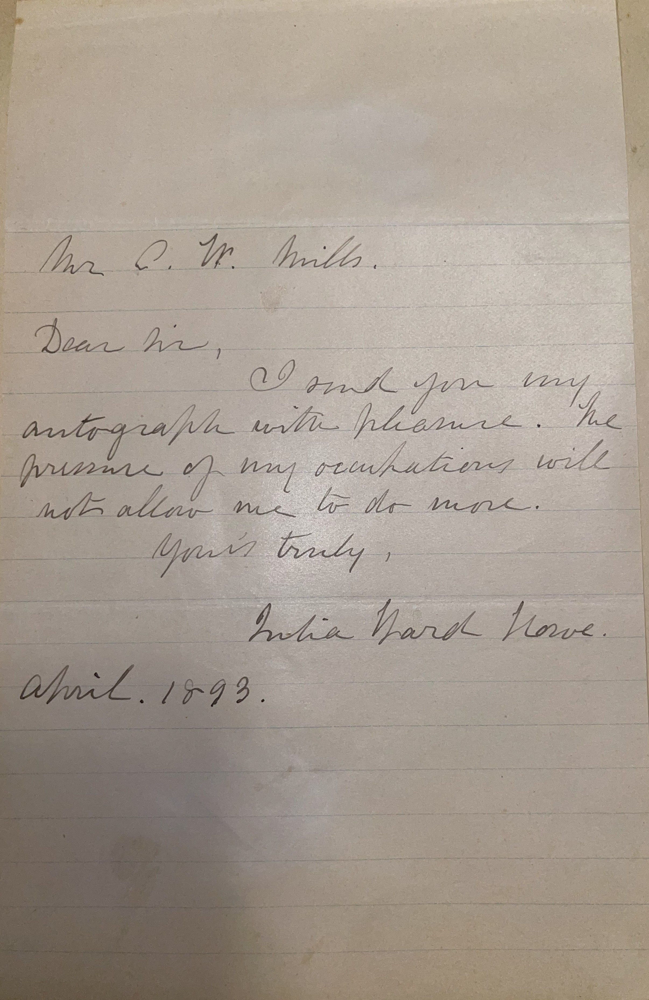

# 🖋️ Julia Ward Howe - Letter (1893)

---

## 📜 Transcription

Mr. C. W. Mills,  

Dear Sir,  

I send you my autograph with pleasure. The pressure of my occupations will not allow me to do more.  

Yours truly,  
Julia Ward Howe  

April, 1893.  

---

## 📚 Julia Ward Howe

**Julia Ward Howe (1819–1910)**, the author of this letter, was a renowned American poet, author, and social reformer, most famous for penning "The Battle Hymn of the Republic" in 1861, which became a defining anthem of the Union during the Civil War. Born on May 27, 1819, in New York City, Howe was the fourth of seven children in a wealthy family. Her father, Samuel Ward III, was a prominent Wall Street banker, and her mother, Julia Rush Cutler Ward, was a poet who died when Howe was five. Educated by private tutors, Howe developed a love for literature and languages early on, teaching herself multiple disciplines despite the restrictive norms for women at the time. In 1843, she married Samuel Gridley Howe, a physician and reformer who founded the Perkins School for the Blind, though their marriage was strained by his disapproval of her literary ambitions. They had six children, and Howe channeled her frustrations into writing, publishing her first poetry collection, *Passion-Flowers*, in 1854.

By April 1893, when this letter was written, Howe was 73 and a leading figure in social reform. She was a co-founder of the American Woman Suffrage Association (1869) and held leadership roles in the New England and Massachusetts Woman Suffrage Associations during the 1890s, advocating for women’s voting rights. A staunch abolitionist, she also worked with the U.S. Sanitary Commission during the Civil War and later championed international peace, issuing her "Mother’s Day Proclamation" in 1870 to call for a global women’s peace movement. Howe’s literary output was vast, including poetry, essays, travel books, and biographies like *Margaret Fuller* (1883). In 1893, she was likely in Boston, where she lived at 241 Beacon Street, balancing her activism with writing and speaking engagements. Her note to Mr. C. W. Mills reflects the autograph requests she often received, a testament to her fame. Howe continued her work until her death on October 17, 1910, in Newport, Rhode Island, leaving a legacy as a pioneer for women’s rights and a cultural icon, later becoming the first woman elected to the American Academy of Arts and Letters in 1908.
