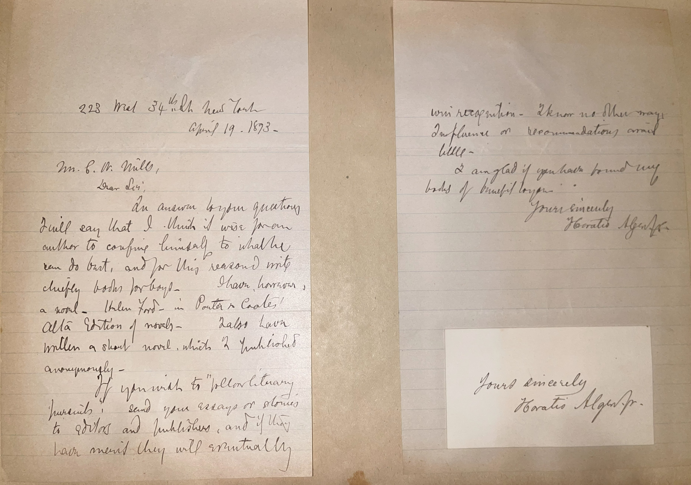

# 🖋️ Horatio Alger - Letter (1893)

---

## 📜 Transcription

228 West 34th New York

April 19, 1873.

Mr. C.W. Mills,

Dear Sir,

In answer to your inquiring I will say that I think it was from author to confine himself to what he can do best, and for this reason I am chiefly books for boys – Glen Morris, a novel – taken from – Porter & Coates, Alta Edition of novels – has been written a short novel, which I published anonymously – If you wish to “follow literary pursuits,” send your essays or stories to editors and publishers, and they have merit they will certainly win recognition – there is always an influence of recommendation amid titles – I am glad if you have found my books of high hopes.

Yours sincerely

Horatio Alger Jr.

---

## 📚 Horatio Alger

**Horatio Alger Jr. (1832–1899)**, the author of this letter, was a prolific American writer of the 19th century, best known for his "rags-to-riches" stories that became emblematic of the American Dream, born on January 13, 1832, in Chelsea, Massachusetts. The son of a Unitarian minister, Alger graduated from Harvard College in 1852 and briefly attended Harvard Divinity School, becoming a minister himself in 1864. However, his ministerial career ended abruptly in 1866 amid allegations of inappropriate behavior with young boys in his congregation in Brewster, Massachusetts, prompting him to leave the ministry and relocate to New York City. There, he reinvented himself as a writer, focusing on juvenile fiction that celebrated hard work, perseverance, and moral virtue. His most famous works, including Ragged Dick (1868) and the Luck and Pluck series, featured young protagonists—often poor or orphaned boys—who rose from poverty to middle-class respectability through diligence and good character, resonating with the era’s belief in self-made success.

By April 19, 1893, when this letter was written from New York City, Alger was 61 years old and nearing the end of his most productive writing period, having published the majority of his over 100 books. The letter, addressed to C.W. Mills, offers practical advice to an aspiring writer, reflecting Alger’s extensive experience in the literary world—he suggests focusing on one’s strengths, mentions his own works like Glen Morris (published by Porter & Coates), and encourages submitting to editors and publishers. Alger’s emphasis on merit aligns with the themes of his stories, though his personal life remained complex; he never married, lived frugally, and dedicated much of his time to mentoring young boys, often through charitable work with organizations like the Newsboys’ Lodging House in New York. Alger continued writing until his death on July 18, 1899, in Natick, Massachusetts, leaving behind a legacy of books that sold millions of copies, shaping the cultural narrative of American opportunity, though modern scholarship often critiques his formulaic plots and the idealized portrayal of social mobility in an era marked by stark inequality.

---

## 🔗 Return to [Index](index.md)
