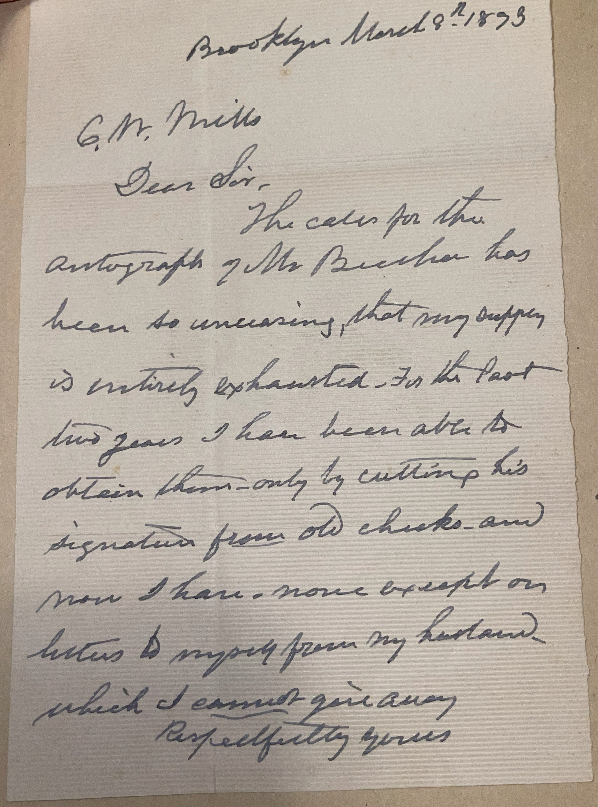
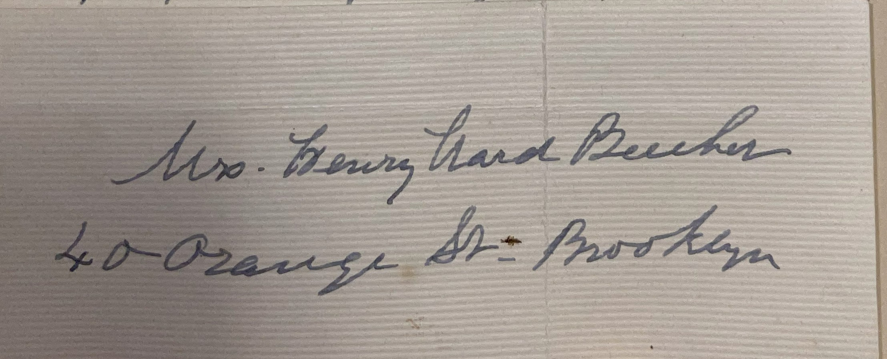

# 🖋️ Mrs. Henry Ward Beecher - Letter (1893)

---

## 📜 Transcription

Brooklyn March 8, 1893  

C. W. Mills  
Dear Sir:  

The calls for the autograph of Mr. Beecher has been so unceasing, that my supply is entirely exhausted. In the past two years I have been able to obtain them only by cutting his signature from old checks and now I have none except on letters & my own which I cannot give away.

Respectfully yours,
Mrs. Henry Ward Beecher  

---

## 📚 Eunice White Beecher

**Eunice White Beecher (1812–1897)** was the widow of **Henry Ward Beecher (1813-1887)**, a prominent American clergyman, abolitionist, and social reformer, known for his influential sermons as pastor of Plymouth Church in Brooklyn, New York. Born Eunice White Bullard on August 26, 1812, in West Sutton, Massachusetts, she married Henry in 1837, becoming a steadfast partner throughout his career. Together, they had eight children, four of whom survived to adulthood. Eunice managed their household and supported Henry’s ministry, often handling correspondence and public requests on his behalf.

By March 8, 1893, when this letter was written, Eunice was 80 and living in Brooklyn, having been a widow for six years following Henry’s death in 1887. In the letter, addressed to C. W. Mills, Eunice explains that the demand for Henry’s autograph remains “unceasing,” even years after his passing, to the point where her supply is exhausted. She notes that in the past two years (1891–1893), she had resorted to cutting signatures from old checks, but now has none left except those on personal letters, which she cannot part with, offering her own signature instead. Henry’s enduring fame as a religious and social leader—known for his abolitionist stance, support for women’s suffrage, and powerful oratory—explains the continued interest in his autograph. Written in 1893, during a period when Henry’s legacy remained strong, this letter highlights Eunice’s role as the guardian of his memory and the persistent public fascination with his autograph. Eunice continued to manage her husband’s legacy until her death on March 8, 1897—exactly four years to the day after writing this letter—in Stamford, Connecticut.

---

## 🔗 Return to [Index](index.md)