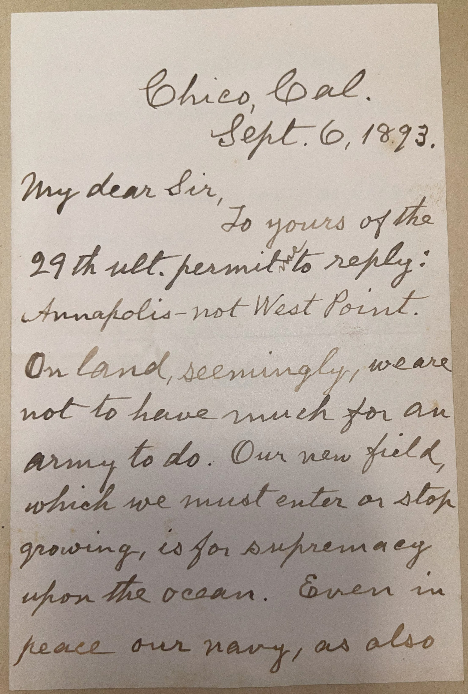
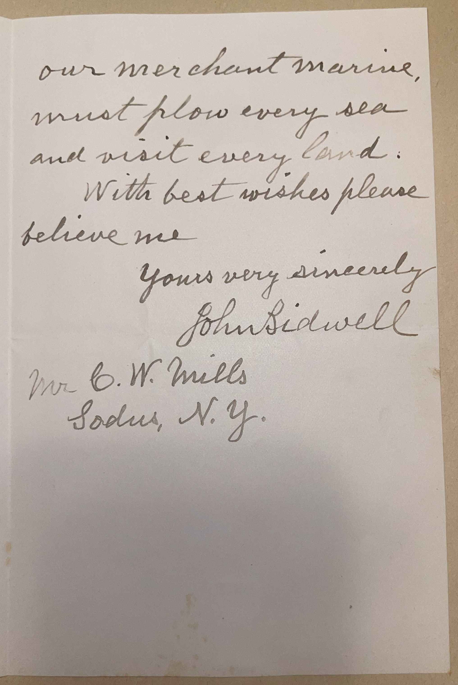

# 🖋️ John Bidwell - Letter (1893)

---

## 📜 Transcription

**Letter (September 6, 1893):**  

Chico, Cal.  
Sept. 6, 1893.  

My dear Sir,  
To yours of the 29th ult. permit me to reply:  
Annapolis—not West Point.  

On land, seemingly, we are not to have much for an army to do. Our new field, which we must enter or stop growing, is for supremacy upon the ocean. Even in peace our navy, as also our merchant marine,  
must plow every sea  
and visit every land.  

With best wishes please believe me  
Yours very sincerely,  
John Bidwell  

Mr. C. W. Mills  
Sodus, N.Y.  

---

## 📚 John Bidwell

**John Bidwell (1819–1900)** was an American pioneer, politician, and philanthropist, best known for his role in California’s early development and his contributions to agriculture and education. In 1893, when this letter was written, Bidwell was 74 years old, living in Chico, California, where he had established his Rancho Chico estate and become a prominent figure in the state’s history. The letter, addressed to C. W. Mills in Sodus, New York, responds to Mills’ inquiry about whether to attend the U.S. Naval Academy or West Point, reflecting Bidwell’s perspective on America’s military and economic future.

Born on August 5, 1819, in Chautauqua County, New York, Bidwell moved west as a young man, becoming one of the first American settlers to reach California in 1841 with the Bidwell-Bartleson Party, the first organized emigrant group to cross the Sierra Nevada. He played a key role in California’s early history, working for John Sutter, participating in the Bear Flag Revolt of 1846, and serving in the California State Senate after statehood in 1850. Bidwell also ran for governor of California in 1875 as a Prohibition Party candidate and served as a U.S. Congressman from 1865 to 1867. He founded the town of Chico in 1860, developing it into a thriving agricultural center, and his Rancho Chico became a model for sustainable farming, introducing crops like almonds and olives to the region. A committed philanthropist, Bidwell donated land for schools and churches, including what would later become California State University, Chico. In this letter, written from Chico on September 6, 1893, Bidwell responds to a query from Mills, who often wrote to prominent military figures asking whether to attend the U.S. Naval Academy in Annapolis, Maryland, or the U.S. Military Academy at West Point, New York. Bidwell advises, “Annapolis—not West Point,” and argues that America’s future lies in naval supremacy and maritime trade, stating, “Our new field, which we must enter or stop growing, is for supremacy upon the ocean,” a view that aligns with the era’s growing emphasis on naval power, as exemplified by Alfred Thayer Mahan’s *The Influence of Sea Power Upon History* (1890). Written in 1893, during a period of American expansion and debate over military priorities, this letter captures Bidwell’s forward-thinking vision for the nation’s role on the global stage, shaped by his own experiences as a pioneer and leader. Bidwell continued to live in Chico until his death on April 4, 1900, leaving a legacy as a pioneer who shaped California’s growth and development.

---

## 🔗 Return to [Index](index.md)