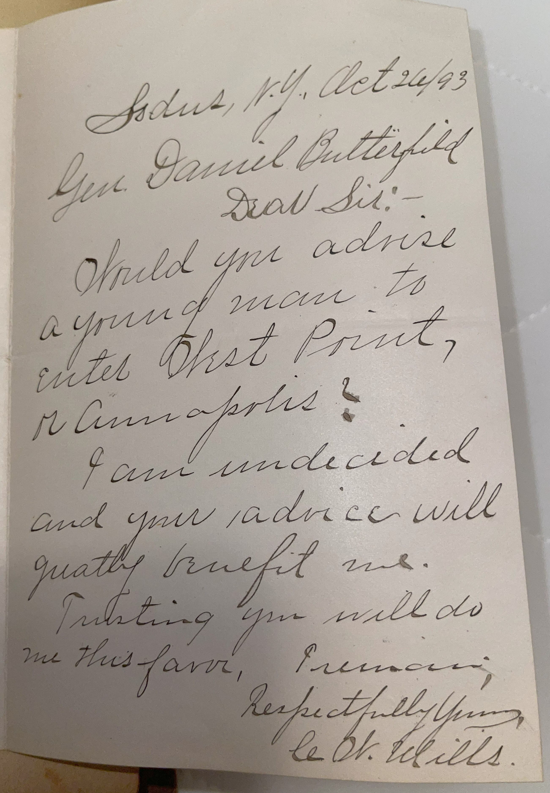
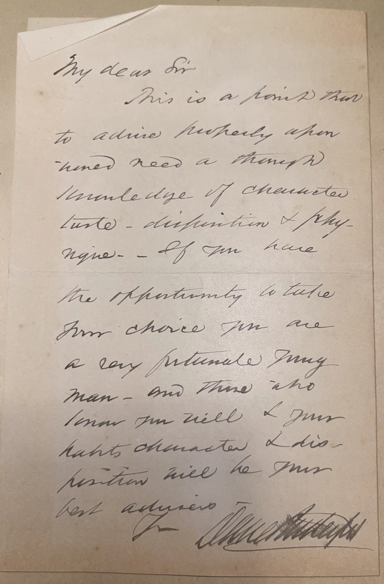

# 🖋️ Daniel Butterfield - Correspondence with C. W. Mills (1893)

---

## 📜 Transcription

### Letter from C. W. Mills to General Daniel Butterfield

Sodus, N.Y. Oct. 24/93

Gen. Daniel Butterfield  
Dear Sir:—  

Would you advise a young man to enter West Point or Annapolis?  

I am undecided and your advice will greatly benefit me.  

Trusting you will do me this favor,  

I remain,  
Respectfully yours,  
C. W. Mills  

---

### Response from General Daniel Butterfield to C. W. Mills

My dear Sir  

This is a point that to advise properly, one needs need a thorough knowledge of character, taste, disposition & physique—  

If you have the opportunity to take your choice you are a very fortunate young man—and those who know you well & your habits, character & disposition will be your best advisers.  

Yours,  
Daniel Butterfield  

---

## 📚 Daniel Butterfield

**Daniel Butterfield (1831–1901)** was a distinguished Union general during the American Civil War, known for his bravery and leadership in key battles such as Antietam, Fredericksburg, and Gettysburg, where he served as chief of staff to General Joseph Hooker. Born in Utica, New York, Butterfield had no formal military training before the war, having worked as a businessman in the American Express Company, but he quickly rose through the ranks due to his organizational skills and courage, earning the Medal of Honor in 1892 for his actions at the Battle of Gaines’ Mill in 1862. He is perhaps best remembered for composing the bugle call “Taps” in 1862, which became the standard call for military funerals and the end of the day in the U.S. Army. After the war, Butterfield held various positions, including superintendent of the U.S. Army’s recruiting service and assistant treasurer of the United States in New York, and remained a respected figure in military and civilian circles.

This correspondence, dated **October 24, 1893**, captures an exchange between **C. W. Mills** and Butterfield, initiated by Mills’ inquiry about whether a young man should attend the United States Military Academy at West Point or the United States Naval Academy at Annapolis. Mills sent this same letter to many prominent military members of the era, a recurring theme in a significant portion of his letter collection. The responses he received, including Butterfield’s, often weighed in on the choice between West Point and Annapolis, reflecting the prestige of these institutions during the Gilded Age as primary pathways for aspiring military officers. Butterfield’s reply, which emphasizes the importance of self-knowledge—character, taste, disposition, and physique—in making such a decision, became a valuable addition to Mills’ growing collection of autographs from notable figures of the time.

---

## 🔗 Return to [Index](index.md)