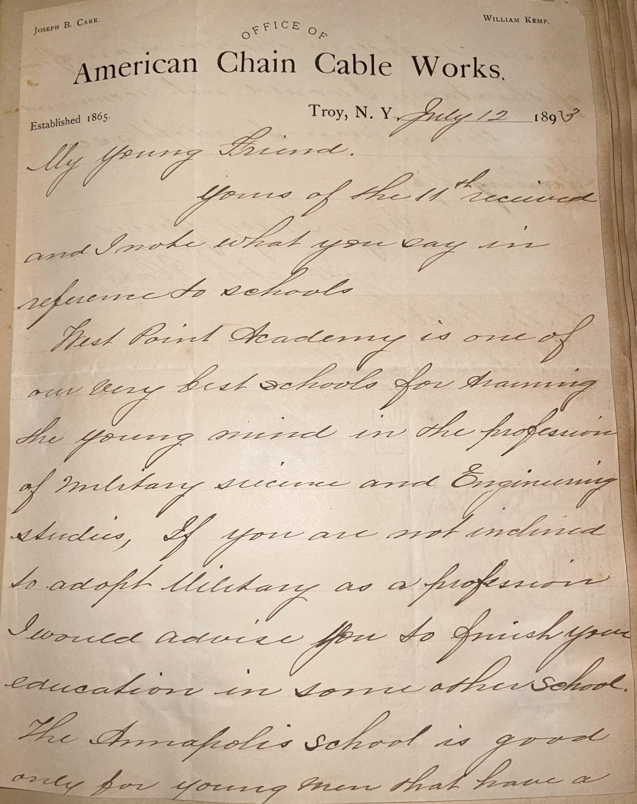
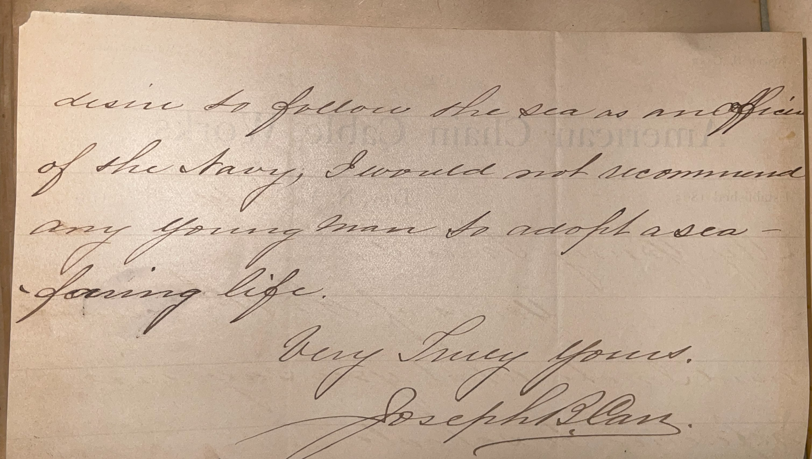

---

## 📜 Transcription

JOSEPH B. CARR.                    OFFICE OF                    WILLIAM KEMP.  
AMERICAN CHAIN CABLE WORKS.  
Established 1865.  
TROY, N.Y. July 12, 1893  

My young friend,  

Yours of the 11th received and I note what you say in reference to schools. West Point Academy is one of our very best schools for training the young mind in the profession of military science and Engineering studies. If you are not inclined to adopt military as a profession, I would advise you to qualify as an educator in some other school. The Annapolis School is good only for young men that have a desire to follow the seas and offices of the navy, I would not recommend any young man to adopt a sea-going life.  

Very truly yours,  
Joseph B. Carr.  

---

## 📚 Joseph B. Carr

**Joseph Bradford Carr (1828–1895)**, the author of this letter, was a Union general during the American Civil War and a successful businessman in the post-war years, born on August 16, 1828, in Albany, New York. Raised in a working-class family, Carr initially pursued a career in business, working as a tobacconist in Troy, New York, before his military service. He had a strong interest in military affairs from a young age, joining the New York State Militia in the 1850s and rising to the rank of colonel by the time the Civil War broke out in 1861.  

When the war began, Carr was appointed colonel of the 2nd New York Volunteer Infantry, a regiment he led with distinction in the early campaigns of the conflict. He saw action at the Battle of Big Bethel in June 1861, one of the war’s first engagements, and later served in the Peninsula Campaign of 1862 under General George B. McClellan. Promoted to brigadier general in September 1862, Carr commanded a brigade in the III Corps of the Army of the Potomac, participating in major battles such as Fredericksburg (December 1862) and Chancellorsville (May 1863). At the Battle of Gettysburg in July 1863, Carr’s brigade played a critical role in defending the Union left flank on the second day, holding positions near the Peach Orchard against fierce Confederate assaults. His leadership earned him praise, though he was later criticized for logistical issues during the battle. Carr was promoted to major general in 1864, but the promotion was not confirmed by the Senate, and he reverted to brigadier general. He continued to serve until the war’s end, commanding troops in the Department of the James during the final campaigns of 1865.  

After the war, Carr returned to Troy, New York, and transitioned into a successful business career. He became involved in the American Chain Cable Works, a company established in 1865 that manufactured chains and cables for industrial and maritime use, as indicated by the letterhead of this correspondence. By July 12, 1893, when this letter was written, Carr was 64 years old and a prominent figure in Troy’s business community. The letter, addressed to an unnamed “young friend,” responds to inquiries about educational paths, likely from a young man considering a career in the military or navy. Carr recommends West Point for those interested in military science and engineering but advises against a naval career, reflecting his own preference for land-based military service and perhaps a skepticism about the challenges of a “sea-going life.” His mention of the United States Naval Academy at Annapolis (referred to as “the Annapolis School”) and West Point underscores his familiarity with military education, likely drawn from his own militia experience and Civil War service.  

Carr’s post-war life was marked by civic engagement as well. He served as the Secretary of State of New York from 1879 to 1885, a position in which he oversaw elections and state records, and was active in veterans’ organizations, including the Grand Army of the Republic. He remained a respected figure in Troy until his death on February 24, 1895, at the age of 66, following a heart attack while traveling in New York City. Carr’s legacy is that of a steadfast Union officer who played a key role in some of the Civil War’s most pivotal battles, as well as a businessman and public servant who contributed to his community in the post-war era.  

---

## 🔗 Return to [Index](index.md)