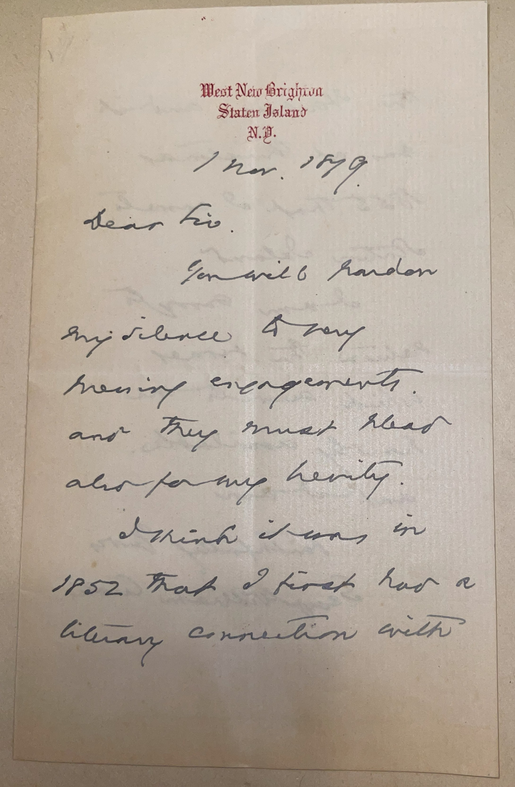
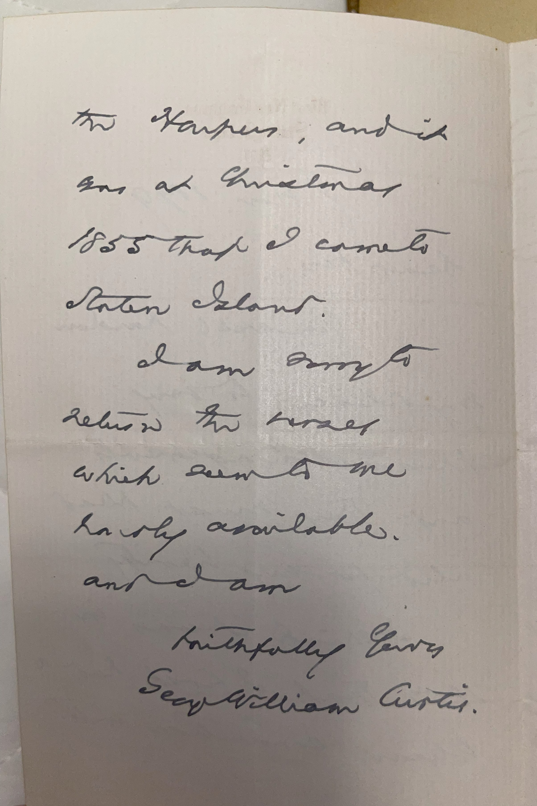

# 🖋️ George William Curtis - Letter (1879)

---

## 📜 Transcription

**Letter (November 1, 1879):**  

West New Brighton  
Staten Island  
N.Y.  
1 Nov. 1879  

Dear Sir,  

You will pardon my silence by my pressing engagements, and they must plead also for my brevity.  

I think it was in 1852 that I first had a literary connection with the Harpers, and it was at Christmas 1855 that I came to Staten Island.  

I am sorry to return the verses which seem to me hardly available.  

And I am  

Faithfully yours,  
George William Curtis  

---

## 📚 George William Curtis

**George William Curtis (1824–1892)** was a distinguished American writer, editor, and public speaker, renowned for his contributions to literature, journalism, and social reform during the 19th century. Born on February 24, 1824, in Providence, Rhode Island, Curtis grew up in a family that valued education and intellectual pursuits. As a young man, he was influenced by the transcendentalist movement, spending time at Brook Farm, a utopian community, in the 1840s, where he befriended Ralph Waldo Emerson and Nathaniel Hawthorne. Curtis began his literary career as a travel writer, publishing *Nile Notes of a Howadji* (1851) and *The Howadji in Syria* (1852) based on his journeys in the Middle East. He gained prominence as an essayist and editor, contributing to *Putnam’s Magazine* and later joining *Harper’s Weekly* in 1863, where he served as political editor for nearly three decades, writing the influential “Editor’s Easy Chair” column.

Curtis was also a passionate advocate for social reform, supporting abolition, women’s suffrage, and civil service reform. He was a founding member of the Republican Party and a delegate to the 1860 Republican National Convention that nominated Abraham Lincoln. During the Civil War, Curtis used his platform at *Harper’s Weekly* to advocate for emancipation and Union victory, and in the post-war era, he became a leading voice for civil rights, notably supporting the 15th Amendment and opposing corruption in government. His oratory skills made him a sought-after lecturer, and his books, such as *Prue and I* (1856), a collection of sentimental sketches, showcased his literary talent and moral sensibility.

In 1879, when this letter was written, Curtis was 55 years old and living in West New Brighton, Staten Island, where he had settled with his family in 1855, as noted in the letter. The letter, addressed to an unnamed “Dear Sir,” responds to a request for information about Curtis’s career and a submission of verses for publication. Curtis confirms that his literary connection with Harper & Brothers began around 1852, likely through his contributions to *Harper’s New Monthly Magazine*, and that he moved to Staten Island at Christmas 1855. He also returns the submitted verses, deeming them “hardly available” for publication—a reflection of his editorial role at *Harper’s Weekly*, where he often reviewed submissions. Unlike many letters in C.W. Mills’ collection, which were written to Mills in 1893–1894, this letter predates Mills’ correspondence campaign, as Mills would have been a child or not yet born in 1879. It was likely collected by Mills later as part of his effort to gather letters from notable figures, possibly due to Curtis’s prominence as a writer and reformer. Written during a period when Curtis was at the height of his influence, the letter captures his busy schedule and editorial duties, as well as his gracious yet candid approach to correspondence. Curtis continued his work as an editor and advocate until his death on August 31, 1892, in West New Brighton, leaving a legacy as a literary figure and a champion of social justice whose writings and speeches shaped public discourse in the Gilded Age.

---

## 🔗 Return to [Index](index.md)