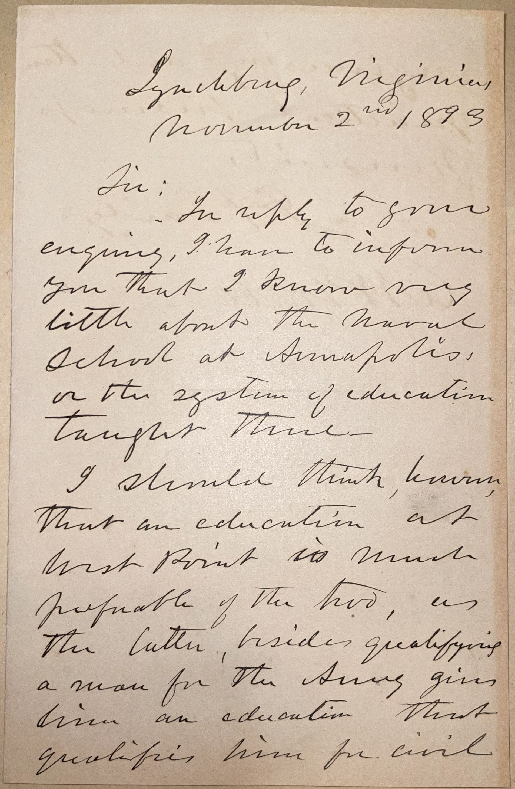
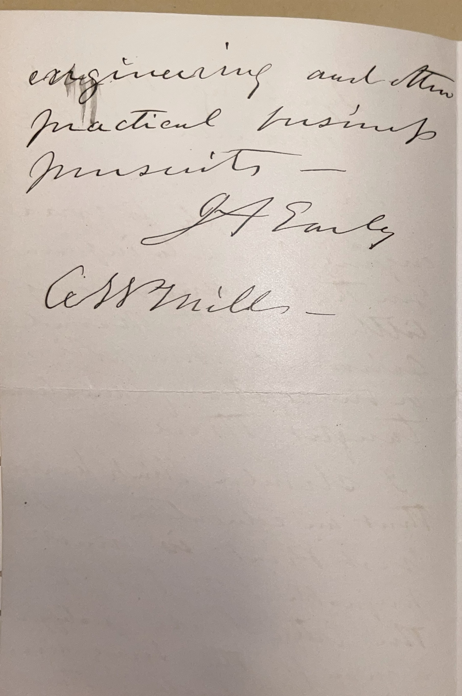

# 🖋️ Jubal Early - Letter (1893)

---

## 📜 Transcription

Lynchburg, Virginia  
November 2nd, 1893  

Sir:  

In reply to your enquiry, I have to inform you that I know very little about the Naval School at Annapolis, or the system of education taught there.  

I should think, however, that an education at West Point is much preferable of the two, as the latter, besides qualifying a man for the Army, gives him an education that qualifies him for civil engineering and other practical business pursuits.  

J.A. Early  

C.W. Mills—  

---

## 📚 Jubal Early

**Jubal Anderson Early (1816–1894)** was a Confederate general during the American Civil War, known for his aggressive tactics and leadership in the Army of Northern Virginia under General Robert E. Lee. Born in Franklin County, Virginia, Early graduated from the United States Military Academy at West Point in 1837, where he studied military engineering, before briefly serving in the Second Seminole War and then resigning to pursue a legal career. He returned to military service during the Civil War, rising to the rank of lieutenant general and leading key campaigns, including the 1864 Shenandoah Valley Campaign, where his forces threatened Washington, D.C., before being defeated by Union General Philip Sheridan. After the war, Early fled to Mexico and Canada, refusing to accept the Confederacy’s defeat, and later became a prominent advocate of the "Lost Cause" ideology, writing memoirs that defended the South’s actions and criticized Reconstruction. By 1893, Early was 77 years old and living in Lynchburg, Virginia, where he continued to practice law and write about the war.

This letter, dated **November 2, 1893**, is a response to an inquiry from **C. W. Mills**, a young man from Sodus, New York, who sent similar letters to many prominent military figures of the era, seeking advice on whether to attend West Point or Annapolis. Early’s reply reflects his familiarity with West Point, his alma mater, and his belief in its superior educational value, noting that it prepares a man not only for military service but also for practical civilian pursuits like civil engineering. The letter is one of many responses in Mills’ collection that weigh in on the choice between West Point and Annapolis, reflecting the prestige of these institutions during the Gilded Age as primary pathways for aspiring military officers.

---

## 🔗 Return to [Index](index.md)