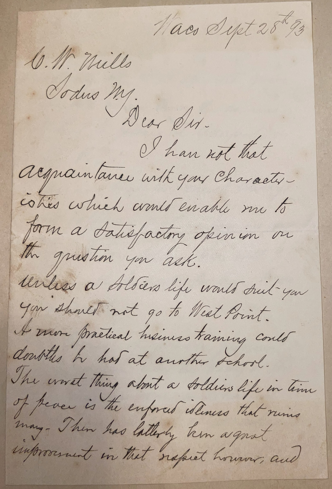
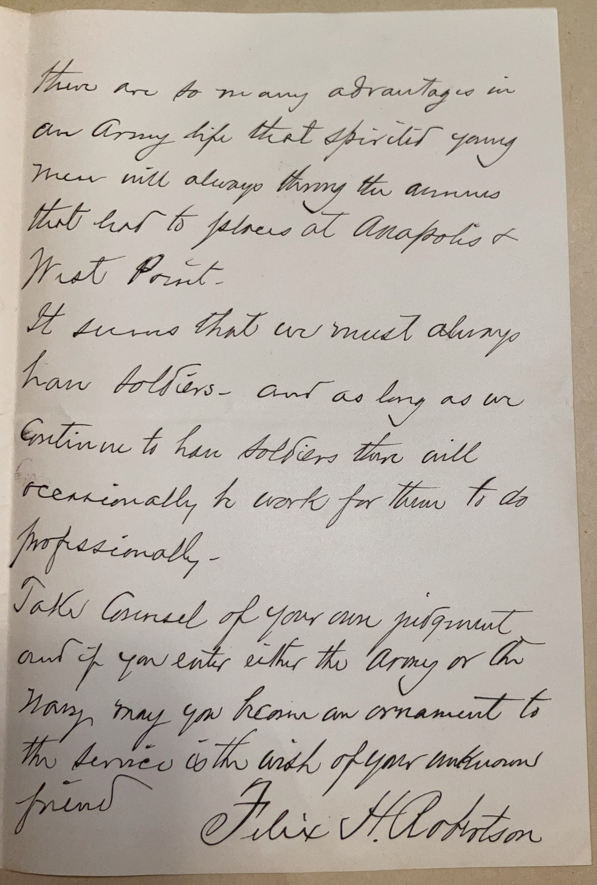

# 🖋️ Felix Huston Robertson - Letter (1893)

---

## 📜 Transcription

**Letter (September 28, 1893):**  

Waco Sept 28th / 93  
C. W. Mills  
Sodus N.Y.  

Dear Sir,  

I have not that acquaintance with your characteristics which could enable me to form a satisfactory opinion on the question you ask.  

Unless a soldier's life would suit you, you should not go to West Point. A more practical business training could doubtless be had at another school.  

The worst thing about a soldier's life in time of peace is the enforced idleness that ruins many. There has latterly been a great improvement in that respect, however, and there are so many advantages in an Army life that spirited young men will always fancy the avenues that lead to places at Annapolis & West Point.  

It seems that we must always have soldiers — and as long as we continue to have soldiers there will occasionally be work for them to do professionally.  

Take counsel of your own judgment, and if you enter either the Army or the Navy, may you become an ornament to the service is the wish of your unknown friend,  
Felix H. Robertson  

---

## 📚 Felix Huston Robertson

**Felix Huston Robertson (1839–1928)** was a Confederate general during the American Civil War, notable for being one of the youngest generals in the Confederate Army, and later a lawyer and businessman in Texas. Born on March 9, 1839, in Washington-on-the-Brazos, Texas, Robertson was the son of Jerome B. Robertson, a physician and fellow Confederate general. Felix attended the United States Military Academy at West Point from 1857 to 1861 but resigned before graduating when Texas seceded from the Union in 1861. Joining the Confederacy, he initially served as an artillery officer, participating in the Battle of Shiloh (1862) and the Siege of Vicksburg (1863). His leadership skills earned him a promotion to brigadier general in 1864 at the age of 25, making him one of the youngest generals in the Confederate Army. Robertson then commanded cavalry units in the Western Theater, including during the Atlanta Campaign (1864) and Hood’s Tennessee Campaign (1864), where he led a brigade at the Battle of Franklin.

After the Confederacy’s defeat in 1865, Robertson returned to Texas, where he studied law and was admitted to the bar, establishing a legal practice in Waco. He also engaged in business ventures, including real estate and railroad development, contributing to the growth of Waco as a commercial hub in the late 19th century. By 1893, when this letter was written, Robertson was 54 years old and a respected member of the Waco community, drawing on his military background to offer advice to younger generations. The letter, addressed to C. W. Mills of Sodus, New York, responds to Mills’ inquiry about pursuing a military career at West Point or Annapolis, a question Robertson was well-suited to address given his West Point experience and military service. Robertson cautions Mills against a military career unless it suits his temperament, noting the “enforced idleness” of a soldier’s life in peacetime—a common critique of the post-Civil War Army, where frontier posts often offered little intellectual or social stimulation. However, he acknowledges recent improvements and the enduring appeal of military academies, reflecting a balanced perspective shaped by his own career. Robertson ultimately advises Mills to follow his own judgment, closing with a wish for success should Mills choose a military path. Written nearly three decades after the Civil War, the letter captures Robertson in his later years, as a former Confederate officer who had successfully transitioned to civilian life while maintaining a connection to his military past. Robertson lived in Waco until his death on April 20, 1928, leaving a legacy as a young Confederate leader and a contributor to Texas’s post-war development.

---

## 🔗 Return to [Index](index.md)