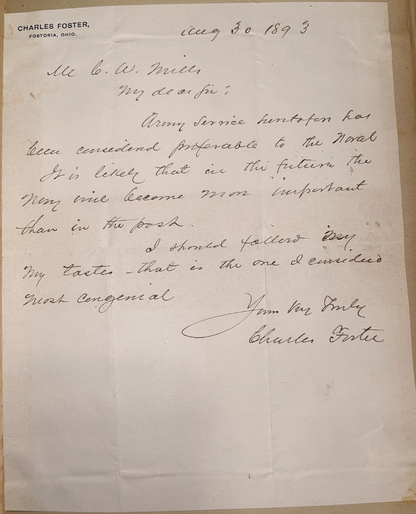

# 🖋️ Charles Foster - Letter (1893)

---

## 📜 Transcription

**Letter (August 30, 1893):**  

CHARLES FOSTER,  
FOSTORIA, OHIO.  
Aug 30, 1893  

Mr. C. W. Mills,  
My dear Sir:  

Army service heretofore has been considered preferable to the Naval.  
It is likely that in the future the Navy will become more important than in the past.  

I should follow my tastes — that is the one I considered most congenial.  

Yours very truly,  
Charles Foster  

---

## 📚 Charles Foster

**Charles Foster (1828–1904)** was a distinguished American politician and businessman, best known for his tenure as U.S. Secretary of the Treasury under President Benjamin Harrison from 1891 to 1893. Born on April 12, 1828, in Seneca County, Ohio, Foster grew up in Fostoria, a town named after his father, Charles W. Foster Sr. He began his career in business, managing a general store in Fostoria, before entering politics as a Republican. Foster’s political career spanned several decades, starting with his election to the U.S. House of Representatives in 1870, where he served four terms from 1871 to 1879, earning a reputation as a fiscal conservative and advocate for protective tariffs. In 1879, he was elected Governor of Ohio, serving two terms from 1880 to 1884, during which he focused on prison reform, education, and reducing state debt.

Foster’s most prominent role came in 1891 when President Benjamin Harrison appointed him Secretary of the Treasury, a position he held until Harrison’s term ended in March 1893. As Treasury Secretary, Foster navigated the U.S. through the early stages of the Panic of 1893, a severe economic depression that began shortly after he left office. He worked to maintain the gold standard and stabilize the economy, though his policies, including the depletion of the Treasury’s gold reserves, were later criticized for exacerbating the crisis. Despite these challenges, Foster was respected for his integrity and dedication to public service, qualities that defined his long career.

In 1893, when this letter was written, Foster was 65 years old and had recently left his post as Treasury Secretary, returning to Fostoria, Ohio, where he resumed his business interests and civic involvement. The letter, addressed to Mr. C. W. Mills, responds to Mills’ inquiry about choosing between a career in the Army or the Navy, a question similar to those posed to other military and political figures in Mills’ collection. Foster notes that Army service had historically been considered preferable, but he predicts a growing importance for the Navy in the future—a prescient observation given the U.S. Navy’s expansion under leaders like Benjamin Franklin Tracy, Foster’s colleague in Harrison’s cabinet. Foster advises Mills to follow his personal tastes, reflecting a pragmatic approach shaped by Foster’s own experience in making career decisions. Written just months after leaving office, the letter captures Foster in a reflective moment, offering guidance to a young man while drawing on his recent experience in national politics. Foster remained active in Fostoria until his death on October 9, 1904, leaving a legacy as a key political figure of the Gilded Age whose policies influenced the economic landscape of the late 19th century.

---

## 🔗 Return to [Index](index.md)