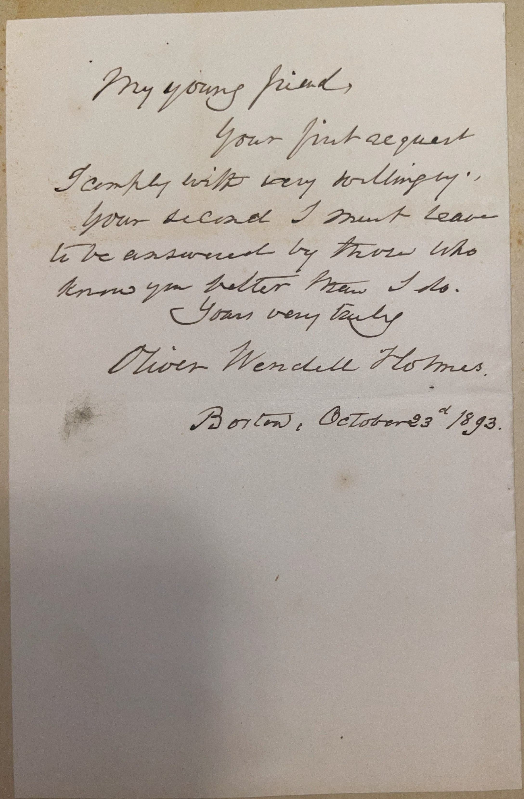

# 🖋️ Oliver Wendell Holmes Sr. - Letter (1893)

---

## 📜 Transcription

**Letter (October 23, 1893):**  

My young friend,  
Your first request  
I comply with very willingly.  
Your second I must leave  
to be answered by those who  
know you better than I do.  
Yours very truly,  
Oliver Wendell Holmes  

Boston, October 23ᵈ 1893.  

---

## 📚 Oliver Wendell Holmes Sr.

**Oliver Wendell Holmes Sr. (1809–1894)** was an American physician, poet, and essayist, renowned for his contributions to literature and medicine in the 19th century. In 1893, when this letter was written, Holmes was 84 years old, living in Boston, Massachusetts, where he had spent much of his life. The letter, addressed to a “young friend,” likely C. W. Mills, reflects Holmes’ gracious yet reserved response to a request, showcasing his characteristic wit and courtesy in his later years.

Born on August 29, 1809, in Cambridge, Massachusetts, Holmes graduated from Harvard College in 1829 and later studied medicine, earning his medical degree from Harvard Medical School in 1836. He became a prominent physician, teaching at Harvard and contributing to medical advancements, including his influential 1843 essay on the contagiousness of puerperal fever, which predated germ theory. However, Holmes gained wider fame as a writer, particularly through his poetry and essays in *The Atlantic Monthly*, which he helped found in 1857. His “Breakfast-Table” series, starting with *The Autocrat of the Breakfast-Table* (1858), blended humor, philosophy, and social commentary, earning him a devoted readership. Holmes also wrote notable poems like “Old Ironsides” (1830), which helped save the USS Constitution from being scrapped. By the 1890s, Holmes was a literary elder statesman, celebrated for his contributions to American letters and his role in Boston’s intellectual circles, often referred to as the “Boston Brahmin” elite. His son, Oliver Wendell Holmes Jr., born in 1841, followed a distinguished path as a jurist, serving as an Associate Justice of the U.S. Supreme Court from 1902 to 1932, and becoming known for his influential legal opinions and the “clear and present danger” test in free speech cases. In this letter, written from Boston on October 23, 1893, Holmes responds to a correspondent’s requests, agreeing to the first “very willingly” but deferring the second to those who know the recipient better, a polite deflection that reflects his careful, thoughtful nature. Written in 1893, during the final year of Holmes’ life—he passed away less than a year later on October 7, 1894, in Boston—this letter captures his enduring engagement with admirers and his characteristic blend of warmth and reserve. Holmes left a lasting legacy as a polymath whose work bridged literature, medicine, and social thought, influencing generations of writers and thinkers.

---

## 🔗 Return to [Index](index.md)