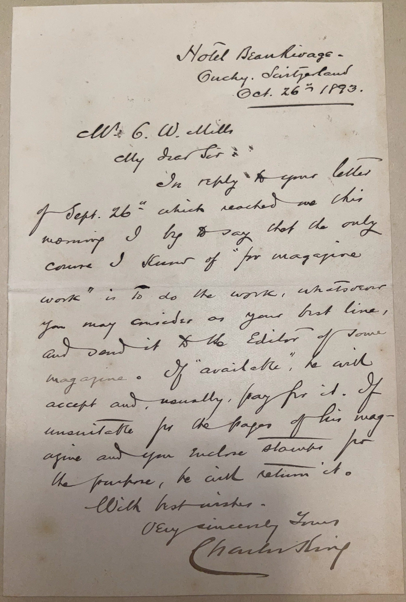

# 🖋️ Charles King - Letter (1893)

---

## 📜 Transcription

**Letter (October 26, 1893):**  

Hotel Beau Rivage  
Ouchy, Switzerland  
Oct. 26th, 1893  

Mr. C. W. Mills  
My dear Sir:  

In reply to your letter of Sept. 26th which reached me this morning I beg to say that the only course I know of “for magazine work” is to do the work, whatever you may consider as your best line, and send it to the Editor of some magazine. If “available” he will accept and, usually, pay for it. If unavailable for the pages of his magazine and you enclose stamps for the purpose, he will return it.  

With best wishes,  
Very sincerely yours,  
Charles King  

---

## 📚 Charles King

**Charles King (1844–1933)** was a prolific American author, soldier, and military historian, celebrated for his novels and short stories that vividly depicted life in the U.S. Army and the American West. Born on October 12, 1844, in Albany, New York, King came from a military family—his father, Rufus King, was a Union general, and his grandfather, also named Rufus King, was a signer of the U.S. Constitution. King graduated from the United States Military Academy at West Point in 1866, beginning a 30-year career in the U.S. Army. He served in the Indian Wars, including campaigns against the Apache and Sioux, and was wounded in action in 1874 during a skirmish in Arizona. King also participated in the Spanish-American War (1898), rising to the rank of brigadier general in the National Guard after his regular army service.

King began writing during his military career, publishing his first novel, *The Colonel’s Daughter* (1883), while still on active duty. His works, which include over 60 books and numerous short stories, often drew on his firsthand experiences, blending adventure, romance, and detailed accounts of military life. Notable titles include *Campaigning with Crook* (1890), a memoir of his service under General George Crook, and *Foes in Ambush* (1893), a novel set during the Indian Wars. King’s stories were frequently serialized in magazines like *Harper’s Weekly* and *The Youth’s Companion*, making him one of the most popular military novelists of his time. His writing not only entertained but also preserved the history of the U.S. Army’s role in the American West, earning him a lasting place in American literature.

In 1893, when this letter was written, King was 49 years old and traveling in Europe, as indicated by the letterhead from the Hotel Beau Rivage in Ouchy, Switzerland, a fashionable resort area on Lake Geneva. The letter, addressed to Mr. C. W. Mills, responds to Mills’ inquiry about pursuing “magazine work,” likely referring to writing for publication in periodicals, a field in which King had significant experience. King offers practical advice, suggesting that Mills write his best work and submit it to magazine editors, enclosing stamps for return if rejected—a standard practice in the 19th-century publishing world. This straightforward guidance reflects King’s own approach to writing, which combined discipline from his military background with a pragmatic understanding of the literary market. Written during a period when King was at the height of his literary career, the letter captures his role as a mentor to aspiring writers, a role he often embraced given his success in the field. King continued writing and serving in the National Guard until his death on March 7, 1933, in Milwaukee, Wisconsin, leaving a legacy as one of America’s foremost military novelists and a chronicler of the frontier era.

---

## 🔗 Return to [Index](index.md)