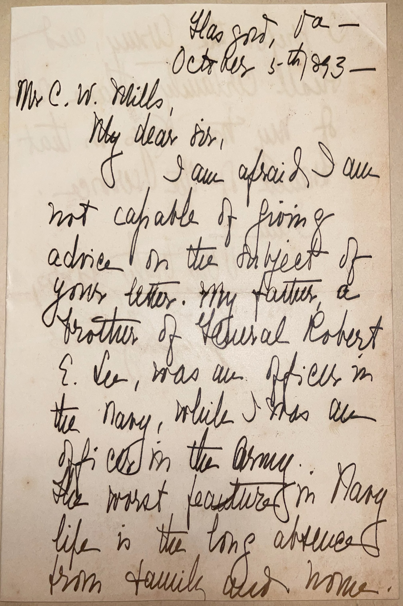
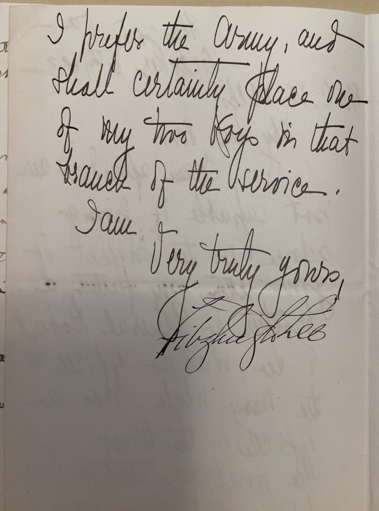

# 🖋️ Fitzhugh Lee - Letter (1893)

---

## 📜 Transcription

**Letter (October 5, 1893):**  

Glasgow, Va —  
October 5th 1893 —  

Mr. C. W. Mills,  
My dear sir,  

I am afraid I am not capable of giving advice on the subject of your letter. My father, a brother of General Robert E. Lee, was an officer in the Navy, while I was an officer in the Army. The worst feature in Navy life is the long absence from family and home. I prefer the Army, and shall certainly place one of my two boys in that branch of the service.  

I am  
Very truly yours,  
Fitzhugh Lee  

---

## 📚 Fitzhugh Lee

**Fitzhugh Lee (1835–1905)** was a Confederate general during the American Civil War, a U.S. Army general during the Spanish-American War, and a prominent Virginia politician, best known for his military service and his role in post-war reconciliation between the North and South. Born on November 19, 1835, at Clermont plantation in Fairfax County, Virginia, Lee was the nephew of General Robert E. Lee, the Confederacy’s most famous commander. His father, Sydney Smith Lee, was a naval officer and Robert E. Lee’s older brother, giving Fitzhugh a deep connection to both military branches. Lee graduated from the United States Military Academy at West Point in 1856, ranking 45th in his class, and served in the U.S. Army’s cavalry on the Texas frontier until 1861, when he resigned to join the Confederacy following Virginia’s secession.

During the Civil War, Lee rose to the rank of major general in the Confederate Army, serving as a cavalry commander under J.E.B. Stuart. He participated in major campaigns, including the Peninsula Campaign (1862), the Battle of Antietam (1862), and the Battle of Gettysburg (1863), and later commanded cavalry in the Shenandoah Valley under Jubal Early. After Stuart’s death in 1864, Lee became one of the Confederacy’s top cavalry leaders, known for his bravery and tactical skill. Following the war, Lee turned to farming in Virginia and became a vocal advocate for reconciliation, delivering speeches that promoted unity between the North and South. He served as Governor of Virginia from 1886 to 1890, focusing on economic development and education, and later as U.S. Consul General in Havana, Cuba, from 1896 to 1898, where he reported on the Cuban insurrection and helped evacuate Americans during the lead-up to the Spanish-American War. During the war, he returned to military service as a major general in the U.S. Army, commanding troops in Cuba.

In 1893, when this letter was written, Lee was 57 years old and living in Glasgow, Virginia, a small town in Rockbridge County where he owned a farm after his governorship. The letter, addressed to Mr. C. W. Mills, responds to Mills’ inquiry about choosing between a career in the Army or the Navy, a question Lee was well-positioned to address given his family’s military background and his own Army service. Lee notes his father’s naval career and his own preference for the Army, citing the Navy’s long absences from family as a significant drawback—a concern rooted in his father’s experiences and his own family-oriented values. His intention to place one of his sons in the Army reflects his belief in the Army’s suitability for a military career, despite the growing prominence of the Navy in the late 19th century. Written during a period of relative quiet in Lee’s life, the letter captures him as a reflective veteran and father, offering personal insights to a young man seeking guidance. Lee continued to serve in public roles until his death on April 28, 1905, in Washington, D.C., leaving a legacy as a military leader, a reconciler of a divided nation, and a dedicated public servant.

---

## 🔗 Return to [Index](index.md)