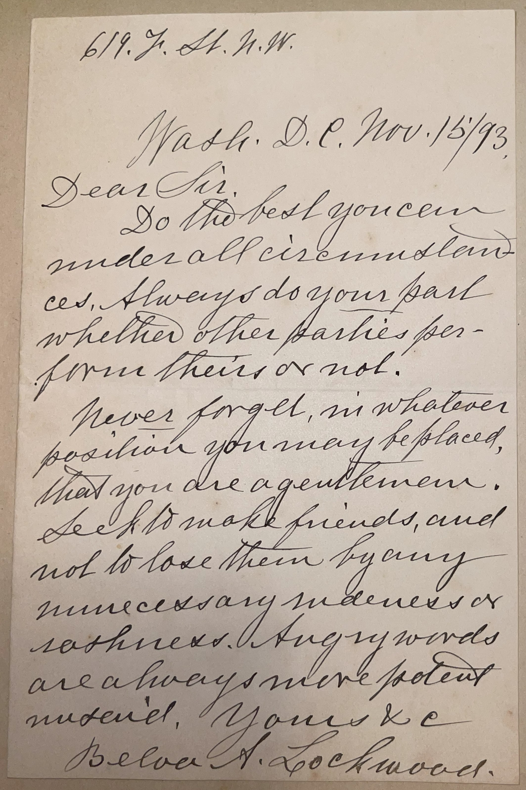

# 🖋️ Belva Ann Lockwood - Letter (1893)

---

## 📜 Transcription

**Letter (November 15, 1893):**  

619 F St. N.W.  
Wash., D.C., Nov. 15/93  

Dear Sir,  
Do the best you can under all circumstances. Always do your part whether other parties perform theirs or not.  

Never forget, in whatever position you may be placed, that you are a gentleman. Seek to make friends, and not to lose them by any unnecessary meanness or rashness. Angry words are always more potent under control.  

Yours &c,  
Belva A. Lockwood  

---

## 📚 Belva Ann Lockwood

**Belva Ann Lockwood (1830–1917)** was a pioneering American lawyer, educator, and women’s rights activist, celebrated as the first woman to argue a case before the U.S. Supreme Court and the first woman to run for President of the United States. Born on October 24, 1830, in Royalton, New York, Lockwood faced significant barriers as a woman seeking education and professional opportunities. She graduated from Genesee College (later Syracuse University) in 1857 and became a teacher, advocating for women’s education and equal pay. After being widowed in 1853 and remarrying in 1868, she pursued a legal career, earning her law degree from National University Law School in 1873 after being denied admission to other institutions due to her gender. Lockwood’s persistence led to her admission to the District of Columbia bar in 1873, but she was initially barred from practicing before the U.S. Supreme Court. She successfully lobbied Congress to pass a bill in 1879 granting women the right to argue before the Court, and in 1880, she became the first woman to do so, representing a case involving Cherokee Nation land rights.

Lockwood’s activism extended beyond the courtroom. In 1884 and 1888, she ran for President as the candidate of the National Equal Rights Party, campaigning on a platform of women’s suffrage, equal pay, temperance, and peace advocacy. Though her candidacies were largely symbolic—she received only a few thousand votes—they brought national attention to the cause of women’s rights. Lockwood was also a prolific writer and speaker, contributing to publications like *The Peacemaker* and lecturing on issues such as women’s legal rights and international arbitration.

In 1893, when this letter was written, Lockwood was 63 years old and living in Washington, D.C., at 619 F Street N.W., where she maintained her law practice and continued her advocacy work. The letter, addressed to a “Dear Sir,” likely C. W. Mills, offers advice on personal conduct and success, reflecting Lockwood’s own principles of perseverance and integrity. She urges Mills to “do the best you can under all circumstances,” to act honorably regardless of others’ actions, and to maintain gentlemanly behavior by controlling anger and fostering friendships—values that guided Lockwood through her own groundbreaking career. Written during a period when Lockwood was actively involved in legal and social reform, the letter captures her role as a mentor to young people, a role she embraced alongside her advocacy. Lockwood continued her work until her death on May 19, 1917, in Washington, D.C., leaving a legacy as a trailblazer for women in law and politics, whose efforts paved the way for future generations of female lawyers and activists.

---

## 🔗 Return to [Index](index.md)