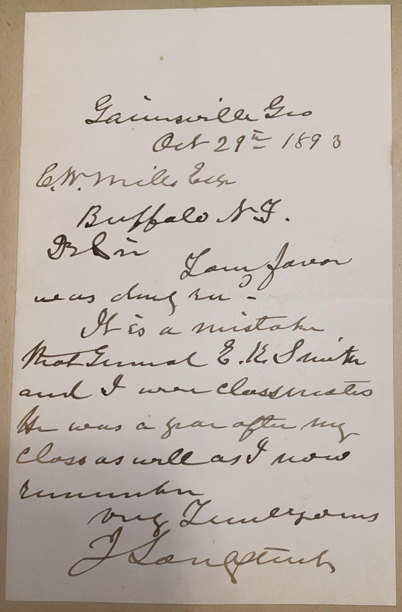

# 🖋️ James Longstreet - Letter (1893)

---

## 📜 Transcription

**Letter (October 29, 1893):**  

Gainesville, Ga.  
Oct 29th, 1893  

C. W. Mills Esq.  
Buffalo N.Y.  

Dr Sir,  

Your favor was duly rec’d.  
It is a mistake that General E. K. Smith and I were classmates. He was a year after my class as well as I now remember.  

Very Truly Yours,  
J. Longstreet  

---

## 📚 James Longstreet

**James Longstreet (1821–1904)** was a Confederate general during the American Civil War, one of Robert E. Lee’s most trusted commanders, and a controversial figure in the post-war South due to his political choices. Born on January 8, 1821, in Edgefield District, South Carolina, Longstreet grew up in Georgia and attended the United States Military Academy at West Point, graduating in 1842, 54th in a class of 56. At West Point, he befriended future generals like Ulysses S. Grant and George Pickett, though, as the letter clarifies, he was not a classmate of Edmund Kirby Smith, who graduated in 1845. Longstreet served in the U.S. Army during the Mexican-American War (1846–1848), earning commendations for bravery at battles like Molino del Rey and Chapultepec, before resigning in 1861 to join the Confederacy after his adopted state of Alabama seceded.

During the Civil War, Longstreet rose to the rank of lieutenant general, becoming Lee’s second-in-command in the Army of Northern Virginia. Nicknamed “Old Pete” and “Lee’s War Horse,” he played a crucial role in major Confederate victories, including Second Bull Run (1862), Fredericksburg (1862), and Chickamauga (1863). However, his performance at the Battle of Gettysburg (1863) drew criticism, particularly for his reluctance to execute Lee’s orders on the second day and his role in the disastrous Pickett’s Charge on the third day, which some Southerners later blamed for the Confederacy’s defeat. After the war, Longstreet’s reputation suffered further when he became a Republican, supported Reconstruction, and accepted appointments from President Ulysses S. Grant, including roles as surveyor of customs in New Orleans (1869–1873) and U.S. Minister to the Ottoman Empire (1880–1881). His political stance and his 1880s memoirs, which defended his actions at Gettysburg and criticized Lee, made him a scapegoat for the “Lost Cause” movement, which sought to absolve Lee of blame for Confederate failures.

In 1893, when this letter was written, Longstreet was 72 years old and living in Gainesville, Georgia, where he had settled after a fire destroyed his home in New Orleans in 1889. The letter, addressed to C. W. Mills of Buffalo, New York, responds to Mills’ inquiry about Longstreet’s time at West Point, specifically whether he was a classmate of General Edmund Kirby Smith, another Confederate general known as “E. K. Smith.” Longstreet corrects the misconception, noting that Smith was a year behind him, a detail consistent with historical records—Longstreet graduated in 1842, while Smith graduated in 1845. Written in the later years of Longstreet’s life, the letter captures him in a reflective mood, addressing a historical query as he sought to set the record straight about his military career. Longstreet continued to defend his legacy in his memoirs, *From Manassas to Appomattox* (1896), until his death on January 2, 1904, in Gainesville. Despite the controversies, modern historians have largely rehabilitated his reputation, recognizing him as one of the Confederacy’s most capable generals and a pragmatic figure who sought to rebuild the South through cooperation with the North.

---

## 🔗 Return to [Index](index.md)