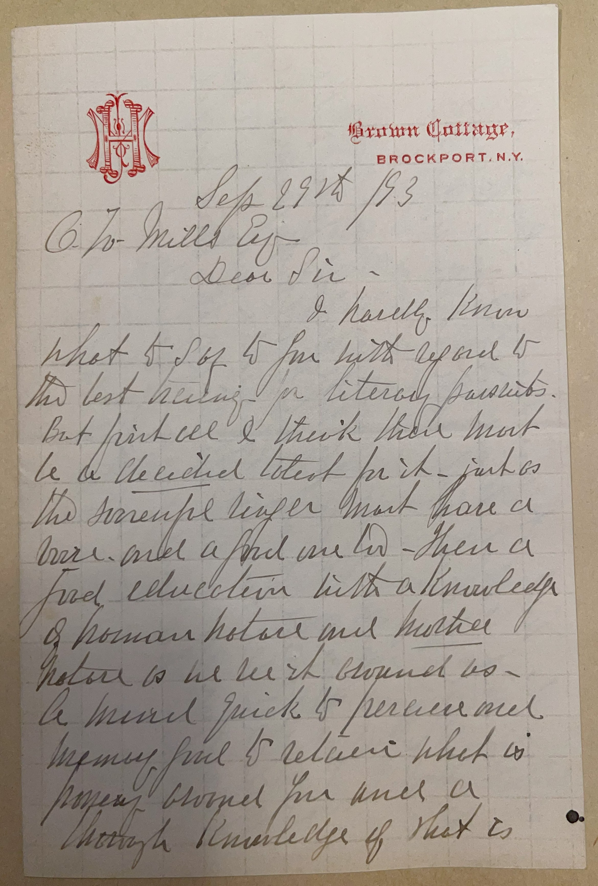
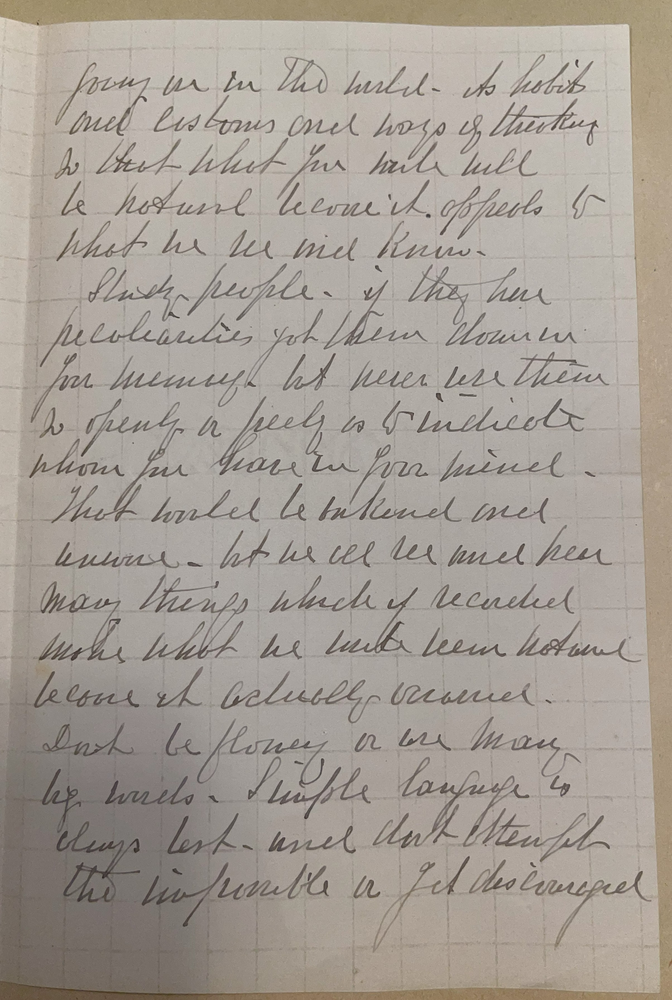
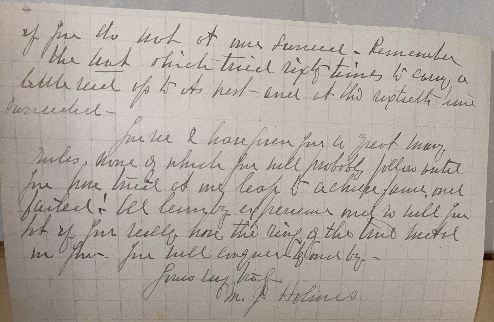

# 🖋️ Mary Jane Holmes - Letter (1893)

---

## 📜 Transcription

**Letter (September 29, 1893):**  

Brown Cottage,  
Brockport, N.Y.  
Sep. 29th, 1893  

C. W. Mills Esq.  
Dear Sir—  

I hardly know what to say to you with regard to the best training for literary pursuits. But first of all I think there must be decided talent for it—just as the successful singer must have a voice, and a good one too—then a good education with a knowledge of human nature and motive. Nature is the best teacher as a mind quick to perceive and memory and to receive what is passing around you and a thorough knowledge of what is going on in the world—as habits and customs and ways of thinking. In short, what you will call a "liberal" training. It appeals to what we see and know.  

Such people—if they are peculiarities, jot them down for memory but never use them too openly or freely, so to ridicule whom you have in your mind—that would be unkind and unwise. But we all see and hear many things which if recorded make what we write seem natural because it actually occurred.  

Don't be flowery or use many big words. Simple language is always best—and don't attempt the impossible or get discouraged if you do not at once succeed. Remember the bird which tried nine times to carry a little seed up to its nest—and at the tenth time succeeded—  

For see I have given you a great many rules, some of which you will probably follow but if you have tried at one leap to achieve fame, and failed! let learning, experience and toil pull you up—if you really have the ring of the true metal in you. You will conquer if only by—  

Yours very truly,  
M. J. Holmes  

---

## 📚 Mary Jane Holmes

**Mary Jane Holmes (1825–1907)** was one of the most popular American novelists of the 19th century, renowned for her domestic fiction that captured the hearts of a wide readership during the Gilded Age. Born on April 5, 1825, in Brookfield, Massachusetts, Holmes began her writing career at a young age, publishing her first story at 15. She married Daniel Holmes in 1852, and the couple eventually settled in Brockport, New York, where she wrote many of her novels from their home, Brown Cottage—the same location from which this letter was penned in 1893. Holmes authored over 40 novels, with her debut, *Tempest and Sunshine* (1854), establishing her as a literary sensation. Her works, including *Lena Rivers* (1856) and *The English Orphans* (1855), often explored themes of family, morality, and romance, resonating with middle-class readers, particularly women, for their relatable characters and emotional depth. By the late 19th century, her books had sold millions of copies, reportedly outselling even those of Harriet Beecher Stowe during her lifetime, making her one of the best-selling authors of her era.

In 1893, when this letter was written, Holmes was 68 years old and a well-established literary figure, living in Brockport, New York. The letter, addressed to C. W. Mills on September 29, 1893, responds to Mills’ inquiry about the best training for literary pursuits. Holmes offers thoughtful advice, emphasizing the importance of natural talent, a broad education, and a deep understanding of human nature and societal customs. She encourages Mills to observe the world around him, record peculiarities discreetly, and use simple language in his writing, cautioning against overambition or discouragement. Her metaphor of the bird succeeding on its tenth attempt reflects her belief in perseverance, a theme often present in her novels. The letter provides a glimpse into Holmes’ approach to writing, revealing her practical yet empathetic perspective on the craft, as well as her willingness to mentor aspiring writers like Mills. Written during a period when Holmes was still actively publishing—her later works, such as *Queenie Hetherton* (1895), continued to find an audience—this letter captures her enduring commitment to literature and her role as a literary mentor in the late 19th century.

Holmes’ popularity waned after her death on October 6, 1907, in Brockport, as literary tastes shifted toward realism and modernism, but her influence on popular fiction during her lifetime was immense. Her novels, often serialized in magazines before being published as books, provided entertainment and moral guidance to a generation of readers, particularly women, and her success as a female author in a male-dominated industry paved the way for future generations of women writers. This letter, written from Brown Cottage, not only showcases her personal engagement with her audience but also underscores her legacy as a prolific and influential figure in American literature.

---

## 🔗 Return to [Index](index.md)