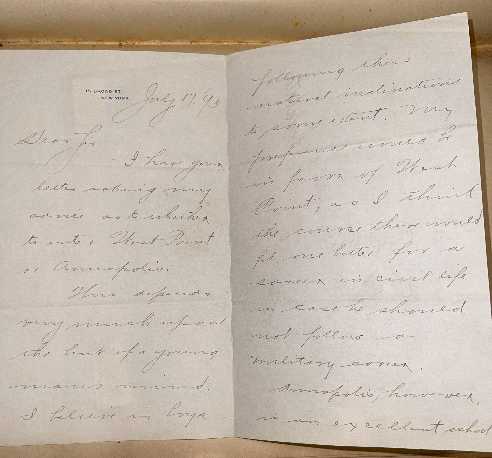
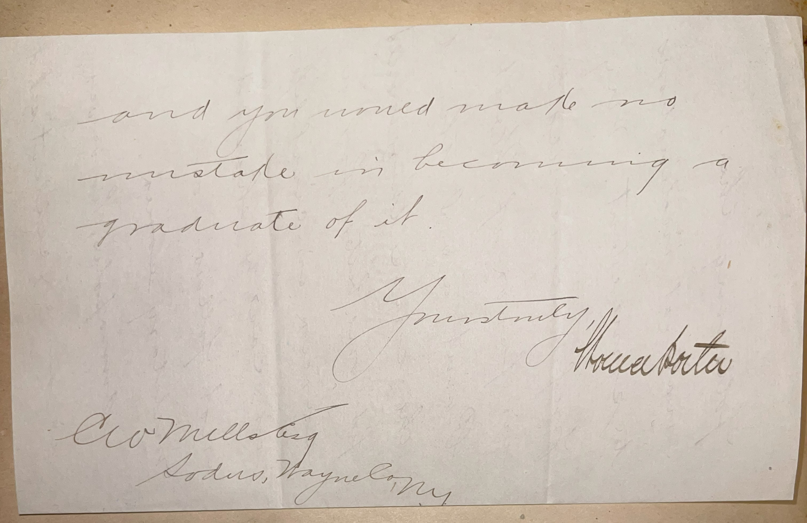

# 🖋️ Horace Porter - Letter (1893)

---

## 📜 Transcription

**Letter (July 17, 1893):**  

15 BROAD ST.  
NEW YORK.  
July 17, 1893  

Dear Sir—  
I have your letter asking my advice as to whether to enter West Point or Annapolis.  

This depends very much upon the bent of a young man’s mind.  
I believe in boys following their natural inclinations to some extent. My preference would be in favor of West Point, as I think the course there would fit one better for a career in civil life in case he should not follow a military career.  

Annapolis, however, is an excellent school and you would make no mistake in becoming a graduate of it.  

Yours truly,  
Horace Porter  

C. W. Mills  
Sodus, Wayne Co., N.Y.  

---

## 📚 Horace Porter

**Horace Porter (1837–1921)** was a distinguished American soldier, diplomat, and businessman, best known for his service as a Union general during the Civil War and his later diplomatic roles under multiple U.S. presidents. Born on April 15, 1837, in Huntingdon, Pennsylvania, Porter graduated from the United States Military Academy at West Point in 1860, where he developed a strong foundation in military strategy and engineering. During the Civil War, he served with distinction, rising to the rank of brigadier general and earning the Medal of Honor for his bravery at the Battle of Chickamauga in 1863. Porter became a close aide to General Ulysses S. Grant, accompanying him through key campaigns, including the Siege of Vicksburg and the Appomattox Campaign, where he was present at the surrender of Confederate General Robert E. Lee in 1865. After the war, Porter continued to serve as Grant’s personal secretary during his presidency (1869–1877), a role that solidified his influence in political and military circles.

By 1893, when this letter was written, Porter was 56 years old and living in New York City, as indicated by the letterhead from 15 Broad Street. Having left military service, he was engaged in business ventures, including his role as vice president of the Pullman Company, and was active in New York’s social and political scene. The letter, addressed to C. W. Mills of Sodus, Wayne County, New York, on July 17, 1893, responds to Mills’ inquiry about whether to pursue a military education at West Point or the Naval Academy at Annapolis. Porter, drawing on his own experience as a West Point graduate, advises Mills to consider his natural inclinations but expresses a preference for West Point, noting its broader applicability to civilian life if Mills does not pursue a military career. He also acknowledges Annapolis as an excellent option, reflecting a balanced and pragmatic approach to mentorship. This letter captures Porter’s perspective on education and career paths during a transformative period in American history, when military academies were key institutions for shaping the nation’s leaders, both in the armed forces and in civilian roles.

Porter’s later career further highlighted his versatility and influence. From 1897 to 1905, he served as the U.S. Ambassador to France under Presidents William McKinley and Theodore Roosevelt, where he played a key role in recovering the remains of John Paul Jones, the Revolutionary War naval hero, and bringing them back to the United States for reinterment at the Naval Academy in Annapolis. Porter was also a prolific writer, publishing *Campaigning with Grant* (1897), a memoir of his Civil War experiences that remains a valuable historical source. He died on May 29, 1921, in New York City, leaving a legacy as a decorated soldier, a trusted diplomat, and a respected public figure. This letter, written during a transitional phase of Porter’s life, underscores his continued engagement with young Americans seeking guidance and his belief in the value of a military education, particularly from his alma mater, West Point.

---

## 🔗 Return to [Index](index.md)