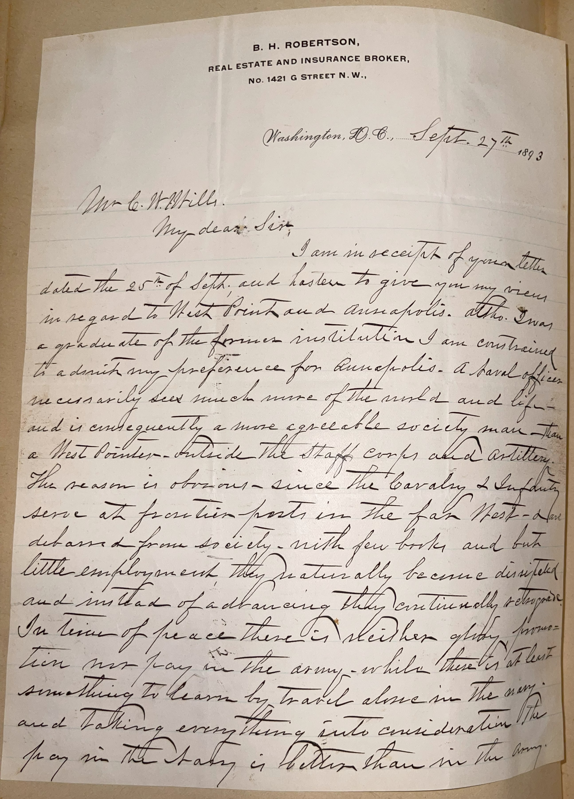
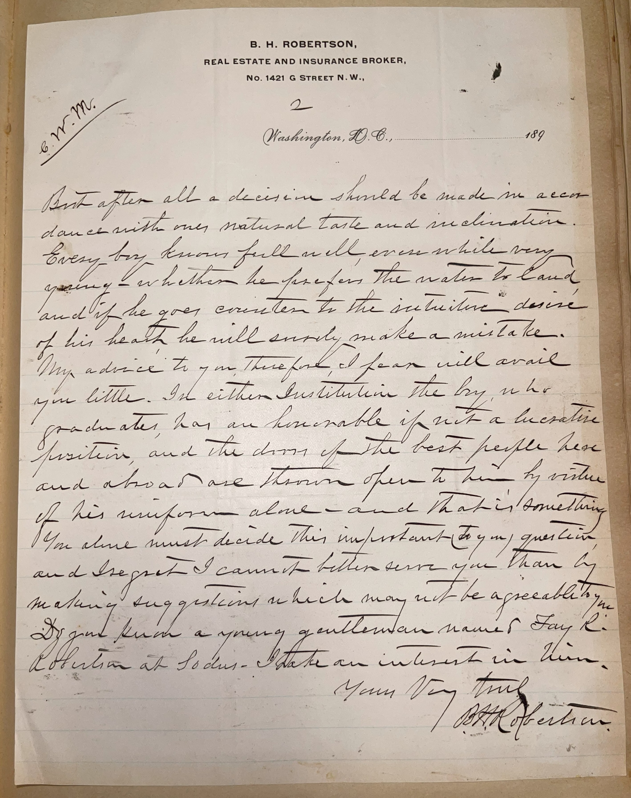

# 🖋️ Beverly H. Robertson - Letter (1893)

---

## 📜 Transcription

**Letter (September 27, 1893):**  

B. H. Robertson,  
Real Estate and Insurance Broker,  
No. 1421 G Street N.W.,  
Washington, D.C., Sept. 27th, 1893  

Mr. C. W. Mills,  
My dear Sir:  
I am in receipt of your letter dated the 25th of Sept. and hasten to give you my views in regard to West Point and Annapolis. Altho I was a graduate of the former institution I am constrained to admit my preference for Annapolis. A naval officer necessarily sees much more of the world and life, and is consequently a more agreeable society man than a West Pointer — outside the staff corps and artillery. The reason is obvious — since the cavalry & infantry serve at frontier posts in the far West — a long distance from society, with few books, and but little employment, they naturally become distasteful and instead of advancing they continually retrograde. In time of peace there is neither glory, promotion nor pay in the army — while there is at least something to learn by travel alone in the navy, and taking everything into consideration the pay in the Navy is better than in the army.  

But after all a decision should be made in accordance with one’s natural taste and inclination. Every boy knows full well even while very young whether he prefers the water to land, and if he goes counter to the instinctive desire of his heart he will surely make a mistake.  
My advice to you therefore I fear will avail you little. In either institution the boy who graduates has an honorable if not a lucrative position, and the doors of the best people here and abroad are thrown open to him by virtue of his uniform alone — and that is something.  
You alone must decide this important question, and I regret I cannot better serve you than by making suggestions which may not be agreeable to you.  
Do you know a young gentleman named Fay L. Robertson at Sodus? I take an interest in him.  

Yours very truly,  
B.H. Robertson  

---

## 📚 Beverly H. Robertson

**Beverly Holcombe Robertson (1827–1910)** was a Confederate general during the American Civil War, a West Point graduate, and later a real estate and insurance broker in Washington, D.C. Born on June 5, 1827, in Amelia County, Virginia, Robertson graduated from the United States Military Academy at West Point in 1849, ranking 25th in his class. He served in the U.S. Army as a cavalry officer, participating in campaigns against Native American tribes in the West, including the Utah War (1857–1858). When the Civil War broke out in 1861, Robertson resigned his commission and joined the Confederacy, rising to the rank of brigadier general. He led cavalry units in several key campaigns, including the Peninsula Campaign (1862) and the Battle of Gettysburg (1863), where he commanded a brigade under J.E.B. Stuart. However, his performance drew criticism from Stuart, particularly during the Gettysburg Campaign, where he was accused of failing to provide timely intelligence, leading to his reassignment to less prominent roles in the Carolinas for the remainder of the war.

After the Confederacy’s defeat in 1865, Robertson returned to civilian life, initially working in the insurance business in Virginia before moving to Washington, D.C., in the 1870s. By 1893, when this letter was written, Robertson was 66 years old and had established himself as a real estate and insurance broker at 1421 G Street N.W., as indicated by the letterhead. The letter, addressed to Mr. C. W. Mills, responds to Mills’ inquiry about choosing between West Point and Annapolis for a military career, a topic Robertson was well-positioned to address given his West Point education and military background. Despite his own Army service, Robertson expresses a preference for Annapolis, citing the broader experiences and social opportunities a naval career offers, such as travel and exposure to global society, compared to the isolated frontier posts often assigned to Army cavalry and infantry. He contrasts the lack of glory, promotion, and pay in the Army during peacetime with the Navy’s advantages, though he ultimately advises Mills to follow his natural inclinations, reflecting a pragmatic and reflective perspective shaped by his own career. The letter also includes a personal note, inquiring about a young man named Fay L. Robertson in Sodus, suggesting a possible familial connection or mentorship interest. Written nearly three decades after the Civil War, the letter captures Robertson in his later years, as a seasoned veteran offering guidance to a younger generation while navigating his post-war life in the nation’s capital. Robertson continued his business career in Washington, D.C., until his death on November 12, 1910, leaving a complex legacy as a military officer and a Southern veteran who adapted to the challenges of the post-war era.

---

## 🔗 Return to [Index](index.md)