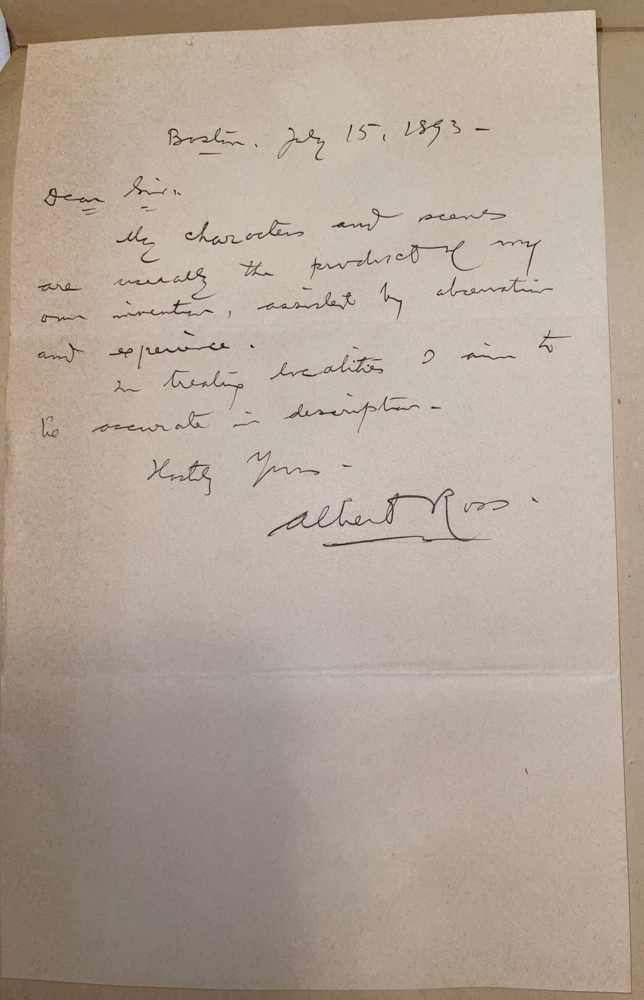

# 🖋️ Albert Ross - Letter (1893)

---

## 📜 Transcription

**Letter (July 15, 1893):**  

Boston, July 15, 1893  

Dear Sir:  

My characters and scenes are usually the product of my own invention, assisted by observation and experience.  
In treating localities I aim to be accurate in description.  

Yours truly –  
Albert Ross  

---

## 📚 Albert Ross

**Albert Ross (1851–1916)**, the pen name of Linn Boyd Porter, was a prolific American novelist of the late 19th century, renowned for his romance and adventure novels that captivated a wide audience during the Gilded Age. Born in 1851 in Massachusetts, Porter adopted the pseudonym Albert Ross to publish his works, beginning with his first major success, *Thou Shalt Not* (1889), which sold over a million copies and established him as one of the best-selling authors of his era. His novels, including titles like *Her Husband’s Secret* (1890) and *The Garston Bigamy Case* (1892), often featured dramatic plots, moral dilemmas, and vivid settings, blending romance with social commentary. Ross’s writing style, accessible yet emotionally charged, made him a favorite among readers seeking escapist literature, though some critics dismissed his work as sensationalist.

In 1893, when this letter was written, Ross was 42 years old and living in Boston, a hub of literary activity where he likely engaged with publishers and readers. The letter, addressed to a “Dear Sir,” presumably C. W. Mills, responds to an inquiry about Ross’s creative process, offering a glimpse into his approach to writing. Ross explains that his characters and scenes are largely invented but informed by observation and experience, and he emphasizes his commitment to accurately describing localities—a detail that reflects the importance of realism in his settings, even within his often melodramatic narratives. Written at the height of his popularity, this letter captures Ross’s dedication to his craft during a period when his books were widely read across the United States. Ross continued writing into the early 20th century, producing over 40 novels before his death in 1916 in Cambridge, Massachusetts. Though his popularity waned with changing literary tastes, his success as a mass-market author marked him as a significant figure in the history of American popular fiction.

---

## 🔗 Return to [Index](index.md)