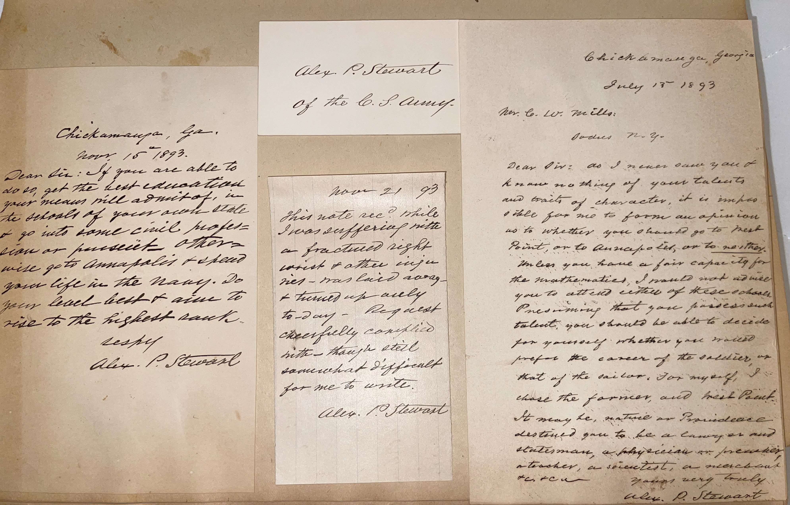

# 🖋️ Alexander P Stewart - Letters & Signature (1893)

---

## 📜 Transcriptions

Chickamauga, Ga.

July 17th 1893

Hon. C.W. Mills,

Sodus, N.Y.

Dear Sir: As I never saw you & know nothing of your talents and habits of character, it is impossible for me to form an opinion as to whether you should go to West Point, or to Annapolis, or to neither. Unless you have a firm capacity for mathematics, I should not advise you to enter either school, assuming that you possess the training. You should be able to decide for yourself whether you are suited for the career of the soldier, or that of the sailor. For myself, I chose the former, and took Rank as may be, nature or Providence destined you to be a lawyer, and statesman, a physician or preacher, a merchant, a scientist, a mechanic, or farmer.

Yours very truly,

Alex. P. Stewart

## 📜

Chickamauga, Ga.,

Aug. 16, 1893.

Dear Sir: If you are able to also get the best education in the means will admit, I should probably advise you to go into civil or parallel lines, where you will get Annapolis rather than your life in the Navy. Do your best to rise to the highest ranks.

Respectfully,

Alex. P. Stewart

of the C.S. Army

## 📜

Aug. 21, ‘93

I was not rec. while I was suffering with a fractured right wrist and other injuries – was laid away & turned up – regularly to-day – Request cheerfully complied with though often somewhat difficult for me to write.

Alex. P. Stewart

---

## 📚 Alexander P Stewart

**Alexander Peter Stewart (1821–1908)**, the author of these letters, was a distinguished Confederate general during the American Civil War, born on October 2, 1821, in Rogersville, Tennessee. After graduating from the United States Military Academy at West Point in 1842 (12th in his class), Stewart briefly served in the U.S. Army before resigning in 1845 to pursue a career in education, becoming a professor of mathematics and philosophy at Cumberland University in Tennessee and later at the University of Nashville. When the Civil War broke out, he joined the Confederate Army, rising to the rank of lieutenant general by 1864, one of the highest ranks in the Confederate military. Known as "Old Straight" for his reliability, Stewart fought in major campaigns, including the Chattanooga Campaign (notably at Chickamauga, where he wrote these letters from in 1893), the Atlanta Campaign, and the Carolinas Campaign, often commanding divisions under generals like Braxton Bragg and Joseph E. Johnston. His leadership at the Battle of Chickamauga in 1863 earned him particular recognition for his tactical skill.

After the war, Stewart returned to education, serving as a professor and later chancellor of the University of Mississippi from 1874 to 1886, where he worked to rebuild the institution in the post-war South. By 1893, when these letters were written from Chickamauga, Georgia, Stewart was 71 years old and serving as a commissioner of the Chickamauga and Chattanooga National Military Park, a role he held from 1890 until his death, reflecting his deep connection to the battlefield where he had fought. The letters, addressed to C.W. Mills and an unnamed recipient, offer cautious advice on pursuing a military career at West Point or Annapolis, emphasizing the importance of self-awareness and mathematical aptitude—likely informed by his own academic and military background. Stewart died on August 30, 1908, in Biloxi, Mississippi, leaving a legacy as a soldier, educator, and preserver of Civil War history, his contributions to the Chickamauga Park ensuring the memory of that pivotal battle endured.

---

## 🔗 Return to [Index](index.md)
