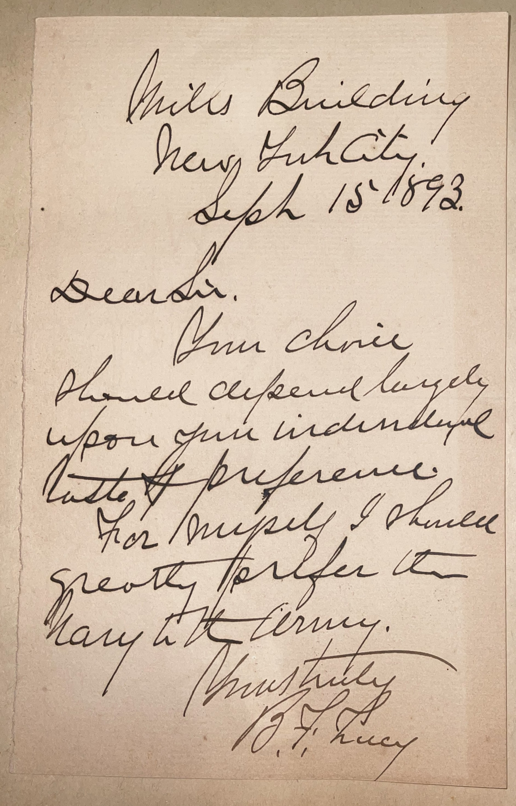

# 🖋️ Benjamin Franklin Tracy - Letter (1893)

---

## 📜 Transcription

**Letter (September 15, 1893):**  

Mills Building  
New York City  
Sept 15ᵗʰ 1893  

Dear Sir,  
Your choice should depend largely upon your individual taste & preference.  
For myself, I should greatly prefer the Navy to the Army.  

Yours truly,  
B. F. Tracy  

---

## 📚 Benjamin Franklin Tracy

**Benjamin Franklin Tracy (1830–1915)** was a distinguished American lawyer, politician, and military figure, best known for his transformative tenure as U.S. Secretary of the Navy under President Benjamin Harrison from 1889 to 1893. Born on April 26, 1830, in Owego, New York, Tracy studied law and was admitted to the bar in 1851, quickly establishing a successful legal practice. During the Civil War, he served with distinction in the Union Army, rising to the rank of brevet brigadier general. Tracy earned the Medal of Honor for his bravery at the Battle of the Wilderness in 1864, where he led a regiment under heavy fire, an act that cemented his reputation as a courageous leader. After the war, he returned to New York, serving as U.S. Attorney for the Eastern District of New York from 1866 to 1877, where he prosecuted several high-profile cases, including those involving corruption in the Brooklyn Navy Yard.

Tracy’s most significant contribution came as Secretary of the Navy, a position he assumed in 1889 under President Harrison, whom he had supported during the 1888 election. During his tenure, Tracy modernized the U.S. Navy, overseeing the construction of the first steel battleships, including the USS *Maine* and USS *Texas*, which marked the beginning of the modern American naval fleet. He also established the Naval War College as a formal institution and advocated for a two-ocean navy, earning him the title “Father of the Modern American Navy.” His reforms strengthened the U.S. as a naval power, setting the stage for its emergence as a global force in the 20th century. Tracy’s time as Secretary was not without controversy; he faced criticism following the 1890 sinking of the USS *Trenton* in a typhoon in Samoa, though he was later exonerated of negligence.

In 1893, when this letter was written, Tracy was 63