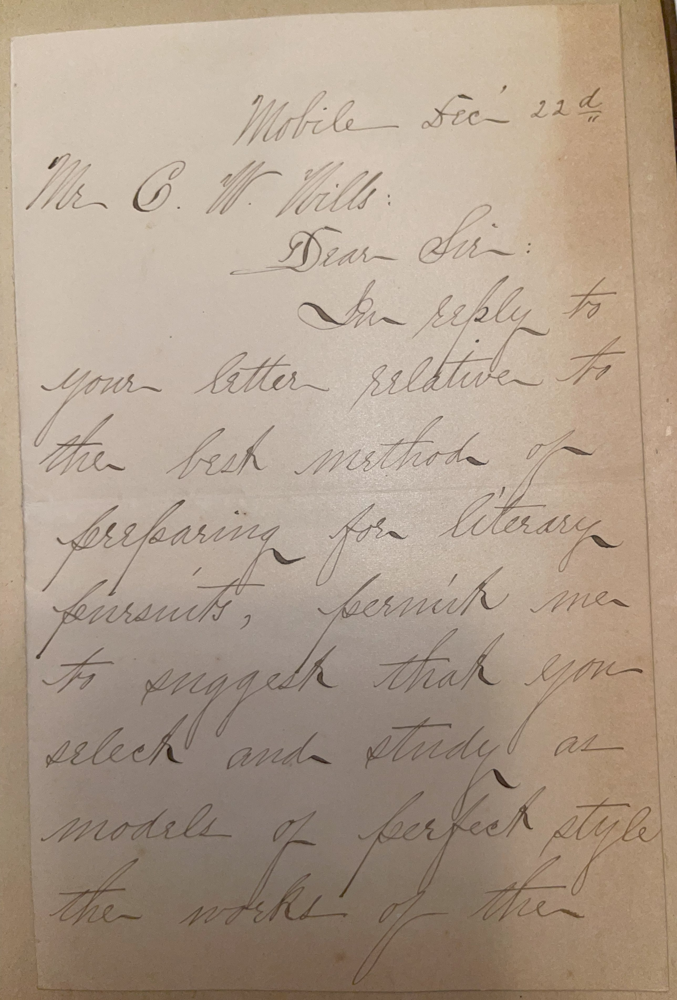
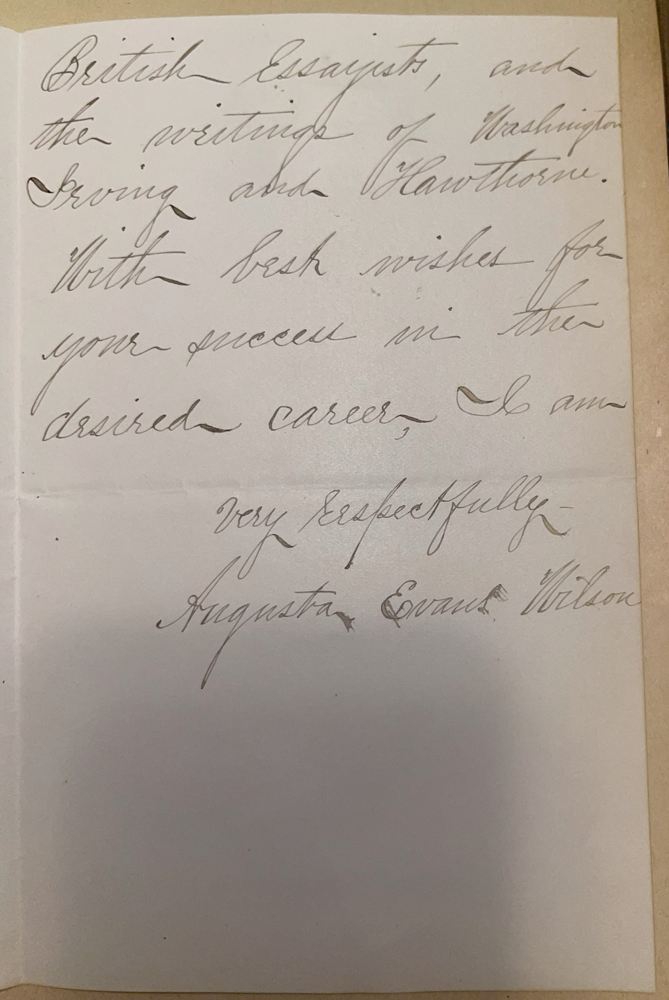

# 🖋️ Augusta Evans Wilson - Letter (1893)

---

## 📜 Transcription

**Letter (December 22, 1893):**  

Mobile, Dec’r 22d  
Mr. C. W. Mills  

Dear Sir:  

In reply to your letter relative to the best method of preparing for literary pursuits, permit me to suggest that you select and study as models of perfect style the works of the British Essayists, and the writings of Washington Irving and Hawthorne.  

With best wishes for your success in the desired career, I am  

Very respectfully,  
Augusta Evans Wilson  

---

## 📚 Augusta Evans Wilson

**Augusta Evans Wilson (1835–1909)**, born Augusta Jane Evans, was a celebrated American novelist of the 19th century, renowned for her domestic fiction that blended moral and religious themes with Southern ideals. Born on May 8, 1835, in Columbus, Georgia, Evans grew up in Mobile, Alabama, where she spent much of her life. She began writing as a teenager, publishing her first novel, *Inez: A Tale of the Alamo* (1855), at the age of 20. Her breakthrough came with *Beulah* (1859), a coming-of-age story that explored a young woman’s spiritual and intellectual growth, which gained her national recognition. During the Civil War, Evans was a staunch Confederate supporter, writing *Macaria; or, Altars of Sacrifice* (1864) to boost Southern morale, a novel that was banned in the North but widely read in the South.

Evans achieved her greatest success with *St. Elmo* (1866), a melodramatic romance that became one of the best-selling novels of the era, reportedly selling over a million copies and inspiring everything from town names to baby names across the South. Her works, including later novels like *At the Mercy of Tiberius* (1887), often featured strong-willed heroines who navigated complex moral dilemmas, reflecting Evans’s belief in traditional gender roles and Christian values. She married Lorenzo Madison Wilson in 1868, a wealthy Mobile businessman, and continued writing under the name Augusta Evans Wilson, balancing her literary career with her roles as a wife and stepmother.

In 1893, when this letter was written, Wilson was 58 years old and living in Mobile, Alabama, where she had settled after her marriage. The letter, addressed to Mr. C. W. Mills, responds to Mills’ inquiry about preparing for a literary career, offering advice that reflects Wilson’s own approach to writing. She recommends studying the British Essayists—likely referring to 18th-century writers like Joseph Addison and Richard Steele—as well as American authors Washington Irving and Nathaniel Hawthorne, whose works she admired for their stylistic elegance and moral depth. This advice underscores Wilson’s emphasis on classical models of literature, a foundation that shaped her own successful career. Written during a period when Wilson was still an influential literary figure, the letter captures her role as a mentor to aspiring writers, a role she often embraced in her later years. Wilson continued writing until her death on May 9, 1909, in Mobile, leaving a legacy as one of the South’s most popular novelists, whose works provided insight into the cultural and moral landscape of the post-Civil War South.

---

## 🔗 Return to [Index](index.md)