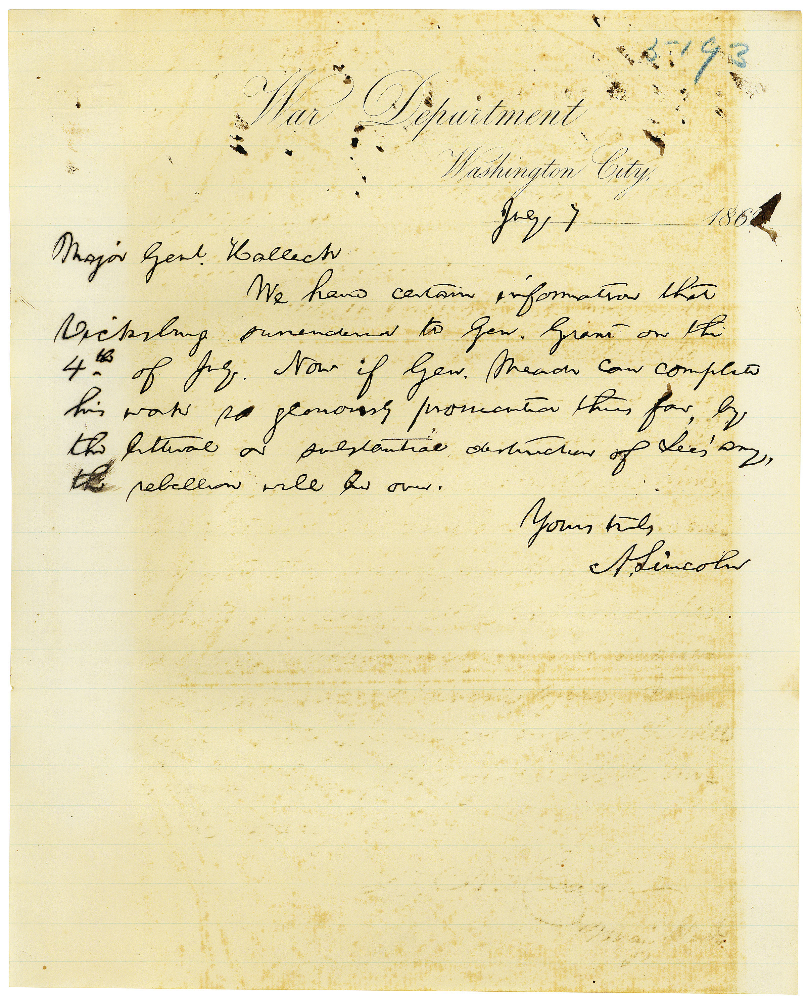

# 🖋️ Abraham Lincoln - Signed Letter (1863)

---

## 📜 Description

This letter, dated **July 1863**, was penned by President **Abraham Lincoln** during the height of the American Civil War. Addressed to a senior Union officer, the letter discusses military strategy and reinforces Lincoln’s commitment to preserving the Union.

The document reflects Lincoln’s characteristic clarity and eloquence, with a closing signature that remains one of the most iconic in American history.

---

## 🕰️ Historical Context

- **Date:** July 4, 1863  
- **Recipient:** General George G. Meade  
- **Topic:** Encouragement following the Union victory at Gettysburg  

In this letter, Lincoln expressed his gratitude to General Meade for his leadership and urged continued vigilance in the wake of the pivotal victory at Gettysburg.

---

## 🖼️ Image Details

- **Title:** Lincoln's Letter to General Meade  
- **Medium:** Ink on parchment  
- **Dimensions:** 8 x 10 inches  

The original document is preserved in the **Library of Congress** and is part of the Abraham Lincoln Papers.

---

## 🔗 Return to [Index](index.md)
