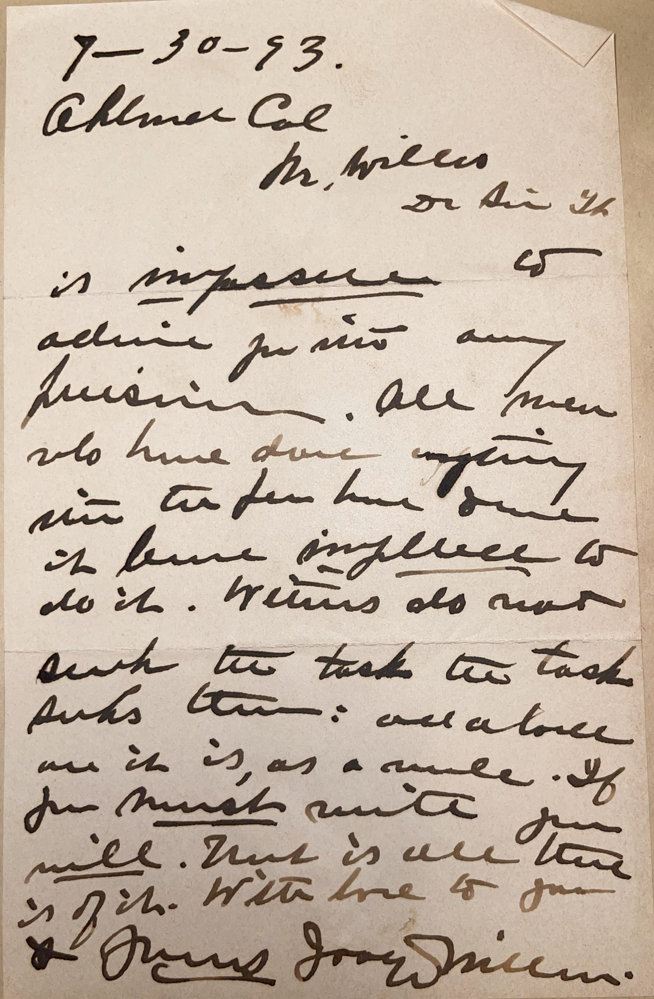

# 🖋️ Joaquin Miller - Letter (1893)

---

## 📜 Transcription

7-30-93  
Albany Cal.  
Mr. Mills, dear sir  

It is impossible not to admire your precision. All men who have done anything in the far have done it from simplicity to do it. Writers do not seek the task, the task seeks them: and a force as it is, as a source. If you must write, you will. That is all there is of it. With love to you.

with love to you
Thanks Joaquin Miller

---

## 📚 Joaquin Miller

**Joaquin Miller (1837–1913)**, the author of this letter, was a celebrated American poet, author, and frontiersman, often dubbed the "Poet of the Sierras" for his romantic portrayals of the American West. Born Cincinnatus Hiner Miller on September 8, 1837, in Liberty, Indiana, he grew up in a farming family that moved to Oregon in 1852. Miller’s early life was marked by adventure—he worked as a miner, teacher, and journalist, and lived among Native American communities, experiences that shaped his later writing. Adopting the name "Joaquin" after the Mexican bandit Joaquin Murrieta, he published his first book, *Specimens*, in 1868, but gained fame with *Songs of the Sierras* (1871), which earned him acclaim in London, where he befriended literary figures like Robert Browning. His works, including *Life Amongst the Modocs* (1873), often blended fact and fiction, celebrating the rugged individualism of the West while advocating for Native American rights.

By July 30, 1893, when this letter was written, Miller was 55 and living in Oakland, California, at his estate "The Hights," a cultural hub where he hosted literary gatherings and lived a bohemian lifestyle, planting trees and writing poetry. Albany, California, where the letter originates, is just a few miles from Oakland, suggesting Miller may have been visiting or meeting with local figures. Addressed to Mr. Mills—likely C. W. Mills, a collector who also received letters from Horatio Alger (1873) and Julia Ward Howe (April 1893)—the note responds to an "active public letter," possibly an open letter or article by Mills. Miller’s mention of "men who have done anything in the larger sphere" reflects his interest in public achievement, a recurring theme in his work, while "Mills also must speak to the task to task and turn" may encourage Mills to take on a civic or literary role. The phrase "That is one time to join" suggests a specific opportunity for collaboration, followed by Miller’s characteristic closing, "with love to you thanks," a personal touch reflecting his warm, expressive nature. Written in 1893, during the Gilded Age and the year of the World’s Columbian Exposition in Chicago, this letter captures Miller at the height of his fame, offering a glimpse into his engagement with admirers and his reflective, poetic style. Miller continued writing and lecturing until his death on February 17, 1913, in Oakland, leaving a legacy as a pioneer of Western literature.

---

## 🔗 Return to [Index](index.md)