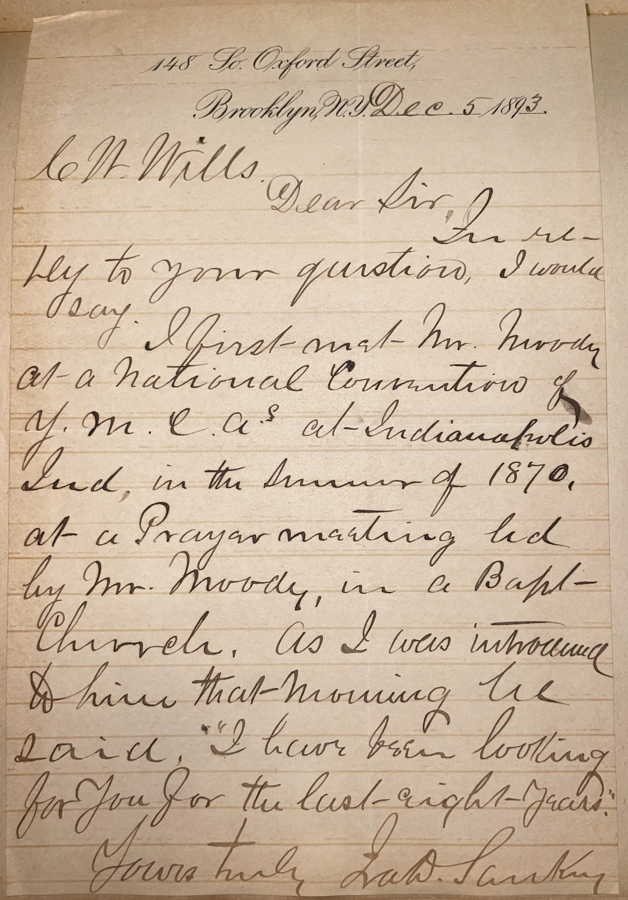

# 🖋️ Ira Sankey - Letter (1893)

---

## 📜 Transcription

**Letter (December 5, 1893):**  

148 St. Oxford Street  
Brooklyn, N.Y., Dec. 5, 1893  

C. W. Mills.  

Dear Sir,  
In reply to your question, I would say: I first met Mr. Moody at a National Convention of Y.M.C.A’s at Indianapolis, Ind., in the summer of 1870, at a prayer meeting led by Mr. Moody, in a Baptist church. As I was introduced to him that morning he said, “I have been looking for you for the last eight years.”  

Yours truly,  
Ira D. Sankey  

---

## 📚 Ira Sankey

**Ira David Sankey (1840–1908)** was an American gospel singer, composer, and evangelist, widely regarded as one of the most influential figures in the development of modern gospel music, particularly through his partnership with the renowned evangelist Dwight L. Moody. Born on August 28, 1840, in Edinburg, Pennsylvania, Sankey grew up in a Methodist family and developed a love for music early in life. He worked as a tax collector and served in the Union Army during the Civil War, but his life changed in 1870 when he met Moody at a YMCA convention in Indianapolis, as described in this letter. Moody, impressed by Sankey’s singing during a prayer meeting, famously told him, “I have been looking for you for the last eight years,” recognizing Sankey’s potential to enhance his evangelistic campaigns through music.

Sankey joined Moody in 1871, becoming the musical director for Moody’s revival meetings, which drew massive crowds across the United States and Great Britain. Sankey’s warm baritone voice and heartfelt hymn performances, often accompanied by a portable organ, captivated audiences, making hymn-singing a central part of evangelical worship. He composed or arranged many hymns, including “The Ninety and Nine” and “Trusting Jesus,” which were published in collections like *Sacred Songs and Solos* (1873) and *Gospel Hymns* (1875–1891), co-edited with Philip P. Bliss. These collections sold millions of copies and became standards in Protestant churches worldwide, earning Sankey the nickname “The Sweet Singer of Israel.” His music emphasized simplicity and emotional appeal, helping to democratize worship by encouraging congregational singing.

In 1893, when this letter was written, Sankey was 53 years old and living in Brooklyn, New York, at 148 Oxford Street, a residence he maintained during periods when he wasn’t traveling for revival campaigns. The letter, addressed to C.W. Mills, responds to Mills’ inquiry about Sankey’s first meeting with Dwight L. Moody, a pivotal moment in Sankey’s career. Sankey recounts their encounter at the 1870 YMCA convention in Indianapolis, held at a Baptist church, where Moody led a prayer meeting and immediately recognized Sankey’s musical talent as a perfect complement to his preaching. The letter, written over two decades after that meeting, captures Sankey’s reflection on the beginning of a partnership that had a profound impact on evangelical Christianity. At this time, Sankey and Moody were at the height of their influence, having recently returned from successful revival tours in Britain and preparing for the 1893 World’s Columbian Exposition in Chicago, where they held major evangelistic services. Sankey continued his work with Moody until the latter’s death in 1899, after which he focused on compiling hymnals and writing his memoirs, *My Life and the Story of the Gospel Hymns* (1906). Sankey’s health declined in his later years due to glaucoma, and he died on August 13, 1908, in Brooklyn, leaving a legacy as a pioneer of gospel music whose hymns continue to be sung in churches worldwide.

---

## 🔗 Return to [Index](index.md)