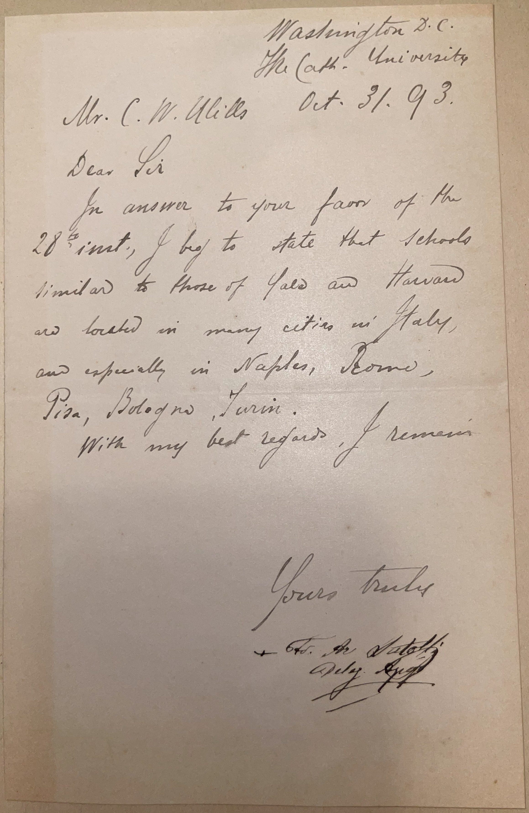

# 🖋️ Francesco Satolli - Letter (1893)

---

## 📜 Transcription

**Letter (October 31, 1893):**  

Washington D.C.  
The Cath. University  
Oct. 31. '93  

Mr. C. W. Mills  
Dear Sir  

In answer to your favor of the 28th inst., I beg to state that schools similar to those of Yale and Harvard are located in many cities in Italy, and especially in Naples, Rome, Pisa, Bologna, Turin.  

With my best regards I remain  

Yours truly  
✝ Fr. Fr. Satolli  
Deleg. Apost.  

---

## 📚 Francesco Satolli

**Francesco Satolli (1839–1910)** was an Italian Catholic prelate and the first Apostolic Delegate to the United States, appointed by Pope Leo XIII in 1893, marking a significant step in the Vatican’s engagement with the growing Catholic population in America. Born on July 21, 1839, in Marsciano, Italy, Satolli was ordained a priest in 1862 and rose through the ranks of the Catholic Church, becoming a professor of theology at the Urban College of Propaganda Fide in Rome and later serving as president of the Pontifical Ecclesiastical Academy, where he trained future Vatican diplomats. In 1888, he was consecrated as a titular archbishop, and in 1892, he was sent to the U.S. to represent the Vatican at the World’s Columbian Exposition in Chicago, a role that showcased the Church’s presence in American culture.

In January 1893, Pope Leo XIII formally appointed Satolli as the first Apostolic Delegate to the United States, a position he held until 1896. Based in Washington, D.C., Satolli worked to strengthen the Catholic Church’s organization in the U.S., addressing issues like the integration of immigrant communities, the role of Catholic education, and tensions between American bishops over “Americanism”—a perceived tendency among some U.S. Catholics to prioritize democratic values over Church authority. Satolli’s most significant contribution was his involvement in the “school controversy” of the 1890s, where he initially supported a compromise allowing Catholic children to attend public schools under certain conditions (the “Faribault Plan”), but later aligned with more conservative bishops who favored parochial schools, issuing a 1892 decree that encouraged the establishment of Catholic schools. He also played a key role in the founding of the Catholic University of America, where he served as a professor of theology and resided during his time in the U.S.

This letter, written on October 31, 1893, from the Catholic University in Washington, D.C., was penned during Satolli’s early tenure as Apostolic Delegate. Addressed to Mr. C.W. Mills, it responds to Mills’ inquiry of October 28 about educational institutions in Italy comparable to Yale and Harvard. Satolli, drawing on his knowledge of Italian academia, lists several cities—Naples, Rome, Pisa, Bologna, and Turin—known for their historic universities, such as the University of Bologna (founded in 1088) and the University of Naples (founded in 1224), which were among the oldest and most prestigious in Europe. His response reflects his background as an educator and his role as a liaison between the Vatican and American Catholics, many of whom were interested in European education models for their children. The letter is signed with a cross (✝), indicating his episcopal status, and “Fr. Fr. Satolli, Deleg. Apost.,” an abbreviation for “Father Francesco Satolli, Apostolic Delegate.” Written in the first year of his delegation, the letter captures Satolli at a pivotal moment, as he worked to navigate the cultural and religious challenges facing the Catholic Church in the U.S. Satolli later became a cardinal in 1895 and returned to Italy in 1896, where he served in various Vatican roles until his death on January 8, 1910, in Rome, leaving a legacy as a bridge between the Vatican and the American Catholic community during a formative period.

---

## 🔗 Return to [Index](index.md)