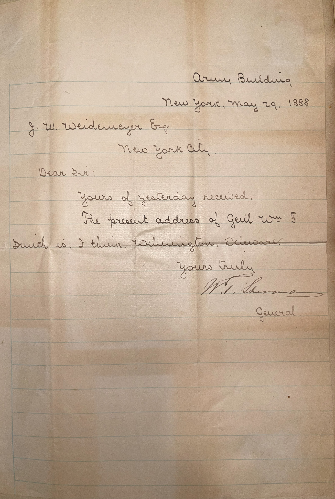

---

## 📜 Transcription

ARMY BUILDING  
NEW YORK, MAY 29, 1888  

J. W. WEIDENMEYER ESQ  
NEW YORK CITY.  

DEAR SIR:  

YOURS OF YESTERDAY RECEIVED.  

THE PRESENT ADDRESS OF GENL WM. F. SMITH IS, I THINK, WILMINGTON, DELAWARE.  

YOURS TRULY  
W. T. SHERMAN  
GENERAL.  

---

## 📚 William Tecumseh Sherman

**William Tecumseh Sherman (1820–1891)**, the author of this letter, was a renowned Union general during the American Civil War, celebrated for his strategic brilliance and controversial tactics, born on February 8, 1820, in Lancaster, Ohio. Sherman graduated from the United States Military Academy at West Point in 1840, ranking sixth in his class, and served in the U.S. Army during the Second Seminole War before resigning in 1853 to pursue civilian careers in banking and education. He briefly served as the first superintendent of the Louisiana State Seminary of Learning & Military Academy (now Louisiana State University) before the Civil War broke out. Returning to the military in 1861, Sherman rose to prominence under Ulysses S. Grant, participating in key battles like Shiloh (1862) and Vicksburg (1863). His most famous campaign, the "March to the Sea" in 1864, saw his troops cut a destructive path through Georgia, targeting Confederate infrastructure to break the South’s will to fight—an early example of total war that hastened the Confederacy’s defeat. Sherman accepted the surrender of Confederate forces in the Carolinas in 1865, cementing his legacy as one of the war’s most effective, if polarizing, commanders.

After the war, Sherman served as Commanding General of the U.S. Army from 1869 to 1883, overseeing military operations in the American West during the Indian Wars, a period marked by controversial policies toward Native American populations. Known for his blunt pragmatism—famously declaring "War is hell"—Sherman retired in 1883 and moved to New York City, where he lived out his final years. On May 29, 1888, when this letter was written from the Army Building in New York, Sherman was 68 years old and engaged in post-retirement correspondence, as evidenced by this note to J. W. Weidenmeyer. The letter provides the address of General William Farrar Smith, a former Union general and engineer likely working on infrastructure projects in Wilmington, Delaware, at the time. Sherman’s involvement in such networks reflects his continued influence in military and professional circles. He remained a public figure, writing memoirs and speaking at events, until his death on February 14, 1891, in New York City. Sherman’s funeral was a major event, attended by thousands, and his legacy endures as a master strategist, though his scorched-earth tactics and role in Native American displacement remain subjects of debate.

---

## 🔗 Return to [Index](index.md)