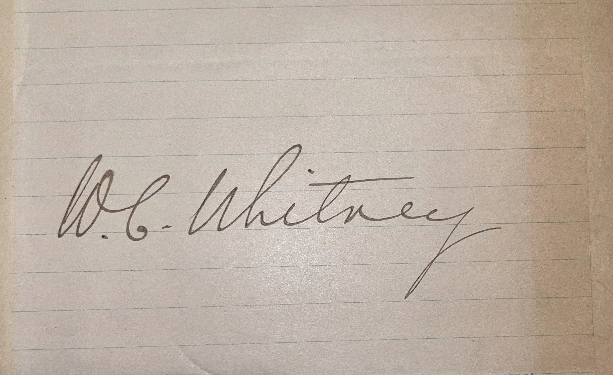
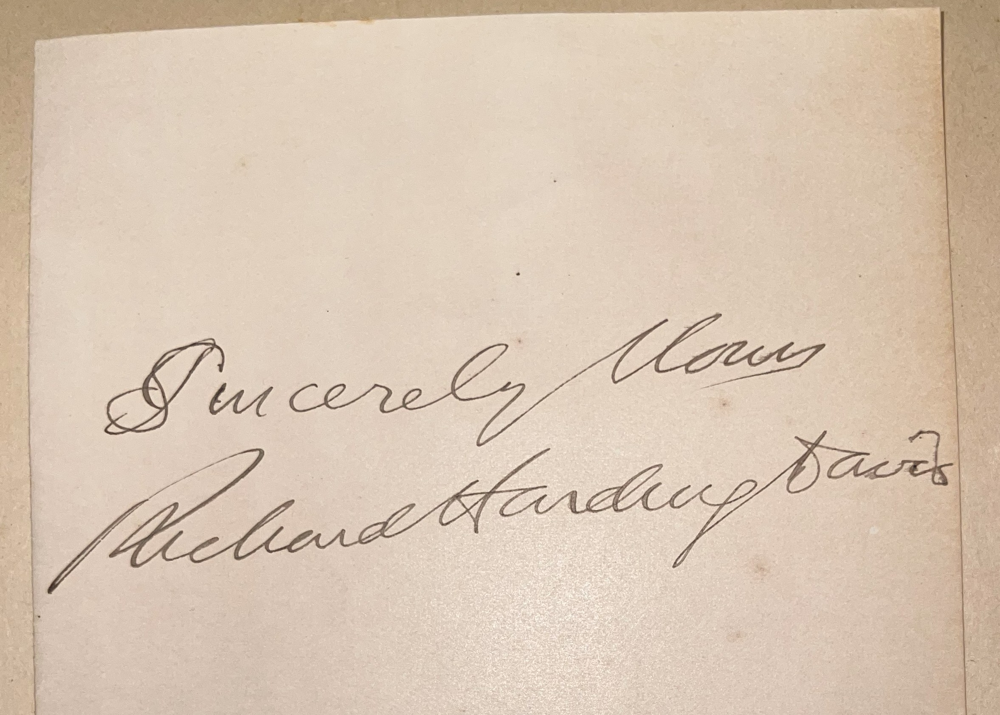
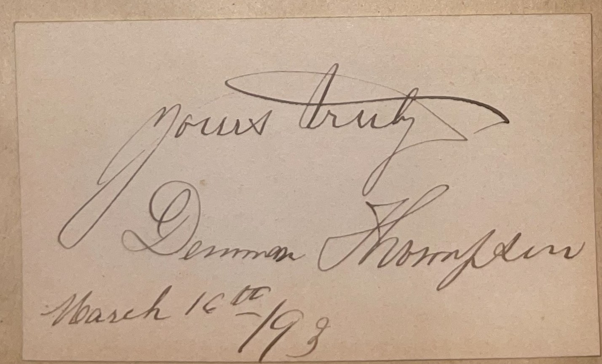
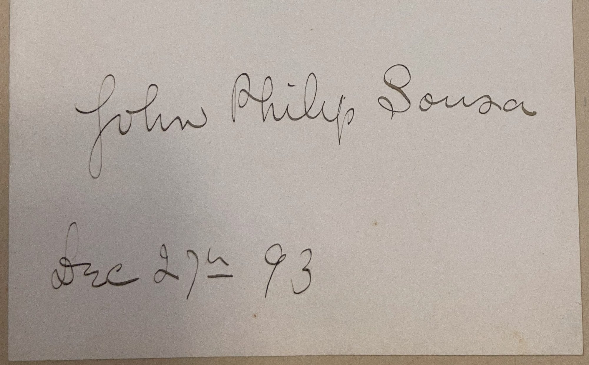
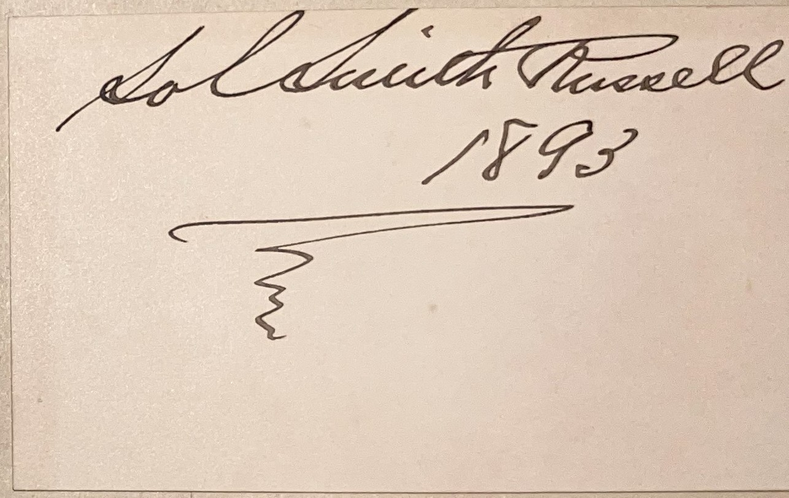
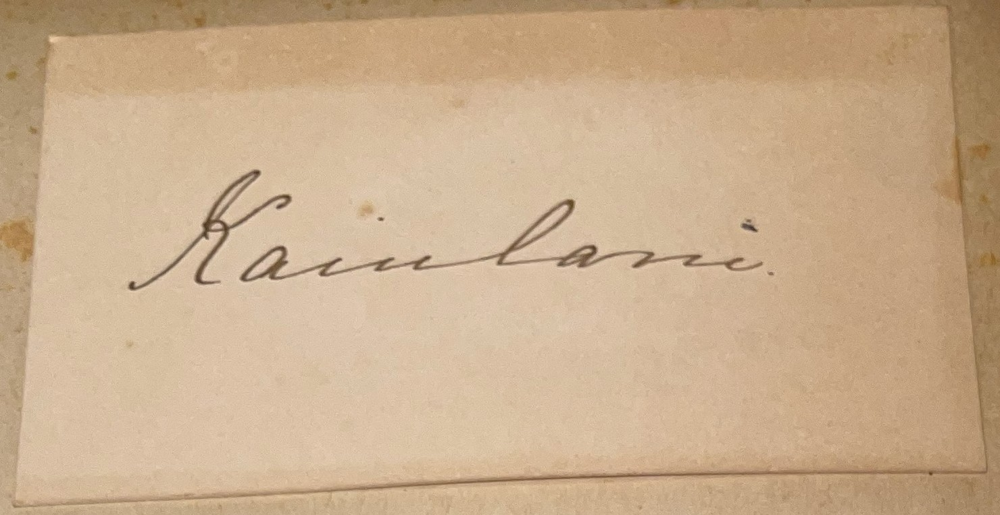

# 🖋️ Signature Collection (Late 19th Century)

## 📜 Overview

This page showcases a collection of 85 signatures from prominent figures of the late 19th century, collected by C. W. Mills as part of his efforts to gather autographs from notable individuals of the era. The signatures are categorized by the individuals’ primary roles or contributions, including politicians, military figures, authors, activists, entertainers, and other notable personalities. **Note**: This collection includes highlighted autographs from especially prominent figures, marked with 🌟 symbols, such as Thomas Edison, Frederick Douglass, and Benjamin Harrison. Look for them in their respective categories below!

---

## 📚 Categorized Signatures

  
  
🌟 <strong>Thomas Edison (1847–1931)</strong> 🌟: Thomas Edison was an American inventor and businessman whose innovations revolutionized modern life in the late 19th and early 20th centuries. He developed the phonograph, the practical incandescent light bulb, and early motion picture technology, holding over 1,000 patents in his lifetime. Edison’s establishment of the first industrial research laboratory in Menlo Park, New Jersey, set a new standard for innovation, and his work on electrical power distribution made electricity accessible to the masses. His fame as the “Wizard of Menlo Park†made him a global icon, and his contributions continue to shape technology today.

### Politicians and Government Officials

  
  
🌟 <strong>Benjamin Harrison (1833–1901)</strong> 🌟: Benjamin Harrison was the 23rd President of the United States, serving from 1889 to 1893 between Grover Cleveland’s two non-consecutive terms, and was a Republican known for his economic policies during the Gilded Age. His administration passed the Sherman Antitrust Act, the first federal law to regulate monopolies, and the McKinley Tariff, which raised duties on imports to protect American industries. Harrison also oversaw the admission of six new states to the Union and was a strong advocate for civil rights, pushing for federal protections against racial discrimination. A Civil War veteran and grandson of President William Henry Harrison, his presidency bridged a transformative period in American politics.

  
  
<strong>Arthur P. Gorman (1839–1906)</strong>: A U.S. Senator from Maryland, Gorman was a key Democratic leader in the late 19th century, known for his role in tariff reform debates.

  
  
<strong>Charles F. Crisp (1845–1896)</strong>: A Georgia Congressman, Crisp served as Speaker of the U.S. House from 1891 to 1895, leading Democratic efforts during a period of economic turmoil.

  
  
<strong>Charles F. Manderson (1837–1911)</strong>: A Nebraska Senator, Manderson was a Civil War veteran who served as President pro tempore of the Senate in the early 1890s.

  
  
<strong>Chauncey Depew (1834–1928)</strong>: A New York Senator, Depew was a prominent Republican orator and railroad executive, known for his influence in Gilded Age politics.

  
  
<strong>Daniel E. Sickels (1819–1914)</strong>: A New York Congressman, Sickels was a controversial Civil War general who later played a role in Reconstruction-era politics.

  
  
<strong>David B. Hill (1843–1910)</strong>: Governor of New York from 1885 to 1891, Hill was a Democratic leader who later served as a U.S. Senator, opposing Cleveland’s policies.

  
  
<strong>Frank Hiscock (1834–1914)</strong>: A New York Senator, Hiscock co-authored the 1890 Sherman Antitrust Act, a landmark law aimed at curbing monopolies.

  
  
<strong>Hamilton Fish (1808–1893)</strong>: A former U.S. Secretary of State under Ulysses S. Grant, Fish was a New York statesman known for his diplomatic efforts in the 1870s.

  
  
<strong>Isaac P. Gray (1828–1895)</strong>: Governor of Indiana from 1885 to 1891, Gray was a Democrat who focused on education reform and later served as a diplomat.

  
  
<strong>Jacob A. Cantor (1854–1921)</strong>: A New York Congressman, Cantor was a Democratic leader in the 1890s, representing Manhattan’s Lower East Side.

  
  
<strong>John A. Logan (1826–1886)</strong>: A U.S. Senator from Illinois, Logan was a Civil War general who championed veterans’ rights and ran as the Republican vice-presidential candidate in 1884.

  
  
<strong>John C. Calhoun (1782–1850)</strong>: A former U.S. Vice President (1825–1832), Calhoun was a South Carolina statesman and advocate for states’ rights, though deceased by 1893.

  
  
<strong>John M. Palmer (1817–1900)</strong>: A U.S. Senator and former Governor of Illinois, Palmer was a Civil War general who later ran for president in 1896 on a third-party ticket.

  
  
<strong>John Sherman (1823–1900)</strong>: A U.S. Senator from Ohio, Sherman authored the Sherman Antitrust Act and served as Secretary of State under William McKinley.

  
  
<strong>Justin McCarthy (1830–1912)</strong>: A British politician and Irish nationalist, McCarthy led the Irish Parliamentary Party in the 1890s and was also a noted historian.

  
  
<strong>Levi P. Morton (1824–1920)</strong>: Vice President under Benjamin Harrison (1889–1893), Morton was a New York banker and diplomat who later became Governor of New York.

  
  
<strong>Matthew Quay (1833–1904)</strong>: A Pennsylvania Senator, Quay was a powerful Republican boss known for his political machine and influence in the Gilded Age.

  
  
<strong>Melville W. Fuller (1833–1910)</strong>: Chief Justice of the U.S. Supreme Court from 1888 to 1910, Fuller led the court during a period of significant legal decisions on economic regulation.

  
  
<strong>Murat Halstead (1829–1908)</strong>: A prominent journalist, Halstead edited the *Cincinnati Commercial* and was a vocal political commentator during the late 19th century.

  
  
<strong>Richard Croker (1843–1922)</strong>: Leader of Tammany Hall in New York City, Croker was a powerful Democratic boss who controlled city politics in the 1890s.

  
  
<strong>Robert E. Pattison (1850–1904)</strong>: Governor of Pennsylvania in the 1880s and 1890s, Pattison was a reform-minded Democrat who tackled corruption in state government.

  
  
<strong>Robert W. Furnas (1824–1905)</strong>: Governor of Nebraska from 1873 to 1875, Furnas was a pioneer in agricultural education and a founder of the Nebraska State Fair.

  
  
<strong>Roger Q. Mills (1832–1911)</strong>: A Texas Senator, Mills was a leading advocate for tariff reform and authored the 1888 Mills Tariff Bill, a key Democratic initiative.

  
  
<strong>Seth Low (1850–1916)</strong>: Mayor of Brooklyn and later President of Columbia University, Low was a reform-minded leader who championed municipal improvements.

  
  
<strong>Thomas Brackett Reed (1839–1902)</strong>: Speaker of the U.S. House from 1889 to 1891 and 1895 to 1899, Reed was a Republican known for his parliamentary reforms.

  
  
<strong>Wade Hampton (1818–1902)</strong>: A South Carolina Senator, Hampton was a former Confederate general and governor who led the state’s Democratic “Redeemer†government.

  
  
<strong>Wayne MacVeagh (1833–1917)</strong>: Former U.S. Attorney General under James Garfield, MacVeagh was a Pennsylvania lawyer and diplomat in the late 19th century.

  
  
<strong>William Bourke Cockran (1854–1923)</strong>: A New York Congressman, Cockran was a renowned orator who influenced Democratic politics and mentored Winston Churchill.

  
  
<strong>William Collins Whitney (1841–1904)</strong>: An American financier and politician, Whitney served as Secretary of the Navy and was a prominent New York socialite.

  
  
<strong>William Eustis Russell (1857–1896)</strong>: Governor of Massachusetts from 1891 to 1894, Russell was a young Democratic reformer focused on labor and education issues.

  
  
<strong>William Sulzer (1863–1941)</strong>: A New York Congressman, Sulzer later became Governor of New York but was impeached in 1913 amid political scandals.

### Military Figures

  
  
<strong>J. G. Walker (1821–1893)</strong>: A Rear Admiral in the U.S. Navy, Walker commanded naval forces during the late 19th century and contributed to naval modernization.

  
  
<strong>James A. Greer (1833–1904)</strong>: A Rear Admiral in the U.S. Navy, Greer served during the Civil War and later commanded the European Squadron in the 1880s.

  
  
<strong>John M. Schofield (1831–1906)</strong>: A Union general during the Civil War, Schofield later served as U.S. Secretary of War and Commanding General of the Army.

  
  
<strong>Nelson A. Miles (1839–1925)</strong>: A U.S. Army general, Miles led campaigns in the Indian Wars and served as Commanding General of the Army during the Spanish-American War.

  
  
<strong>Oliver O. Howard (1830–1909)</strong>: A Union general during the Civil War, Howard founded Howard University and led the Freedmen’s Bureau during Reconstruction.

  
  
<strong>William Rosecrans (1819–1898)</strong>: A Union general during the Civil War, Rosecrans led key campaigns like Stones River but later served in political roles.

  
  
<strong>Winfield Scott Hancock (1824–1886)</strong>: A Union general during the Civil War, Hancock was a hero at Gettysburg and ran as the Democratic presidential candidate in 1880.

  
  
<strong>Mrs. John A. Logan (1838–1923)</strong>: Widow of General John A. Logan, she was a writer and advocate for veterans, preserving her husband’s legacy.

### Authors and Poets

  
  
🌟 <strong>Ralph Waldo Emerson (1803–1882)</strong> 🌟: Ralph Waldo Emerson was an American essayist, poet, and philosopher who led the Transcendentalist movement, profoundly shaping 19th-century American intellectual thought. His essays, such as *Self-Reliance* (1841) and *Nature* (1836), emphasized individualism, spiritual connection to nature, and the rejection of materialism, influencing writers like Henry David Thoreau and Walt Whitman. As a lecturer, Emerson spoke widely on abolition, education, and reform, becoming a central figure in American literary and philosophical circles. His ideas on self-reliance and transcendentalism remain foundational to American cultural identity, making his autograph a highlight of this collection.

  
  
🌟 <strong>Harriet Beecher Stowe (1811–1896)</strong> 🌟: Harriet Beecher Stowe was an American novelist and abolitionist whose 1852 novel *Uncle Tom’s Cabin* had a profound impact on the anti-slavery movement in the United States. The book, which depicted the harsh realities of slavery, sold over 300,000 copies in its first year and was credited with shifting public opinion in the North, earning praise from abolitionists and criticism from slaveholders. Stowe, a member of a prominent religious family, continued to write and advocate for social reform throughout her life, including works on women’s roles and education. Her international fame, including meetings with Queen Victoria, cemented her legacy as a literary and moral force.

  
  
<strong>Alexander Salvini (1859–1896)</strong>: An Italian-American actor and author, Salvini was known for his dramatic performances and writings on theater in the 1890s.

  
  
<strong>Charles Hoyt (1859–1900)</strong>: A playwright and producer, Hoyt wrote popular farces like *A Trip to Chinatown* (1891), shaping American theater in the Gilded Age.

  
  
<strong>Charlotte Mary Yonge (1823–1901)</strong>: A British novelist, Yonge wrote historical and religious fiction, including *The Heir of Redclyffe* (1853), popular in the Victorian era.

  
  
<strong>Edgar Wilson Nye (1850–1896)</strong>: A humorist known as “Bill Nye,†he wrote satirical columns and books, entertaining readers with his wit in the late 19th century.

  
  
<strong>Edna Dean Proctor (1829–1923)</strong>: An American poet, Proctor wrote patriotic and sentimental verse, including works celebrating the Civil War and American landscapes.

  
  
<strong>Edward Eggleston (1837–1902)</strong>: An American novelist, Eggleston wrote *The Hoosier Schoolmaster* (1871), a pioneering work of regional fiction about rural life.

  
  
<strong>Edward Everett Hale (1822–1909)</strong>: An American author and minister, Hale wrote *The Man Without a Country* (1863), a patriotic story that gained fame during the Civil War.

  
  
<strong>Frances Hodgson Burnett (1849–1924)</strong>: A British-American novelist, Burnett wrote *Little Lord Fauntleroy* (1886) and *The Secret Garden* (1911), beloved children’s classics.

  
  
<strong>Frank Leslie (1821–1880)</strong>: A British-American publisher, Leslie founded *Frank Leslie’s Illustrated Newspaper*, a popular pictorial journal in the 19th century.

  
  
<strong>George W. Peck (1840–1916)</strong>: An American humorist and politician, Peck wrote the *Peck’s Bad Boy* series and later served as Governor of Wisconsin.

  
  
<strong>Harry Castlemon (1842–1915)</strong>: A pseudonym for Charles Austin Fosdick, he was a prolific children’s author known for adventure series like the *Gunboat Series*.

  
  
<strong>Henry James (1843–1916)</strong>: An American-British novelist, James wrote psychological realist works like *The Portrait of a Lady* (1881), exploring transatlantic culture.

  
  
<strong>Henry Longfellow (1807–1882)</strong>: An American poet, Longfellow wrote beloved works like *The Song of Hiawatha* (1855) and *Paul Revere’s Ride* (1860), shaping national literature.

  
  
<strong>Henry Watterson (1840–1921)</strong>: A journalist and editor of the *Louisville Courier-Journal*, Watterson was a Pulitzer Prize winner and influential Democratic voice.

  
  
<strong>James Whitcomb Riley (1849–1916)</strong>: An American poet, Riley was known as the “Hoosier Poet†for works like *Little Orphant Annie*, capturing rural life.

  
  
<strong>Marion Harland (1830–1922)</strong>: Pen name of Mary Virginia Terhune, Harland wrote domestic novels and cookbooks, including *Common Sense in the Household* (1871).

  
  
<strong>Rebecca Harding Davis (1831–1910)</strong>: An American novelist, Davis wrote *Life in the Iron Mills* (1861), a pioneering work of social realism addressing industrial labor.

  
  
<strong>Richard Harding Davis (1864–1916)</strong>: An American journalist and author, Davis covered wars and wrote popular fiction, including *Gallegher and Other Stories* (1891).

  
  
<strong>Thomas Bailey Aldrich (1836–1907)</strong>: An American poet and novelist, Aldrich wrote *The Story of a Bad Boy* (1870), a precursor to Mark Twain’s *Tom Sawyer*.

  
  
<strong>William Cullen Bryant (1794–1878)</strong>: An American poet, Bryant wrote *Thanatopsis* (1817) and edited the *New-York Evening Post*, influencing literary and political discourse.

  
  
<strong>William Taylor Adams (1822–1897)</strong>: Pen name Oliver Optic, Adams wrote children’s adventure novels like the *Boat Club Series*, popular in the 19th century.

### Activists and Reformers

  
  
🌟 <strong>Frederick Douglass (1818–1895)</strong> 🌟: Frederick Douglass was an American abolitionist, orator, and writer whose powerful advocacy made him one of the most influential figures in the fight against slavery in the 19th century. Born into slavery, he escaped in 1838 and became a leading voice for abolition, publishing his autobiography, *Narrative of the Life of Frederick Douglass, an American Slave* (1845), which exposed the horrors of slavery and became a bestseller. Douglass lectured extensively, served as a consultant to President Lincoln during the Civil War, and later held public offices, including U.S. Minister to Haiti. His eloquent speeches and writings on racial equality and justice continue to resonate, cementing his legacy as a champion of human rights.

  
  
🌟 <strong>Elizabeth Cady Stanton (1815–1902)</strong> 🌟: Elizabeth Cady Stanton was a leading American suffragist and social reformer who played a pivotal role in the women’s rights movement in the 19th century. She co-organized the 1848 Seneca Falls Convention, the first women’s rights convention, where she presented the *Declaration of Sentiments*, demanding equal rights for women, including the right to vote. Stanton worked closely with Susan B. Anthony, co-founding the National Woman Suffrage Association in 1869, and authored influential works like *The Woman’s Bible*, challenging religious justifications for gender inequality. Her lifelong advocacy laid the groundwork for the eventual passage of the 19th Amendment, making her a cornerstone of the fight for gender equality.

  
  
<strong>Dwight L. Moody (1837–1899)</strong>: An American evangelist, Moody founded the Moody Bible Institute and led massive revival campaigns in the U.S. and Britain.

  
  
<strong>Henry George (1839–1897)</strong>: An American economist and social reformer, George wrote *Progress and Poverty* (1879), advocating for a single tax on land to reduce inequality.

  
  
<strong>John H. Vincent (1832–1920)</strong>: A Methodist bishop, Vincent co-founded the Chautauqua Institution, promoting adult education and cultural enrichment in the late 19th century.

  
  
<strong>James Cardinal Gibbons (1834–1921)</strong>: Archbishop of Baltimore, Gibbons was a leading American Catholic who advocated for labor rights and religious tolerance.

  
  
<strong>William Jennings Demorest (1822–1895)</strong>: An American publisher and businessman, Demorest pioneered the paper pattern industry and advocated for temperance and women’s rights.

### Entertainers and Performers

  
  
🌟 <strong>Buffalo Bill Cody (1846–1917)</strong> 🌟: William Frederick “Buffalo Bill†Cody was an American scout, bison hunter, and showman who became a cultural icon of the American West in the late 19th century. He earned his nickname by hunting buffalo to supply meat for railroad workers, later serving as a scout for the U.S. Army during the Indian Wars. In 1883, Cody founded Buffalo Bill’s Wild West, a traveling show that featured reenactments of frontier life, including performances by figures like Annie Oakley and Sitting Bull, touring the U.S. and Europe. His show popularized the romanticized image of the West, making him a global celebrity and a symbol of American frontier mythology.

  
  
<strong>Denman Thompson (1833–1911)</strong>: An American actor, Thompson was best known for his play *The Old Homestead*, a popular rural drama in the late 19th century.

  
  
<strong>Edwin Booth (1833–1893)</strong>: A renowned American actor, Booth was a leading Shakespearean performer, though overshadowed by his brother John Wilkes Booth’s assassination of Lincoln.

  
  
<strong>Helena Modjeska (1840–1909)</strong>: A Polish actress who immigrated to the U.S., Modjeska was celebrated for her Shakespearean roles and performances in the 1880s and 1890s.

  
  
<strong>Ignacy Jan Paderewski (1860–1941)</strong>: A Polish pianist and composer, Paderewski was a global celebrity for his virtuosic performances and later served as Poland’s Prime Minister.

  
  
<strong>John Philip Sousa (1854–1932)</strong>: An American composer and bandleader, Sousa, known as the “March King,†wrote iconic marches like *The Stars and Stripes Forever*.

  
  
<strong>Lavinia Warren (1841–1919)</strong>: An American circus performer, Warren, known as Mrs. Tom Thumb, performed with P.T. Barnum alongside her husband, General Tom Thumb.

  
  
<strong>Nat Goodwin (1857–1919)</strong>: An American actor and comedian, Goodwin was a popular stage performer known for his roles in light comedies and dramas.

  
  
<strong>Sol Smith Russell (1848–1902)</strong>: An American actor, Russell was a beloved comedian known for his roles in plays like *A Poor Relation* in the late 19th century.

  
  
<strong>William J. Florence (1831–1891)</strong>: An American actor, Florence was a popular stage performer and co-founder of the Shriners, a fraternal organization.

### Other Notable Figures

  
  
<strong>Darius Ogden Mills (1825–1910)</strong>: An American businessman, Mills was a financier and philanthropist who founded the Bank of California and supported charitable causes.

  
  
<strong>Kaiulani (1875–1899)</strong>: The last heir to the Hawaiian throne, Princess Kaiulani advocated for the restoration of the monarchy after its overthrow in 1893.

  
  
<strong>Robert Grant (1852–1940)</strong>: An American judge and author, Grant served on the Massachusetts bench and wrote novels like *Unleavened Bread* (1900).

---

## 🔗 Return to [Index](index.md)
