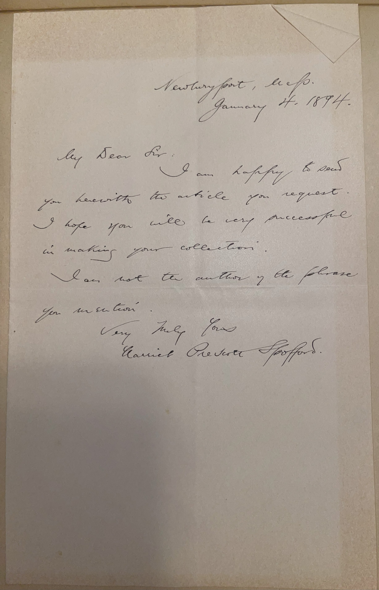

# 🖋️ Harriet Prescott Spofford - Letter (1894)

---

## 📜 Transcription

**Letter (January 4, 1894):**  

Newburyport, Mass.  
January 4, 1894  

My Dear Sir:  

I am happy to send you herewith the article you request. I hope you will be very successful in making your collection.  

I am not the author of the phrase you mention.  

Very Truly Yours,  
Harriet Prescott Spofford  

---

## 📚 Harriet Prescott Spofford

**Harriet Prescott Spofford (1835–1921)** was a prolific American writer, celebrated for her short stories, novels, and poetry that spanned genres from romance and gothic fiction to social realism, making her a significant literary figure of the 19th century. Born on April 3, 1835, in Calais, Maine, Spofford grew up in Newburyport, Massachusetts, where her family moved when she was a child. Facing financial hardship, she began writing to support her family, achieving early success with her story “In a Cellar,” a detective tale published in *The Atlantic Monthly* in 1859, which earned her national recognition at the age of 24. The story’s intricate plot and vivid style established her as a talented writer, and she went on to contribute regularly to major magazines like *Harper’s Bazaar*, *Lippincott’s Magazine*, and *The Atlantic Monthly*, producing hundreds of stories, essays, and poems over her career.

Spofford’s work often explored themes of beauty, morality, and the supernatural, blending romanticism with gothic elements. Her 1860 collection *The Amber Gods and Other Stories* showcased her lyrical prose and imaginative storytelling, while later works like *A Scarlet Poppy and Other Stories* (1895) reflected her interest in social issues, including women’s roles and economic inequality. She also wrote novels, such as *Sir Rohan’s Ghost* (1860), and poetry, often focusing on nature and domestic life. Spofford’s versatility allowed her to appeal to a wide audience, though she was sometimes overshadowed by more canonical figures like Nathaniel Hawthorne, whom she admired and was compared to early in her career. Beyond her literary contributions, Spofford was known for her generosity to aspiring writers, often mentoring younger authors and engaging with her readers through correspondence.

In 1894, when this letter was written, Spofford was 58 years old and living in Newburyport, Massachusetts, where she had settled with her husband, Richard Spofford, a lawyer whom she married in 1865. The letter, addressed to “My Dear Sir,” likely C.W. Mills, responds to Mills’ request for an “article”—possibly a signed piece, manuscript, or autograph—for his collection of signatures and letters from notable figures. Spofford expresses her pleasure in contributing to Mills’ collection and wishes him success, reflecting her gracious nature and support for literary enthusiasts. She also clarifies that she is not the author of a phrase Mills mentioned, though the specific phrase is unknown. Written during a period when Spofford was an established and respected author, the letter captures her continued engagement with her audience and her role as a literary figure in the late 19th century. Spofford continued writing into the 20th century, publishing her final work, *A Wedding in a Nunnery*, in 1921, the year of her death on August 14 in Amesbury, Massachusetts. Her legacy endures as a pioneer for women writers, whose diverse body of work contributed to the development of American literature during a transformative era.

---

## 🔗 Return to [Index](index.md)