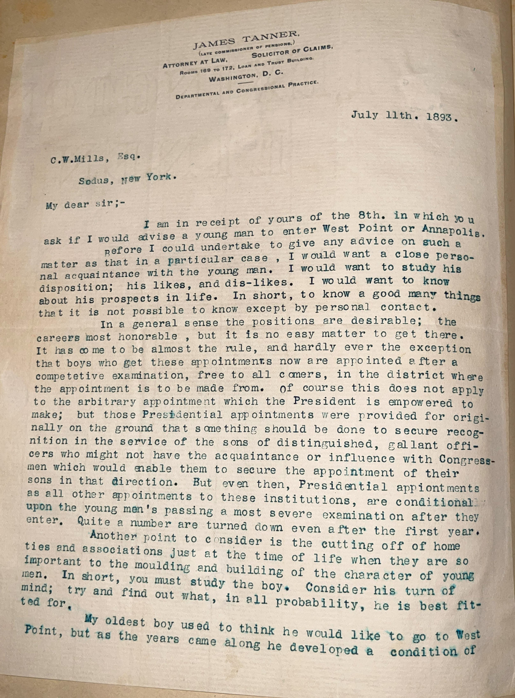
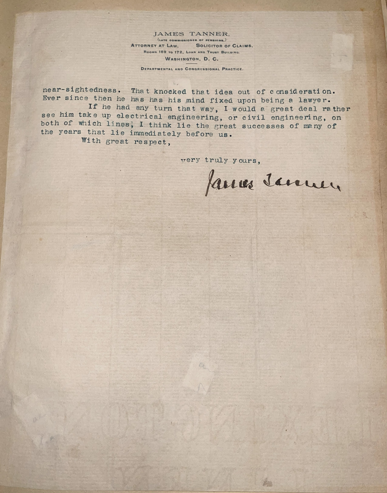

# 🖋️ James Tanner - Letter (1893)

---

## 📜 Transcription

JAMES TANNER,

(ATTORNEY AT LAW, SOLICITOR OF CLAIMS,
ATTORNEY FOR WAR CLAIMANTS OF PENSIONS,)

ROOMS 169 TO 172, LAW AND TRUST BUILDING,

WASHINGTON, D. C.

DEPARTMENTAL AND CONGRESSIONAL PRACTICE.

JULY 11th, 1893.

C.W. Mills, Esq.
Sodus, New York.

My dear sir;-

I am in receipt of yours of the 8th, in which you ask if I would advise a young man to enter West Point or Annapolis. Before I could undertake to give you any such a matter as that in a particular case, I would want a close personal acquaintance with the young man. I would want to study his disposition; his likes, and dis-likes. I would want to know about his prospects in life. In short, to know a good many things that it is not possible to know except by personal desireable; the careers most honorable, but it is no easy matter to get there. It has come to be almost the rule, and hardly ever the exception that the boys who get these appointments now are appointed after a competitive examination, free to all comers, in the district where the arbitrary appointment which the President is empowered to make; but those Presidential appointments were provided for originally on the ground that something should be done to secure recognition in the service of the sons of distinguished, gallant officers who might not have the acquaintance or influence with Congressmen which would enable them to secure the appointment of their sons in that direction. But even then, Presidential appointments as all other appointments to these institutions, are conditional upon the young men’s passing a most severe examination after they enter; quite a number are turned down even after the first year.
Another point to consider is the cutting off of home ties and associations just at the time of life when they are so important to the moulding of the character of young men. In short, you must study building of the character of young mind; try and find out what, in all probability, he is best fitted for.
My oldest boy used to think he would like to go to West Point, but as the years came along he developed a condition of near-sightedness. That knocked that idea out of consideration. Ever since then he has his mind fixed upon being a lawyer. If he had any turn that way, I would see him take up electrical engineering, or civil engineering, on both of which lines I think lie the great successes of many of the years that lie immediately before us.

With great respect,

very truly yours,

James Tanner

---

## 📚 James Tanner

**James Tanner (1844–1927)**, the author of this letter, was a notable figure in post-Civil War America, known for his service as a Union soldier, his role in documenting Abraham Lincoln’s assassination, and his later advocacy for veterans’ rights. Born on April 7, 1844, in Richmondville, New York, Tanner enlisted in the Union Army at the age of 17 and served in the 87th New York Infantry Regiment. During the Second Battle of Bull Run in 1862, he suffered a severe injury, losing both legs below the knees to a Confederate artillery shell, which ended his combat service and left him a double amputee at 18. Despite this, Tanner’s resilience led him to a remarkable career: he learned stenography while recovering, a skill that placed him at the War Department on the night of Lincoln’s assassination in 1865, where he recorded witness testimonies, including those at Lincoln’s deathbed. This experience cemented his place in history, and he later became a prominent advocate for disabled veterans, eventually serving as Commander-in-Chief of the Grand Army of the Republic (GAR) from 1876 to 1877.

By 1893, when this letter was written, James Tanner had established himself as a successful attorney in Washington, D.C., specializing in veterans’ pensions and claims, as indicated by his letterhead. The letter, addressed to C.W. Mills of Sodus, New York, on July 11, 1893, reflects Tanner’s thoughtful approach to mentoring, offering nuanced advice on whether a young man should pursue a military education at West Point or Annapolis, emphasizing the importance of understanding the individual’s character and the challenges of such a path. Tanner’s own experience with adversity likely informed his perspective, as he highlights the competitive nature of military appointments and the personal sacrifices involved. He served as U.S. Commissioner of Pensions under President Benjamin Harrison from 1889 to 1893, a role that earned him the nickname “Corporal Tanner” and some controversy for his generous pension policies. Tanner continued his advocacy work until his death on October 2, 1927, in Washington, D.C., leaving a legacy as a champion for veterans and a witness to one of America’s most pivotal moments.

---

## 🔗 Return to [Index](index.md)
