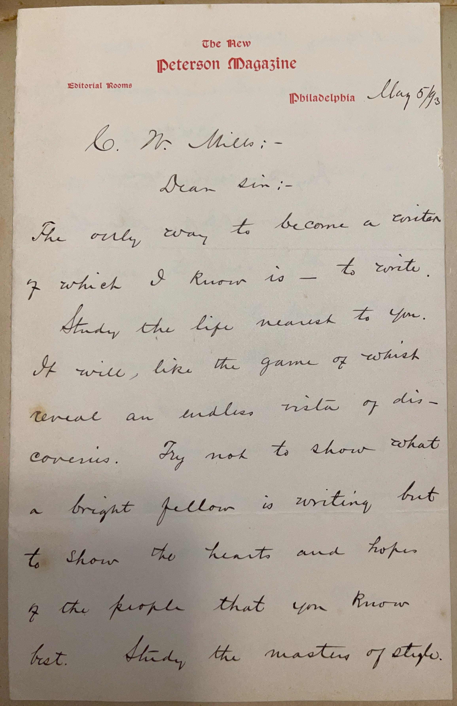
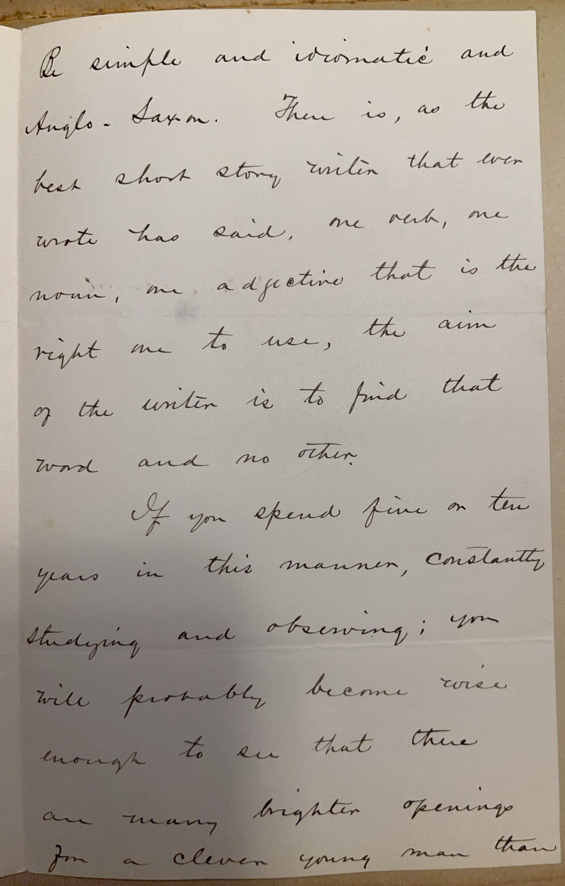
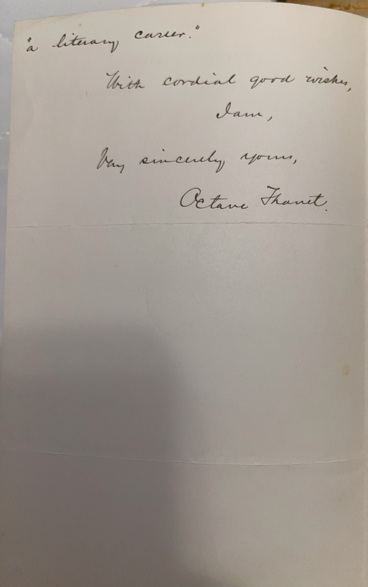

# 🖋️ Octave Thanet - Letter (ca. 1893–1894)

---

## 📜 Transcription

**Letter (ca. 1893–1894):**  

C. W. Mills:-  
Dear Sir:-  
The only way to become a writer of which I know is — to write. Study the life nearest to you. It will, like the game of whist, reveal an endless vista of discoveries. Try not to show what a bright fellow is writing but to show the hearts and hopes of the people that you know best. Study the masters of style. Be simple and idiomatic and Anglo-Saxon. There is, as the best short story writer that ever wrote has said, one verb, one noun, one adjective that is the right one to use, the aim of the writer is to find that word and no other.  

If you spend five or ten years in this manner, constantly studying and observing; you will probably become wise enough to see that there are many brighter openings for a clever young man than “a literary career.”  

With cordial good wishes,  
I am,  
Very sincerely yours,  
Octave Thanet.  

---

## 📚 Octave Thanet

**Octave Thanet** was the pseudonym of **Alice French (1850–1934)**, an American writer known for her short stories and novels that captured life in the Midwest and South, blending realism with social commentary, and making her a prominent literary figure of the late 19th and early 20th centuries. Born on March 19, 1850, in Andover, Massachusetts, French grew up in a well-to-do family and moved to Davenport, Iowa, in her youth after her father’s business interests shifted. She began writing under the pen name Octave Thanet in the 1870s, adopting a masculine pseudonym to navigate the male-dominated literary world. Her early success came with stories published in magazines like *The Atlantic Monthly*, *Scribner’s*, and *Harper’s*, where her vivid depictions of regional life and her sharp social observations earned her a wide readership.

Thanet’s work often focused on the lives of ordinary people—farmers, laborers, and small-town residents—while addressing issues like class, race, and gender. Her collections, such as *Knitters in the Sun* (1887) and *Stories of a Western Town* (1893), showcased her ability to combine local color with psychological depth, earning praise for their authenticity and humor. She also wrote novels, including *The Man of the Hour* (1905), and was known for her sympathetic portrayals of African American and working-class characters, though her views on race and labor were shaped by the conservative biases of her time, including a belief in social hierarchy. Thanet spent much of her life in Davenport, Iowa, but also maintained a winter home in Arkansas, where she wrote many of her Southern stories and engaged with local communities.

This letter, addressed to C.W. Mills, lacks a specific date and location but is likely from 1893–1894, given the timeframe of Mills’ correspondence campaign and Thanet’s active writing career during this period. It may have been written from her home in Davenport, Iowa, or her winter residence in Arkansas. In the letter, Thanet responds to Mills’ inquiry about becoming a writer, offering practical and philosophical advice that reflects her own approach to literature. She emphasizes the importance of writing regularly, observing the life around you, and focusing on the “hearts and hopes” of familiar people rather than self-aggrandizement. Thanet advises studying the masters of style, using simple and idiomatic language rooted in “Anglo-Saxon” traditions, and striving for precision in word choice—a principle she attributes to “the best short story writer that ever wrote,” possibly a reference to Edgar Allan Poe or Guy de Maupassant, both of whom she admired. Her caution that a literary career may not be the brightest path for a young man, even after years of study, reveals her pragmatic view of the challenges of writing as a profession, likely informed by her own experiences in a competitive field. Written during the height of her career, the letter captures Thanet’s role as a mentor to aspiring writers and her belief in the craft of writing as a disciplined, observational art. Thanet continued writing into the early 20th century, though her popularity waned with changing literary tastes, and she died on January 9, 1934, in Davenport, leaving a legacy as a key figure in American regional literature.

---

## 🔗 Return to [Index](index.md)