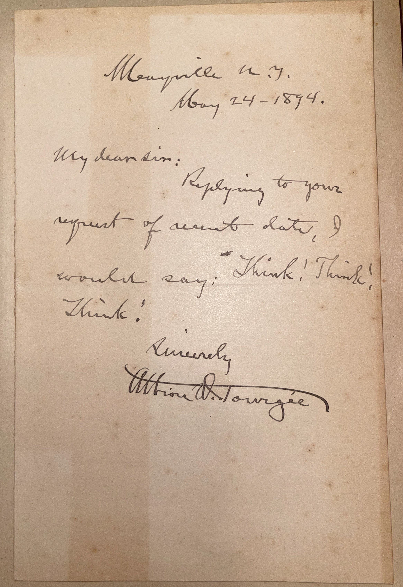

# 🖋️ Albion W. Tourgée - Letter (1894)

---

## 📜 Transcription

**Letter (May 24, 1894):**  

Mayville N.Y.  
May 24 – 1894  

My dear Sir:  

Replying to your request of recent date, I would say: Think! Think! Think!  

Sincerely,  
Albion W. Tourgée  

---

## 📚 Albion W. Tourgée

**Albion W. Tourgée (1838–1905)** was an American lawyer, writer, and civil rights activist, renowned for his tireless advocacy for racial equality during and after the Reconstruction era. Born on May 2, 1838, in Williamsfield, Ohio, Tourgée served as a Union soldier in the Civil War, where he was wounded and briefly held as a prisoner of war. After the war, he moved to North Carolina in 1865 as a “carpetbagger,” becoming a Radical Republican and working to rebuild the South under Reconstruction policies. He served as a delegate to the North Carolina constitutional convention of 1868, helped draft the state’s new constitution, and was elected a superior court judge, earning both admiration and enmity for his efforts to protect the rights of freedmen against the rising tide of white supremacy.

Tourgée gained national prominence as a writer with his semi-autobiographical novel *A Fool’s Errand* (1879), which exposed the failures of Reconstruction and the violence of the Ku Klux Klan, selling over 200,000 copies and cementing his reputation as a voice for justice. He wrote several other novels, including *Bricks Without Straw* (1880), which further explored the struggles of African Americans in the post-war South. In 1891, Tourgée founded the National Citizens’ Rights Association to advocate for equal rights, and in 1896, he served as the lead attorney for Homer Plessy in the landmark Supreme Court case *Plessy v. Ferguson*, arguing against racial segregation. The court’s decision to uphold the “separate but equal” doctrine was a devastating blow to Tourgée’s efforts, but his legal arguments laid the groundwork for future civil rights challenges.

In 1894, when this letter was written, Tourgée was 56 years old and living in Mayville, New York, having returned to the North in 1881 after facing increasing hostility in the South. The letter, addressed to a “My dear Sir,” likely C. W. Mills, responds to a request with a succinct and emphatic piece of advice: “Think! Think! Think!” This brief but powerful message reflects Tourgée’s belief in the importance of critical thinking, a principle that guided his own work as a lawyer, writer, and activist. Written just two years before his involvement in *Plessy v. Ferguson*, the letter captures Tourgée at a time when he was deeply engaged in the fight for civil rights, using his platform to challenge systemic racism. Tourgée continued his advocacy until his death on May 21, 1905, in Bordeaux, France, where he had been serving as U.S. Consul. His legacy as a pioneer of civil rights endures, influencing later activists and the eventual overturning of *Plessy* in *Brown v. Board of Education* (1954).

---

## 🔗 Return to [Index](index.md)