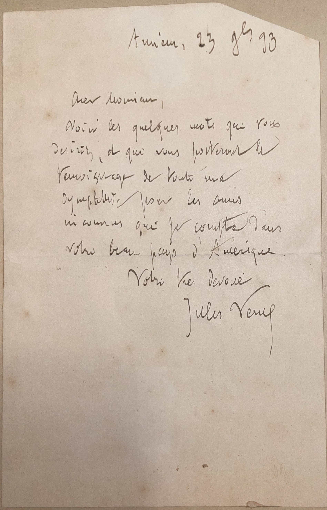

# 🖋️ Jules Verne - Letters (1893)

---

## 📜 Transcription

**Letter 1 (July 23, 1893):**  

**French Transcription:**  
Amiens, 23 Juillet 93  

Cher Monsieur,  
Voici les quelques mots que vous désirez, et qui vous porteront le témoignage de toute ma sympathie pour les amis niçois que je rencontre dans votre beau pays d’Amérique.  
Votre très dévoué,  
Jules Verne  

**English Translation:**  
Amiens, July 23, 1893  

Dear Sir,  
Here are the few words you requested, which will convey to you the testimony of all my sympathy for the Niçois friends I meet in your beautiful country of America.  
Yours very devotedly,  
Jules Verne  

**Letter 2 (July 24, 1893):**  

**French Transcription:**  
Amiens, 24 Juillet 93  

Cher Monsieur,  
Voici les quelques lignes que vous désirez, et qui vous porteront le témoignage de sympathie que j’éprouve pour vos amis inconnus du Nouveau Monde, et au nombre desquels je suis heureux de vous compter.  
Votre tout dévoué,  
Jules Verne  

**English Translation:**  
Amiens, July 24, 1893  

Dear Sir,  
Here are the few lines you requested, which will convey to you the expression of sympathy I feel for your unknown friends of the New World, and among whom I am happy to count you.  
Yours most devotedly,  
Jules Verne  

---

## 📚 Jules Verne

**Jules Verne (1828–1905)** was a French novelist, poet, and playwright, widely regarded as one of the fathers of science fiction. His imaginative works, including *Twenty Thousand Leagues Under the Sea* (1870), *Journey to the Center of the Earth* (1864), and *Around the World in Eighty Days* (1873), captivated readers worldwide with their blend of adventure, scientific innovation, and visionary ideas. In 1893, when these letters were written, Verne was 65 years old, living in Amiens, France, where he had settled in 1871. Despite declining health, including partial blindness and diabetes, he remained prolific, continuing to write and correspond with fans and admirers.

Born on February 8, 1828, in Nantes, France, Verne initially studied law but turned to writing, publishing his first major success, *Five Weeks in a Balloon*, in 1863. His collaboration with publisher Pierre-Jules Hetzel led to the creation of the *Voyages Extraordinaires*, a series of 54 novels that aimed to “outline all the geographical, geological, physical, and astronomical knowledge amassed by modern science and to recount the history of the universe.” Verne’s works were groundbreaking for their detailed scientific accuracy and optimistic vision of technology, predicting innovations like submarines, air travel, and space exploration. By the 1890s, Verne was an international literary celebrity, with his books translated into many languages, including English, making him immensely popular in America. In these letters, written from Amiens on July 23 and 24, 1893, just a day apart, Verne responds to a correspondent, likely C. W. Mills, expressing his sympathy and appreciation for his American readers. The first letter conveys his warm feelings for the “Niçois friends” (likely referring to friends from Nice, France, or a metaphorical reference to kind acquaintances) he has met in America, while the second expresses his happiness in counting the recipient among his “unknown friends of the New World,” reflecting his broad affection for his American audience. Written in 1893, during a period when Verne’s health was deteriorating but his fame was at its peak, these letters capture his gracious engagement with readers and his continued connection to his global fanbase. Verne continued writing until his death on March 24, 1905, in Amiens, leaving a legacy as a visionary author whose works inspired generations of scientists, explorers, and storytellers.

---

## 🔗 Return to [Index](index.md)