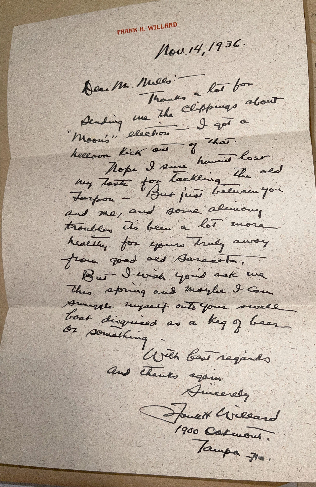

# 🖋️ Frank H. Willard - Letter (1936)

---

## 📜 Transcription

FRANK H. WILLARD  
Nov. 14, 1936  

Dear Mr. Mills:—  

Thanks a lot for sending me the clippings about “Moon's” election—I got a hellova kick out of that. Nope I sure haven't lost my taste for tackling the red Tarpon—but just between you and me, and some alimony troubles its been a lot more healthy for you truly away from good old Sarasota. But I wish you’d ask me this spring and maybe I can smuggle myself onto your swell boat disguised as a keg of beer or something.  

With best regards and thanks again,  

Sincerely  
Frank Willard  
1900 Oaklawn  
Tampa, Fla.  

---

## 📚 Frank H. Willard

**Frank Henry Willard (1893–1958)** was an American cartoonist best known for creating the comic strip *Moon Mullins*, which ran from 1923 to 1991 and became one of the most popular strips of its era. Born on September 21, 1893, in Anna, Illinois, Willard began his career as a cartoonist after serving in World War I, initially working on various strips before launching *Moon Mullins* in 1923 with the Chicago Tribune Syndicate. The strip followed the misadventures of Moonshine Mullins, a lovable but lazy boarding house resident, and his colorful cast of friends, including his brother Kayo and landlady Emmy Schmaltz. Its humor, rooted in the antics of working-class characters, resonated widely, and by the 1930s, it was syndicated in hundreds of newspapers across the United States.

By November 14, 1936, when this letter was written, Willard was 43 and living in Tampa, Florida, as indicated by his letterhead and address at 1900 Oaklawn. In the letter, addressed to C. W. Mills, Willard thanks Mills for sending clippings about a “Moon” election, likely a humorous storyline or promotional event tied to *Moon Mullins*, possibly inspired by the 1936 U.S. presidential election. Willard expresses his delight, noting he got a “hellova kick” from the clippings, and shares that he has lost his taste for tarpon fishing in Sarasota due to "alimony" troubles, which have made it “a lot more healthy” for him to stay away. Despite this, he playfully suggests a future visit to Sarasota, proposing to “smuggle” himself onto Mills’ “swell boat” disguised as a “keg of beer”. Written in 1936, during the Great Depression and a time when *Moon Mullins* was at the peak of its popularity, this letter captures Willard’s warm, informal tone, his engagement with fans, and his personal challenges with health. Willard continued to draw *Moon Mullins* until his death on January 11, 1958, in Los Angeles, after which his assistant Ferd Johnson took over the strip until its end in 1991.

---